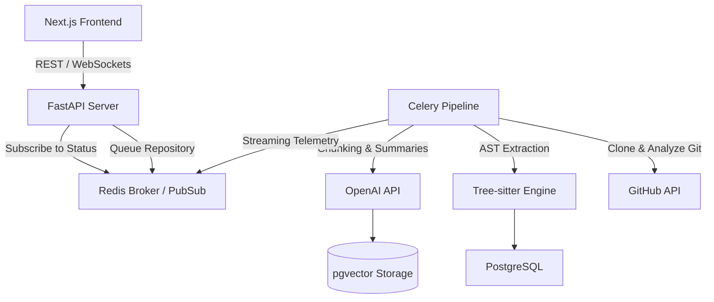

# 🧠 Illume — AI-Powered Codebase Onboarding Platform

<div align="center">

**An intelligent onboarding accelerator that transforms dense repositories into interactive guides, drastically reducing engineer ramp-up time.**

[Live Demo](https://illume.tejasnasa.me) · [GitHub](https://github.com/tejasnasa/illume) · [Features](#-features) · [Tech Stack](#-tech-stack) · [Architecture](#-architecture)

</div>

---

## ✨ Features

### 🗺️ Auto-Generated Architecture Briefs
- **Dynamic Executive Summaries** — Instantly unpacks new codebases. Automatically detects tech stacks, identifies primary application entry points, and traces data flows.
- **Dependency Inference** — Synthesizes module and directory-level summaries to give new engineers a bird's-eye view.

### 🧭 Guided Reading Order
- **Topological Learning Paths** — Uses Abstract Syntax Tree (AST) import dependency graphs and Tarjan's algorithm to compute foundational modules vs. entry points.
- **Where To Begin** — Provides a step-by-step checklist annotated by an LLM ("Read `database.py` first because it sets up the DB..."), entirely removing the guesswork.

### 📚 Codebase Glossary
- **Domain Dictionary** — Extracts functions, classes, and complex variable structures and runs them against AI to generate plain-English explanations.
- **Searchable Definitions** — New hires can immediately search what a niche domain term or custom service class means, without hunting down the original author.

### 👥 Code Ownership Map
- **Git Intelligence Integration** — Leverages deep `git log` and GitHub Pull Request analysis to attribute primary owners and map out contribution percentages.
- **Knowledge Silo Flags** — Automatically identifies bus-factors of 1 (files only touched by a single engineer) and traces domain expertise.

### 🚧 Critical Files & Guardrails
- **Traffic-Light Prioritization** — Tags core plumbing and infrastructure components (🔴 Critical, 🟡 Caution, 🟢 Safe to Explore) using heuristic algorithms that measure code fan-in, historical test presence, and update churn rates.

### 🔎 "Ask the Codebase" RAG Chat
- **Multi-Source Context Search** — Vector embeddings generated off AST symbols, semantic code, pull request discussions, and commit messages. 
- **The "Why" Beyond the "What"** — Empowers queries like *"Why did we switch to gRPC in the messaging service?"* by referencing the original pull request context rather than just blind code reading.

### 🌐 3D Dependency Graph
- **Interactive Visualization** — Render complex dependencies natively in the browser via WebGL and `react-force-graph-3d`. Nodes are colored by criticality and sized relative to their architectural weight.

---

## 🛠 Tech Stack

| Layer | Technology |
|---|---|
| **Backend Framework**| FastAPI (Python 3.12, Async) |
| **Frontend UI** | Next.js 15 (App Router, Tailwind CSS 4) |
| **Parsing Engine** | Tree-Sitter |
| **Database** | PostgreSQL + SQLAlchemy 2.0 |
| **Vector Search** | pgvector + OpenAI Embeddings |
| **Task Distributed Queue** | Celery + Redis |
| **Visual Graphing** | react-force-graph-3d |
| **AI LLM** | OpenAI API |

---

## 🚀 Getting Started

### Prerequisites
- Python 3.11+
- Node.js 18+
- Docker & Docker Compose
- OpenAI API Key & GitHub OAuth Credentials

### Installation

```bash
# 1. Spin up the Postgres (with pgvector) and Redis instances
docker-compose up -d

# 2. Launch the FastAPI backend
cd server
uv sync
uv run uvicorn app.main:app --reload

# 3. Launch the Celery Worker pipeline
uv run celery -A app.core.celery worker --loglevel=info

# 4. Boot the Next.js Client
cd client
npm install
npm run dev
```

---

## 🏗 System Architecture



---

<div align="center">

**Built with ❤️ by [Tejas](https://github.com/tejasnasa)**

</div>
