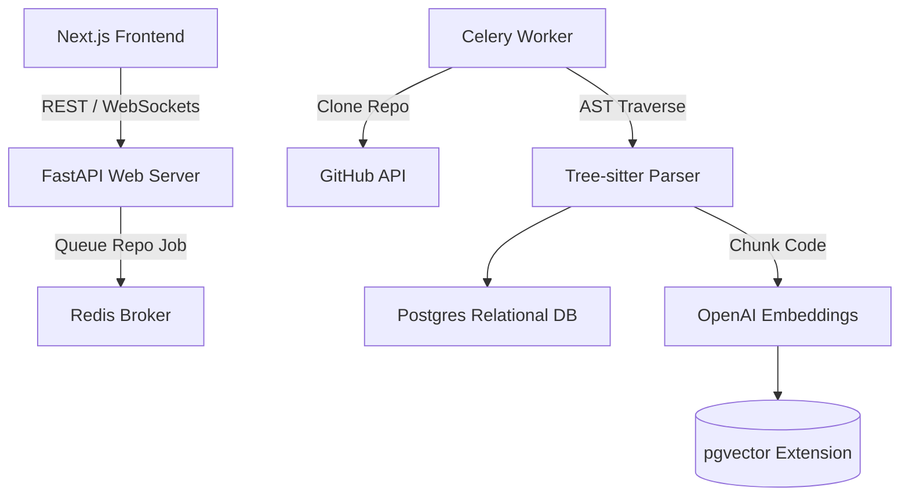

# 🧠 Illume — AI-Powered Repo Analyzer

<div align="center">

**An elite-tier AI Code Analyzer adopting a deterministic AST-first approach for hallucination-free querying and 3D architectural visualization.**

[Live Demo](https://illume.tejasnasa.me) · [GitHub](https://github.com/tejasnasa/illume) · [Features](#-features) · [Tech Stack](#-tech-stack) · [Architecture](#-architecture)

</div>

---

## ✨ Features

### 🌳 Deterministic AST Engine
- **Tree-Sitter Parsing** — Instead of dumping raw strings into an LLM context window, Illume strictly parses code structurally first. Accurate extraction of Functions, Classes, and Call relationships.
- **Relational Code Graphs** — Analyzes AST extractions to deterministically graph exactly how dependencies interact across a codebase, bypassing AI-guessing.

### 🔎 Intelligent RAG Architecture
- **Semantic Embeddings** — Converts functional AST blocks into precise semantic vector embeddings stored in pgvector holding foreign-keys to the source AST table.
- **Hallucination-Free Q&A** — Enables hyper-specific semantic search capabilities that map directly to functional logic codeblocks, practically eliminating generic LLM hallucinations.

### 🌐 3D Dependency Visualization
- **React Force Graph 3D** — An interactive 3D client-side renderer that visually plots complex webs of imports and circular dependencies for repositories traversing 10,000+ nodes.
- **Real-Time Telemetry** — Seamless WebSocket streaming pushing live GitHub ingestion processing logs directly to the user interface.

### 🧬 Code Health Metrics
- **Automated Scoring** — Computes repository health natively via Lines of Code (LOC), cyclomatic complexity, and coupling heatmaps derived purely before any LLM is contacted.

---

## 🛠 Tech Stack

| Layer | Technology |
|---|---|
| **Backend Framework**| FastAPI (Python 3.11+) |
| **Frontend UI** | Next.js 14 (App Router) + React |
| **Parsing Engine** | Tree-Sitter |
| **Database** | PostgreSQL + SQLAlchemy |
| **Vector Engine** | pgvector + OpenAI Embeddings |
| **Task Queue** | Celery + Redis |
| **Visual Graphing** | react-force-graph-3d |
| **Styling** | Tailwind CSS + shadcn/ui |

---

## 🚀 Getting Started

### Prerequisites
- Python 3.11+
- Node.js 18+
- Docker & Docker Compose (for PostgreSQL & Redis)

### Installation

```bash
# 1. Spin up the Postgres and Redis environments
docker-compose up -d

# 2. Launch the FastAPI backend
cd api
pip install -r requirements.txt
uvicorn main:app --reload

# 3. Launch the Celery Worker queue
celery -A core.tasks worker --loglevel=info

# 4. Boot the Next.js Client
cd web
npm install
npm run dev
```

---

## 🏗 Architecture Workflow



---

<div align="center">

**Built with ❤️ by [Tejas](https://github.com/tejasnasa)**

</div>
