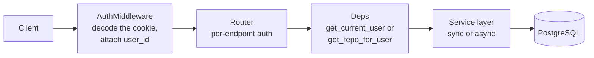

# HTTP API Reference

You have a repository's id and you want its dependency graph. You build `GET
/api/v1/repository/{id}/graph` and get a `404`. The id is right, the repository is yours, and the docs
said this endpoint exists.

The reason is almost always the same: **a repository has two identifiers**, and the route you picked
takes the other one. It is the single most common way to get a `404` from this API, and it is why this
document starts with identifiers rather than endpoints.

This is the narrative reference. It explains the conventions, the error semantics, and the sharp
edges. For the mechanically generated schema — every field of every model, with types — the OpenAPI
document is the authority, with the caveat in [Conventions](#conventions).

If you are integrating for the first time, [The two identifiers](#the-two-identifiers) and
[Error semantics](#error-semantics) are what to read first. If you are preparing to discuss the
design, [Design decisions and trade-offs](#design-decisions-and-trade-offs) collects the reasoning.

## Contents

- [Conventions](#conventions)
- [The two identifiers](#the-two-identifiers)
- [The request pipeline](#the-request-pipeline)
- [Error semantics](#error-semantics)
  - [Ownership and 404s](#ownership-and-404s)
  - [Quota and payment-required](#quota-and-payment-required)
- [Endpoint reference](#endpoint-reference)
  - [Authentication — `/api/v1/auth`](#authentication--apiv1auth)
  - [Repositories — `/api/v1/repository`](#repositories--apiv1repository)
  - [Chat — `/api/v1/repository`](#chat--apiv1repository)
  - [Graph — `/api/v1/repository`](#graph--apiv1repository)
  - [Guide — `/api/v1/repository`](#guide--apiv1repository)
  - [Glossary — `/api/v1/repository`](#glossary--apiv1repository)
  - [Ownership — `/api/v1/repository`](#ownership--apiv1repository)
  - [Stats — `/api/v1/repository`](#stats--apiv1repository)
  - [GitHub proxy — `/api/v1/github`](#github-proxy--apiv1github)
  - [Contact — `/api/v1/contact`](#contact--apiv1contact)
  - [Health — `GET /healthz`](#health--get-healthz)
  - [WebSocket — `/api/v1/ws/ingest/{repo_id}`](#websocket--apiv1wsingestrepo_id)
- [Status code conventions](#status-code-conventions)
- [Troubleshooting](#troubleshooting)
- [Design decisions and trade-offs](#design-decisions-and-trade-offs)
- [Related documentation](#related-documentation)

## Conventions

| Property           | Value                                                              |
| ------------------ | ------------------------------------------------------------------ |
| Base path          | `/api/v1`                                                          |
| Health check       | `GET /healthz` (outside the versioned prefix)                      |
| Interactive schema | `/docs`, `/redoc`, `/openapi.json` — only `/openapi.json` is public |
| Authentication     | HTTP-only cookie named `access_token`, carrying a JWT              |
| Content type       | `application/json`, except the export endpoint (`text/plain`)      |
| CORS               | Configured for the single origin in `FRONTEND_URL`, with credentials |

The application is assembled in `server/app/main.py`; each router is included with its own prefix and
tag.

> **The `/docs` and `/redoc` pages sit behind the auth gate.** Only `/openapi.json` is on the
> middleware allow-list, so an unauthenticated reader gets `401 {"detail":"Not authenticated"}` rather
> than the schema. Sign in first, or fetch `/openapi.json` directly.

Authentication is applied **per endpoint**, not per router, and it is invisible to OpenAPI: no
security scheme is registered on the app. A reader of `/docs` therefore cannot tell from the schema
which endpoints are protected. The tables below state it explicitly for every route.

Two mechanisms appear:

- **`get_current_user`** — a FastAPI dependency that loads the `User` row and fails with `401` if it
  is missing.
- **Middleware identity** — `AuthMiddleware` decodes the cookie and attaches `request.state.user_id`
  for every request. Endpoints that use this read the attribute directly.

## The two identifiers

This is the most important thing to know before calling the API.

| Identifier    | Type    | Where it comes from                                    | Used by                                              |
| ------------- | ------- | ------------------------------------------------------ | ---------------------------------------------------- |
| `repo_id`     | UUID    | The primary key of the `Repository` row                | Almost every route                                    |
| `repo_number` | Integer | A database-generated, **globally unique** number       | Exactly one route: `GET /api/v1/repository/{repo_num}` |

The URL segment is spelled `{repo_id}` on the routes that take the UUID and `{repo_num}` on the one
route that takes the integer. They are not interchangeable — passing a UUID where an integer is
expected fails validation, and passing an integer elsewhere returns `404`.

The numbered lookup is scoped to the caller's `user_id`, so a number that belongs to someone else
still returns `404`. The counter itself is not per-user.

## The request pipeline

The two things to note: the middleware runs for **every** request including public ones, and the
ownership check is a separate step that a route can forget — it is not a dependency that applies
itself.

## Error semantics

| Status | Meaning in Illume                                                                                                                                     |
| ------ | ---------------------------------------------------------------------------------------------------------------------------------------------------- |
| `400`  | The request is malformed *for the current state* — re-ingesting a repository that is not `ready` or `failed`, or asking a question of a repo that is not `ready` |
| `401`  | No session, or an expired/invalid one                                                                                                                 |
| `402`  | The free-tier allowance is exhausted and no BYOK key is stored — see below                                                                             |
| `403`  | A GitHub operation was attempted without a linked GitHub account                                                                                       |
| `404`  | The resource does not exist **or is not yours** — there is no `403` for ownership                                                                     |
| `409`  | The request is valid but conflicts with current state — the repository is not `ready`, a sync is already running, or auto-update is disabled             |
| `422`  | Validation failure (FastAPI) — an unknown AI provider, or an out-of-range interval                                                                     |
| `500`  | An unhandled server-side error                                                                                                                        |
| `502`  | An upstream provider (LLM or GitHub) failed, timed out, or rejected the request                                                                        |
| `503`  | A dependency is unavailable — the task broker refused a task, `/healthz` found a failing dependency, or the mailer is unconfigured                      |
| `504`  | An upstream provider timed out — the contact mailer, or the GitHub proxy on a GitHub timeout                                                           |

### Ownership and 404s

There is no global query scoping in the ORM. Each route enforces ownership itself, either through the
`get_repo_for_user(repo_id, user_id, db)` helper or by filtering on `user_id` inline.

**The helper is a plain async function, not a FastAPI dependency.** It is called directly, as
`await get_repo_for_user(...)`, from the route body.

When ownership fails it raises **`404`, not `403`** — a `403` would confirm the resource exists, leaking
the existence of other users' repositories. A client should treat "not found" and "not mine" as the
same condition. See [auth.md](auth.md#ownership-and-why-it-is-a-404).

### Quota and payment-required

Illume has a free tier: a new user can run one ingestion and ask a small number of chat questions on
the operator's credential before they must supply their own key. Quota decisions live in
`server/app/services/entitlements.py` and are enforced in the route layer.

`402` means *"the free allowance for this action is gone and you have no stored key"*. It is returned
by:

- `POST /api/v1/repository` — starting an ingestion
- `PUT /api/v1/repository/{repo_id}/reingest` — re-analysing one
- `PATCH /api/v1/repository/{repo_id}/auto-update` — enabling background updates
- `POST /api/v1/repository/{repo_id}/sync` — triggering a manual sync
- `POST /api/v1/repository/{repo_id}/chat` — asking a question

A stored key always wins: once a user has saved credentials, the gate is open regardless of the
counters. Removing the key does not restore the allowance.

## Endpoint reference

### Authentication — `/api/v1/auth`

Nine endpoints: six for sessions and OAuth, three for per-user AI credentials.

| Method   | Path                             | Purpose                                        | Auth    | Notable responses                 |
| -------- | -------------------------------- | ---------------------------------------------- | ------- | --------------------------------- |
| `POST`   | `/api/v1/auth/register`          | Create an account; sets the cookie             | —       | `201`; `400` email already registered |
| `POST`   | `/api/v1/auth/login`             | Password login; sets the cookie                | —       | `200`; `401` invalid credentials  |
| `POST`   | `/api/v1/auth/logout`            | Clear the session cookie                       | —       | `200`                             |
| `GET`    | `/api/v1/auth/me`                | The current user, plus quota counters          | Session | `200`                             |
| `GET`    | `/api/v1/auth/github`            | Begin GitHub OAuth                             | —       | `307` to GitHub                   |
| `GET`    | `/api/v1/auth/github/callback`   | OAuth callback; sets the cookie                | —       | `400` on failure; `302` to the frontend |
| `GET`    | `/api/v1/auth/me/ai-credentials` | Whether a key is stored, and for which provider | Session | `200` always                     |
| `PUT`    | `/api/v1/auth/me/ai-credentials` | Store or replace the user's key                | Session | `422` unknown provider; `400` probe failed |
| `DELETE` | `/api/v1/auth/me/ai-credentials` | Remove the stored key                          | Session | `200`                             |

Notes:

- `GET /auth/me` returns `has_ai_key`, `free_ingest_used` and `free_chat_messages_used`, plus
  `avatar_url`, `github_id`, `ai_provider` and `ai_model` — never the key itself.
- `PUT /auth/me/ai-credentials` performs a **live probe** before persisting, so a bad key fails at the
  form rather than later as an empty artefact. See [auth.md](auth.md#the-save-time-probe).
- Allowed providers are the keys of the registry in `llm_providers.py`: `openai`, `groq`,
  `openrouter`, `deepseek`.

### Repositories — `/api/v1/repository`

| Method   | Path                                         | Purpose                              | Auth    | Notable responses             |
| -------- | -------------------------------------------- | ------------------------------------ | ------- | ----------------------------- |
| `POST`   | `/api/v1/repository`                         | Ingest a repository                  | Session | `202`; `402` quota exhausted  |
| `GET`    | `/api/v1/repository`                         | List the caller's repositories       | Session | `200`                         |
| `GET`    | `/api/v1/repository/{repo_num}`              | Fetch one repository **by number**   | Session | `404`                         |
| `DELETE` | `/api/v1/repository/{repo_id}`               | Delete a repository and all its data | Session | `204`; `404`                  |
| `PUT`    | `/api/v1/repository/{repo_id}/reingest`      | Re-run a full analysis               | Session | `202`; `402`; `400` wrong status |
| `PATCH`  | `/api/v1/repository/{repo_id}/auto-update`   | Toggle/configure background updates  | Session | `422` bad interval; `402`     |
| `POST`   | `/api/v1/repository/{repo_id}/sync`          | Trigger a sync now                   | Session | `202`; `409` ×3; `503`        |
| `GET`    | `/api/v1/repository/{repo_id}/export/illume` | Download the compact text export     | Session | `400` not ready; `404`        |

Behaviour worth knowing:

- **`POST /repository` returns `202`, not `201`.** Ingestion is asynchronous; the response carries the
  new identifiers and the work happens in a Celery worker.
- **Re-ingest deletes and recreates the row** under the same `id` and `repo_number`, cascading away
  every child row, then re-queues. It is only permitted while the repository is `ready` or `failed`.
- **`POST /sync` has three distinct `409`s**, because three things can block it: auto-update is
  disabled deployment-wide, another sync holds the lease, or the repository has no recorded commit to
  diff against. The response body distinguishes them.
- **Listing truncates summaries** to 200 characters plus an ellipsis, as a payload-size defence.
- **The export endpoint** streams `text/plain` with a `Content-Disposition` attachment header. See
  [exports.md](exports.md).

### Chat — `/api/v1/repository`

| Method   | Path                                             | Purpose                | Auth    | Notable responses          |
| -------- | ------------------------------------------------ | ---------------------- | ------- | -------------------------- |
| `POST`   | `/api/v1/repository/{repo_id}/chat`              | Ask a question         | Session | `400`; `404`; `402`; `502` |
| `GET`    | `/api/v1/repository/{repo_id}/chat/history`      | Load prior turns       | Session | `200`                      |
| `DELETE` | `/api/v1/repository/{repo_id}/chat/{message_id}` | Delete one turn        | Session | `204`                      |
| `DELETE` | `/api/v1/repository/{repo_id}/chat`              | Clear the conversation | Session | `204`                      |

- The request body carries `question` and a `history` array of `{role, content}` turns.
- **History is truncated server-side**: only the last five *messages* are forwarded.
- The free-tier counter is charged **only when the answer was actually generated**.
- The route catches provider errors and maps them to `502` with the provider's message.

### Graph — `/api/v1/repository`

| Method | Path                                 | Purpose                  | Auth    | Notable responses             |
| ------ | ------------------------------------ | ------------------------ | ------- | ----------------------------- |
| `GET`  | `/api/v1/repository/{repo_id}/graph` | Dependency graph payload | Session | `404`; `409` not ready; `500` |

- Query parameter `level` is `file` (default) or `symbol`.
- **`409` means the repository exists and is yours, but is not `ready`.** Treat it as "come back
  later" and keep polling rather than as an error.
- Nothing is cached, and there is **no node cap**.

### Guide — `/api/v1/repository`

| Method | Path                                 | Purpose                     | Auth    | Notable responses        |
| ------ | ------------------------------------ | --------------------------- | ------- | ------------------------ |
| `GET`  | `/api/v1/repository/{repo_id}/guide` | The generated reading order | Session | `404` repo or guide absent |

A `404` here covers two cases: the repository is not yours, or the guide has not been generated. The
reading order is only produced during a full analysis.

### Glossary — `/api/v1/repository`

| Method | Path                                           | Purpose          | Auth    | Notable responses |
| ------ | ---------------------------------------------- | ---------------- | ------- | ----------------- |
| `GET`  | `/api/v1/repository/{repo_id}/glossary`        | Paginated glossary | Session | `404`           |
| `GET`  | `/api/v1/repository/{repo_id}/glossary/search` | Substring search   | Session | `404`           |

- Browse defaults to 50 per page (maximum 100); search defaults to 20 (maximum 100).
- Only the browse endpoint accepts a `file_path` filter; search does not take one.
- Entries named `<anonymous>` are excluded from results.

### Ownership — `/api/v1/repository`

| Method | Path                                           | Purpose                        | Auth    | Notable responses |
| ------ | ---------------------------------------------- | ------------------------------ | ------- | ----------------- |
| `GET`  | `/api/v1/repository/{repo_id}/ownership`       | Per-file contributor breakdown | Session | `404`             |
| `GET`  | `/api/v1/repository/{repo_id}/ownership/silos` | Files with a bus factor of one | Session | `404`             |

The ownership map paginates at 50 per page, maximum **200** — a higher ceiling than the glossary
endpoints, because each row is small. See [pipeline/git-intelligence.md](pipeline/git-intelligence.md).

### Stats — `/api/v1/repository`

| Method | Path                                 | Purpose                                      | Auth    | Notable responses |
| ------ | ------------------------------------ | -------------------------------------------- | ------- | ----------------- |
| `GET`  | `/api/v1/repository/{repo_id}/stats` | Totals, language breakdown, top contributors | Session | `404`             |

### GitHub proxy — `/api/v1/github`

These endpoints exist so the browser can browse a user's GitHub repositories and branches without ever
holding the GitHub access token. The token stays server-side; the server proxies the call.

| Method | Path                                                      | Purpose                            |
| ------ | --------------------------------------------------------- | ---------------------------------- |
| `GET`  | `/api/v1/github/repos`                                    | The caller's GitHub repositories   |
| `GET`  | `/api/v1/github/repos/{owner}/{repo}/branches`            | Branches of a repository           |
| `GET`  | `/api/v1/github/repos/{owner}/{repo}/commits`             | Commits, optionally from a `sha`   |
| `GET`  | `/api/v1/github/repos/{owner}/{repo}/commits-multibranch` | Commits across up to five branches |

- All four require a session **and** a linked GitHub account. Without one they return `403`
  `"GitHub account not linked"`.
- Upstream failures are mapped: a timeout is `504`, any other transport failure is `502`, and a
  repository GitHub does not have is `404`.
- The multibranch variant queries up to five branches, deduplicates by SHA, and caps the result at 100
  commits. It exists because a repository's most recent activity is often not on its default branch.
- An expired GitHub token surfaces as `401` from `/repos`.

### Contact — `/api/v1/contact`

| Method | Path              | Purpose                 | Auth | Notable responses                          |
| ------ | ----------------- | ----------------------- | ---- | ------------------------------------------ |
| `POST` | `/api/v1/contact` | Submit the contact form | —    | `503` mailer unconfigured; `504`/`502` failure |

Public by design — the form must work for someone who cannot sign in. Details:

- Categories are `bug`, `feature`, `question`, `other`.
- A hidden honeypot field is included. When it is filled, the endpoint returns `200` **without sending
  anything**, so a bot cannot learn that it was detected.
- The endpoint returns `503` while the mail configuration is incomplete, rather than accepting a
  message it has no way to deliver.

### Health — `GET /healthz`

Outside the versioned prefix, public, and used by both the production smoke suite and any external
monitor.

- `200` with `{"status": "ok", "checks": {...}}` when every dependency responds.
- `503` with `{"status": "degraded", ...}` when one does not.

Returning `503` rather than `200` with a failure flag is intentional: an ordinary uptime monitor needs
no custom logic to detect a degraded instance. Note that only Redis is probed — the database probe was
deliberately removed.

### WebSocket — `/api/v1/ws/ingest/{repo_id}`

Documented separately in [websockets.md](websockets.md), because the frame contract matters more than
the connection itself.

## Status code conventions

Three conventions hold across the whole surface, and they are worth stating once:

1. **`404` covers "not yours".** There is no ownership `403` anywhere.
2. **`409` means "come back later", not "you did something wrong".** It appears where a resource
   exists but its state does not permit the action yet — most often a repository that is not `ready`.
3. **`402` is a quota answer, not an auth answer.** The session is valid; the allowance is not.

## Troubleshooting

**A `404` on a repository you own.**

Almost always the identifier. Only `GET /api/v1/repository/{repo_num}` takes the integer; every other
route takes the UUID.

**Everything returns `401`.**

The cookie is not reaching the server. Check the client is using `credentials: "include"` and that CORS
is configured for its origin.

**A `500` on an endpoint that should return `401`.**

A password login against a GitHub-only account, which has no stored password —
see [auth.md](auth.md#password-storage).

**The graph endpoint returns `409` and never `200`.**

The analysis has not finished. Poll — `409` is the expected answer while `status != "ready"`.

**`/docs` returns `401`.**

Expected. Only `/openapi.json` is public; sign in first.

**A `402` on the first ingestion.**

`AI_API_KEY` is empty on the server, which disables the free tier entirely. That is the intended
switch.

## Design decisions and trade-offs

### Why two identifiers?

Because `repo_number` is a much nicer thing to put in a URL a user sees or shares, and the UUID is the
right thing to key a foreign key on. The number is database-generated and globally unique, so it never
collides and is never reused.

The cost is exactly the confusion at the top of this document: one route takes the integer and every
other takes the UUID, which is easy to get wrong and produces a plain `404` when you do.

### Why is authentication per endpoint rather than per router?

Because the routers group by feature, not by access level. `/api/v1/auth` contains both public
(`login`) and protected (`me`) endpoints, and `/api/v1/repository` contains public-adjacent and
strictly-owned ones.

The cost is that auth is invisible in the generated schema — no security scheme is registered — so a
reader of `/docs` cannot tell which routes are protected.

### Why does ownership return `404` rather than `403`?

Because `403` confirms the resource exists. An attacker enumerating ids could distinguish "exists but
not mine" from "does not exist", leaking the existence of other users' repositories. See
[auth.md](auth.md#ownership-and-why-it-is-a-404).

### Why is there no global query scoping?

Because there is no clean way to inject a per-query tenant filter in SQLAlchemy without session events
or a custom query class, and both make queries harder to read. An explicit filter is visible at the
call site.

The cost is that a forgotten filter is a silent data leak rather than a loud error — which is why this
document says so in three separate places.

### Why `202` for a create?

Because the create is the *queueing* of work, not the work. Returning `201 Created` with a resource
that is not yet usable would be technically true and practically misleading. `202 Accepted` says the
request was taken and something will happen.

### Why does `POST /sync` return three different `409`s?

Because three genuinely different things can block a sync, and the caller needs to tell them apart to
react correctly: auto-update disabled deployment-wide (nothing the user can do), another sync holding
the lease (retry shortly), or no recorded commit to diff against (re-ingest first).

Collapsing them into one `409` would be simpler and useless.

### Why is the contact endpoint public and honeypotted?

Because it must work for someone who cannot sign in — that is the whole point of a contact form — and
rate limiting it would require a store keyed on something the caller controls. A honeypot returns
success without sending, so a bot learns nothing about whether it was detected.

The cost is that the endpoint is unauthenticated and, beyond the honeypot, unthrottled.

## Related documentation

- [auth.md](auth.md) — the session, the ownership model, and the credential store behind `/auth/me`.
- [websockets.md](websockets.md) — the one non-HTTP endpoint, and its frame contract.
- [data-model.md](data-model.md) — the identifiers, the status columns, and the quota counters these
  endpoints read and write.
- [pipeline/ingestion.md](pipeline/ingestion.md) — what `POST /repository` actually starts.
- [pipeline/sync.md](pipeline/sync.md) — the three `409`s on `POST /sync`.
- [exports.md](exports.md) — the `.illume` text format the export endpoint returns.
