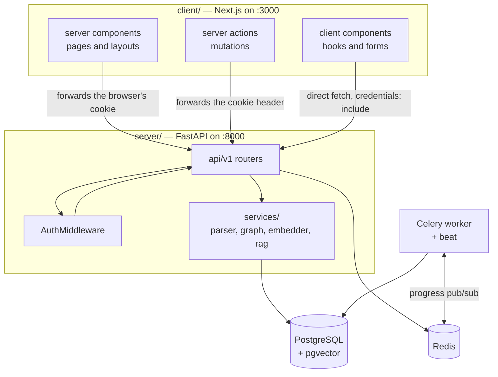

# Architecture

Illume turns a GitHub repository into an interactive onboarding workspace. It clones the repository
and parses it into symbols with tree-sitter, then builds a dependency graph between files. It mines
the git history for ownership and change patterns, and scores every file for criticality. Finally, a
language model writes a glossary, an ordered reading path, and an architecture brief. All of it is
served through a web application with a 3D dependency graph and a chat interface that answers
questions from the code itself.

This is the entry point to the documentation. It explains how the system is put together, what happens
when someone uses it, and which decisions shaped it — so a reader can go to the right document instead
of reading all of them.

If you are reading for the first time, [The two applications](#the-two-applications) and
[The four flows](#the-four-flows) are the map. If you are preparing to discuss the system,
[Design decisions and trade-offs](#design-decisions-and-trade-offs) collects the reasoning.

## Contents

- [The two applications](#the-two-applications)
  - [Why two](#why-two)
- [Repository layout](#repository-layout)
- [The four flows](#the-four-flows)
  - [Adding a repository](#adding-a-repository)
  - [Keeping it current](#keeping-it-current)
  - [Asking a question](#asking-a-question)
  - [Loading a page](#loading-a-page)
- [Where state lives](#where-state-lives)
- [Auth is the spine](#auth-is-the-spine)
- [Cross-cutting conventions](#cross-cutting-conventions)
  - [Async and sync are split by caller](#async-and-sync-are-split-by-caller)
  - [No session crosses a thread](#no-session-crosses-a-thread)
  - [Idempotency is enforced by the database](#idempotency-is-enforced-by-the-database)
  - [Configuration is environment-only](#configuration-is-environment-only)
- [Known limits](#known-limits)
- [Design decisions and trade-offs](#design-decisions-and-trade-offs)
- [Related documentation](#related-documentation)

## The two applications

| | `server/` | `client/` |
| --- | --- | --- |
| What | FastAPI API, Celery workers, the analysis pipeline | Next.js application |
| Language | Python 3.14 | TypeScript, React 19 |
| Serves | HTTP API, one WebSocket | Every page a user sees |
| Deployed | Three containers on a droplet | Separately |

They communicate two ways: the browser calls the API directly at an absolute URL, and server
components forward the incoming cookie to the API on the user's behalf. There is no proxy layer and no
BFF.

### Why two

Because the analysis is long-running, CPU- and memory-heavy, and has nothing in common with rendering
a React page. Ingestion shells out to `git`, runs tree-sitter over thousands of files, and holds
hundreds of megabytes at peak — that work cannot live inside a Next.js request, and it must survive
the request that started it.

The cost is a second deployment, a second toolchain, and the CORS and cookie arrangement described
below.

## Repository layout

```
illume/
├── client/                     Next.js 16 — App Router
│   ├── src/app/                routes: dashboard, settings, contact, repo/[id]/{explorer,glossary,graph}
│   ├── src/api/                server-side fetchers (cookie forwarded)
│   ├── src/actions/            server actions ("use server")
│   ├── src/components/         UI, including the three graph components
│   ├── src/hooks/              client hooks
│   └── src/proxy.ts            the middleware auth gate
│
├── server/                     FastAPI + Celery
│   ├── app/api/v1/             11 routers under /api/v1
│   ├── app/core/               config, both database engines, security, Celery, Redis, health
│   ├── app/middleware/         AuthMiddleware — the JWT cookie gate
│   ├── app/models/             12 SQLAlchemy models
│   ├── app/services/           the domain logic (parser, graph, embedder, rag, sync helpers)
│   ├── app/tasks/              Celery: ingest, sync, the auto-update sweep
│   ├── alembic/                24 migrations, one linear chain
│   └── tests/                  pytest
│
└── docs/                       this documentation
```



## The four flows

### Adding a repository

`POST /api/v1/repository` writes a `Repository` row and queues a Celery task. The response is `202` —
the work is asynchronous. The browser then opens a WebSocket and watches progress frames as the worker
moves through the pipeline.

The full treatment is in [pipeline/ingestion.md](pipeline/ingestion.md). The essential shape: stages
run in dependency order, three pairs of them overlap on thread pools, and the repository becomes
`ready` only after the LLM phase completes.

### Keeping it current

A per-repository switch enables background updates. Celery beat sweeps every ten minutes for
repositories whose next update is due, claims each with a conditional update, and dispatches a worker
task. The worker refreshes the clone, reads the head commit, and — if both of the repository's
watermarks already match — stops immediately.

Otherwise it reprocesses only what changed, escalating to a full rebuild when the diff is unusable or
large. See [pipeline/sync.md](pipeline/sync.md).

### Asking a question

The chat embeds the question, retrieves the nearest chunks from the index built at ingest time,
narrows them with per-type caps, and asks a model to answer from those chunks alone. History is
replayed as real conversation turns. See [pipeline/retrieval.md](pipeline/retrieval.md).

### Loading a page

Server components fetch through `src/api/*` with the browser's cookie forwarded; client components
fetch the API directly with `credentials: "include"`. Both strategies exist for good reasons — see
[frontend.md](frontend.md#data-fetching-three-strategies-deliberately).

## Where state lives

| State | Lives in | Lifetime |
| --- | --- | --- |
| Users, repositories, all analysis data | PostgreSQL | Until deleted |
| Embeddings | PostgreSQL, via pgvector | Rebuilt on re-analysis |
| Session identity | A JWT in an `access_token` cookie | Until the token's `exp` |
| Task queue and results | Redis | Task-scoped |
| Live progress frames | Redis pub/sub, channel `task:{repo_id}:logs` | Fire-and-forget |
| Clone cache | Disk, `/tmp/illume/clone_cache` | Until evicted at 2 GiB |
| Beat's schedule | A file at `/var/illume/celerybeat-schedule` | Until the file is lost |

The last two are the ones that need infrastructure help: both live on disk inside containers, so both
are bind-mounted in production. Without those mounts every deploy destroys the clone cache and resets
the beat cadence. See [deployment.md](deployment.md).

## Auth is the spine

Every request passes through `AuthMiddleware`, which decodes the `access_token` cookie into
`request.state.user_id` — except on an allow-list of public paths. Routers then either read that
attribute or take a `get_current_user` dependency, and ownership is enforced by filtering `user_id` in
each query rather than by any ORM-level scoping.

Two consequences worth knowing early:

- **There is no global scoping.** A route that forgets the `user_id` filter is a data leak, not a bug
  that fails loudly. The ownership check is the one thing that must not be omitted on a new endpoint.
- **Ownership failures return `404`, not `403`.** A `403` would confirm the resource exists, leaking
  the existence of other users' repositories.

The full picture, including the OAuth flow and the BYOK credential store, is in [auth.md](auth.md).

## Cross-cutting conventions

### Async and sync are split by caller

FastAPI routes use the async engine (asyncpg). Celery tasks and Alembic use the sync engine
(psycopg2). Both live in `app/core/database.py`.

The consequence is that some services exist in two flavours, and the rule for a new service is *match
the flavour of your caller*.

**Why:** the alternative is one engine everywhere, which means either making the workers fully async —
Celery is a sync framework, so this fights the tooling — or making the routes sync, which blocks the
event loop under load. **The cost** is duplication, and the risk of writing a service in the wrong
flavour, which surfaces as a runtime error rather than a compile error.

### No session crosses a thread

The pipeline runs three pairs of stages concurrently. The rule that makes this safe is not exception
handling — it is that **no database session is ever shared across threads**. Every overlapped helper
receives only scalars and opens its own session.

**Why:** a SQLAlchemy session is not thread-safe, and a shared one fails unpredictably rather than
reliably. **The cost** is that each thread re-loads what it needs, and credentials must be passed
explicitly — which is why `LLMConfig` is a frozen dataclass rather than a contextvar.

### Idempotency is enforced by the database

Concurrent ingestion of the same repository is made safe by unique constraints and `ON CONFLICT`
clauses, not by application-level locking.

**Why:** two workers can always race — a re-ingest during a sync, or a retried task. A constraint holds
under every interleaving; a check-then-insert does not. **The cost** is that the schema now carries
correctness weight, so the constraints are documented as invariants in
[data-model.md](data-model.md).

### Configuration is environment-only

A single `Settings` class reads the process environment and a `.env` file. Every field is required
except three, which means anything importing `app.core.config` needs a complete environment.

**Why:** it removes a class of "works on my machine" divergence, and makes a missing variable a
startup failure rather than a runtime surprise. **The cost** is that a fresh checkout, a CI job, or a
standalone script fails with a validation error unless the variables are set — which is why
`llm_providers.py` and the OpenAI stub server deliberately import no configuration at all.

The converse convention is that **tunables live in code, not in `Settings`**. Sync intervals, cache
ceilings, quota limits, and analysis caps are module-level constants, because adding a `Settings` field
is another way for an unrelated process to fail to start. A code change plus a deploy is the intended
way to change them, and each is documented next to the behaviour it controls rather than in a central
list.

## Known limits

Recorded so a reader is not surprised by them. These are design boundaries, not defects.

- **The graph payload has no node cap and no cache.** A large repository produces a large response,
  rebuilt on every request.
- **Long code chunks are skipped, not truncated.** A function over the token limit is absent from the
  search index entirely.
- **The call graph does not exist.** The dependency table declares `calls`, `inherits` and
  `instantiates`, but only `imports` is ever written — so the embedder's `Called by:` and `Calls:`
  lines are always empty.
- **Test detection is name-based**, so unconventional test names are missed.
- **Re-ingest deletes and recreates** the repository row, cascading away every child row.

## Design decisions and trade-offs

### Why a separate backend instead of API routes inside Next.js?

Because ingestion is a long-running job with different resource characteristics from a page render. It
shells out to `git`, parses thousands of files, and holds hundreds of megabytes at peak. Putting it in
a Next.js route would tie it to the request lifecycle, and the request that started it would be gone
long before the work finished.

The separate app also lets the worker run on a box sized for memory rather than for serving pages.

### Why does the browser call the API directly instead of through a proxy?

Because a proxy would double every payload — the graph response, the chat answer, the live progress
frames — and add a hop for no benefit. The cost is CORS pinned to a single configured origin, and
cookies that have to be forwarded explicitly on the server side.

The mixed model that results — some fetches server-side with the cookie forwarded, some client-side
with `credentials: "include"` — is the price of both.

### Why is `status` separate from `sync_status`?

Because they mean different things to different readers. `status` is the user-visible lifecycle, and
the graph endpoint, the nav and the progress view all key off it. `sync_status` is a narrow state
machine for a background update that only the settings panel reads.

Keeping them apart is what allows a background update to run without changing `status` — so the
product stays usable while it happens.

### Why does ownership return 404 rather than 403?

Because a `403` confirms the resource exists. An attacker enumerating repository ids could distinguish
"exists but not mine" from "does not exist", which leaks the existence of other users' repositories.

The cost is that a legitimate user who mistypes an id cannot tell the two cases apart either. That is
the intended trade, and it is why the API documents "not found" and "not mine" as the same condition.

### Why two graph joins instead of one?

Because they want different outputs, and they had already drifted. One needs collapsed counts and a
dominant edge type; the other needs a streaming adjacency map it can fold into integers.

The cost is that a change to edge derivation must be checked in both places — which is the kind of
duplication that is only acceptable while it stays visible. See
[pipeline/graph.md](pipeline/graph.md#one-join-two-implementations).

### Why is progress publishing best-effort but contact email is not?

These two are opposites, deliberately. Progress frames are published inside a swallowed exception:
losing one must never fail the analysis that is reporting on itself. The contact form does the
reverse — every mail failure raises, because the request's only product *is* the email, and a
swallowed failure means the operator never learns a visitor wrote while the visitor is told it was
sent.

The correct failure behaviour depends on whether the side effect is the point of the request or an
observation about it.

### Why is the deploy gated on CI rather than on the push?

Because it removes the window in which a red build could reach production, and it means the image is
built from the exact commit CI validated.

The cost is accepted deliberately: a documentation-only commit still rebuilds and restarts the
containers, costing a few seconds of API downtime. A missed backend deploy costs more than a brief
restart.

## Related documentation

- [pipeline/ingestion.md](pipeline/ingestion.md) — the analysis, stage by stage.
- [pipeline/sync.md](pipeline/sync.md) — background updates, locking and watermarks.
- [pipeline/generation.md](pipeline/generation.md) — the LLM services and the credential model.
- [pipeline/retrieval.md](pipeline/retrieval.md) — the index and the chat.
- [pipeline/graph.md](pipeline/graph.md) — the dependency graph and its rendering.
- [data-model.md](data-model.md) — the schema, its constraints and its migrations.
- [auth.md](auth.md) — authentication, authorisation and the credential store.
- [deployment.md](deployment.md) — the containers, the CI/CD pipeline, and what survives a deploy.
