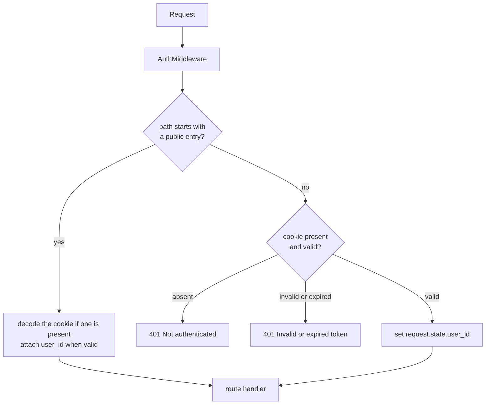
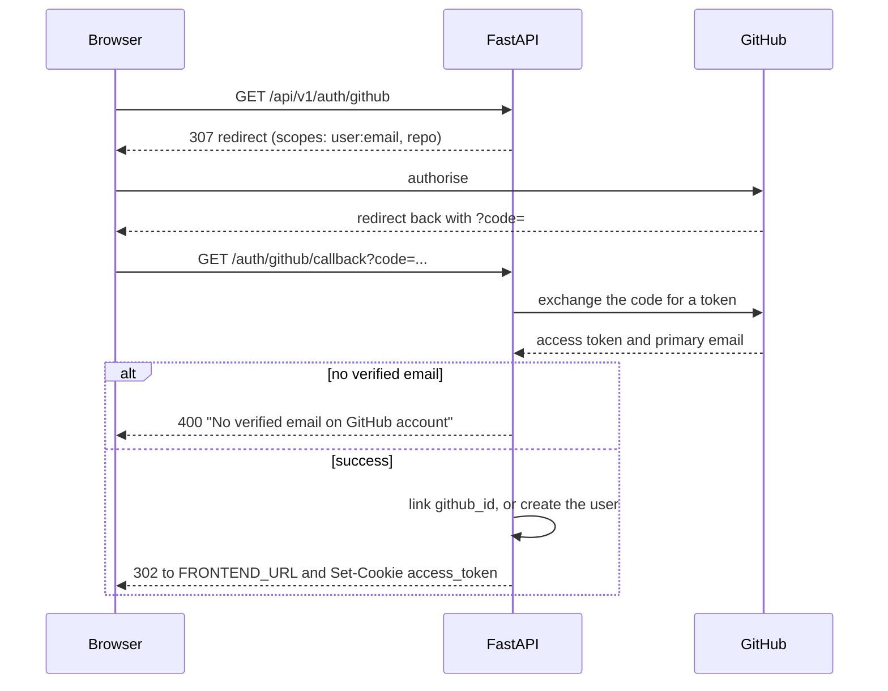

# Authentication and Authorisation

Sign in with GitHub, and every request that follows carries a signed cookie. That cookie is the only
thing standing between two users' repositories: there is no ORM-level scoping anywhere in the
codebase, so ownership is an explicit `user_id` filter in each query. Forget it once and you have a
data leak, not a bug that fails loudly.

This document covers both halves — proving who someone is, and deciding what they may touch — plus the
per-user LLM credential store that sits on the same route prefix. That last part is not really
authentication at all: it is a user's own API key, stored so the operator stops paying for their
generation.

If you are reading for the first time, [The shape of the problem](#the-shape-of-the-problem) is the
map. If you are preparing to discuss it,
[Design decisions and trade-offs](#design-decisions-and-trade-offs) collects the reasoning.

## Contents

- [The shape of the problem](#the-shape-of-the-problem)
- [The session cookie](#the-session-cookie)
- [The token](#the-token)
- [The middleware gate](#the-middleware-gate)
- [Reading identity in a route](#reading-identity-in-a-route)
  - [Ownership, and why it is a 404](#ownership-and-why-it-is-a-404)
- [Password storage](#password-storage)
- [GitHub OAuth](#github-oauth)
- [The AI credential store](#the-ai-credential-store)
  - [The save-time probe](#the-save-time-probe)
- [The threat model](#the-threat-model)
- [Troubleshooting](#troubleshooting)
- [Design decisions and trade-offs](#design-decisions-and-trade-offs)
- [Related documentation](#related-documentation)

## The shape of the problem

There are three separate concerns here, and keeping them apart is most of the design:

1. **Identity** — who is making this request? A JWT in an HttpOnly cookie, decoded by middleware.
2. **Authorisation** — may they touch this repository? An explicit `user_id` filter in every query.
3. **Credentials** — whose money pays for the model calls? A separate per-user store of LLM API keys.

They share a route prefix and nothing else. In particular, the credential store is *not* an
authentication mechanism: it is data belonging to an already-authenticated user, and it is never
consulted to decide who someone is.

## The session cookie

| Property   | Value                                                        |
| ---------- | ------------------------------------------------------------ |
| Name       | `access_token`                                               |
| Content    | A JWT signed with `SECRET_KEY`                                |
| `HttpOnly` | Yes                                                          |
| `SameSite` | `Lax`                                                        |
| `Secure`   | `true` when `ENVIRONMENT == "production"`, otherwise `false`  |
| `Domain`   | `settings.DOMAIN` — a bare hostname, never a URL or a port    |
| Lifetime   | None set on the cookie; expiry comes from the JWT's `exp`     |

The absence of `max_age` or `expires` means the browser treats it as a session cookie, but the token
inside remains valid until its own `exp` regardless. Logout deletes the cookie with the same flags it
was set with.

`DOMAIN` is a common misconfiguration: the value is written straight into the cookie's `Domain`
attribute, where a scheme (`https://`) or a port is invalid and causes the browser to reject the
cookie silently. It must be a bare hostname such as `localhost` or `illume.example.com`.

## The token

- **Library**: `python-jose`.
- **Algorithm**: `HS256`, hardcoded — not configurable.
- **Key**: `settings.SECRET_KEY`.
- **Claims**: exactly two — `sub` (the user's UUID as a string) and `exp`. No `iat`, `iss`, `aud`, or
  `jti`.
- **Lifetime**: `now(UTC) + ACCESS_TOKEN_EXPIRE_MINUTES`. The setting has **no default in code** —
  `1440` (24 hours) is the value written in `.env.example` and CI, not a fallback.

Decoding is deliberately total: `decode_access_token` returns `None` on any `JWTError` rather than
raising, so callers cannot forget to handle an invalid token.

The two-claim payload is worth noting if you are used to richer tokens. There is no revocation list and
no token version, so a stolen token is valid until it expires and cannot be individually invalidated —
rotating `SECRET_KEY` invalidates every session at once, which is the only lever.

## The middleware gate

`AuthMiddleware` runs on every request. It has an allow-list of public paths, matched with
`path.startswith(...)`:

```
/healthz
/api/v1/auth/login
/api/v1/auth/register
/api/v1/auth/logout
/api/v1/auth/github
/api/v1/auth/github/callback
/api/v1/contact
/api/v1/ws
/openapi.json
```



Two details matter:

1. **Public paths still attach identity when a valid cookie is present.** The middleware decodes
   opportunistically on public paths too, ignoring failures. This is what lets the contact endpoint
   note which signed-in user sent a message without requiring a session.
2. **Prefix matching is a bypass surface.** A future route whose path begins with any entry above
   would be unintentionally public — `/api/v1/auth/github` already covers `/github/callback` as a
   consequence.

Note also what is *not* on the list: `/docs` and `/redoc` are behind the gate, so the interactive API
schema needs a session. Only `/openapi.json` is public.

## Reading identity in a route

Two mechanisms, and the difference matters when reading the code:

- **`get_current_user`** (`app/api/deps.py`) is a proper FastAPI dependency. It reads
  `request.state.user_id`, fails with `401` if absent, loads the `User` row, and fails with `401`
  `"User not found"` if the row has since been deleted.
- **Middleware identity** is read directly as `request.state.user_id`. Routes that only need the id
  use this and raise their own `401` when it is missing.

### Ownership, and why it is a 404

`get_repo_for_user(repo_id, user_id, db)` is **a plain async function, not a dependency**. Routes call
it directly:

```python
repo = await get_repo_for_user(repo_id, user_id, db)
```

It filters on `Repository.id == repo_id AND Repository.user_id == user_id` and raises **`404`**, not
`403`, when nothing matches.

**There is no ORM-level scoping, no global query filter, and no `relationship()` in the models.** Each
route either calls this helper or repeats the `user_id` filter inline — `chat`, `graph`, and the
repository list/get/delete routes do the latter. This means a new route that forgets the filter is a
data leak, not a failure. When adding an endpoint, the ownership check is the one thing that must not
be omitted.

## Password storage

Passwords are hashed as:

```
bcrypt( base64( sha256(password) ) )
```

The SHA-256 pre-hash exists because bcrypt silently truncates input at 72 bytes — without it, two
passwords sharing their first 72 bytes would hash identically. The digest is base64-encoded because
bcrypt operates on bytes and cannot safely accept arbitrary binary.

Verification re-computes the pre-hash and calls `bcrypt.checkpw`. There is no pepper and no custom
cost factor — bcrypt's default work factor applies.

> **A known defect lives here.** Users created through GitHub OAuth have `password = NULL`, and
> `verify_password(plain, None)` raises `AttributeError` on `hashed.encode(...)`. A password login
> against a GitHub-only account is therefore a `500`, not a `401` — repeatable by anyone who knows the
> address, and distinguishable from the `401` a non-existent address returns.

## GitHub OAuth

GitHub OAuth is **login and account-link only**. It is not how repositories are cloned — cloning uses
the access token stored on the user row, which OAuth is what obtains.



Failure modes are `400`: a failed exchange returns `"GitHub auth failed"`, and an account with no
verified email returns `"No verified email on GitHub account"`.

Retrieving repos, branches and commits then happens through the
[GitHub proxy endpoints](api.md#github-proxy--apiv1github), so the browser never holds the token. The
`repo` scope is what makes private repositories cloneable; a user who signed in without it can still
use the product on public repositories.

## The AI credential store

Separate from authentication but on the same route prefix: a user may store their own LLM provider
credentials. Three endpoints under `/api/v1/auth/me/ai-credentials` handle it, all requiring a
session.

| Provider     | Default model             | Base URL                          | Reasoning |
| ------------ | ------------------------- | --------------------------------- | --------- |
| `openai`     | `gpt-4o-mini`             | `https://api.openai.com/v1`       | Yes       |
| `groq`       | `llama-3.3-70b-versatile` | `https://api.groq.com/openai/v1`  | **No**    |
| `openrouter` | `openai/gpt-4o-mini`      | `https://openrouter.ai/api/v1`    | Yes       |
| `deepseek`   | `deepseek-flash`          | `https://api.deepseek.com`        | Yes       |

The registry lives in `server/app/services/llm_providers.py` and deliberately imports no
configuration, so the probe can read base URLs without a fully populated environment. There is no
custom-URL option: allowing a user-supplied base URL would make the server issue authenticated
requests to an arbitrary host.

### The save-time probe

A key is validated **before it is stored**. `PUT /api/v1/auth/me/ai-credentials` issues a 16-token
Responses call with the supplied provider, key and model, and writes the row only on success. Each
failure message names the provider:

| Outcome               | Response                                          |
| --------------------- | ------------------------------------------------- |
| Bad key               | `400 "Incorrect API key for <Provider>."`          |
| Model unavailable     | `400 "That model isn't available on <Provider>."`  |
| Provider unreachable  | `400 "Could not reach <Provider>."`                |
| Unknown provider name | `422`                                              |

The probe uses a 15-second timeout and disables retries, so a slow provider fails at the form rather
than hanging the request. The API key must be 8–512 characters.

This is the difference between a form that tells a user their key is wrong and one that accepts it and
then produces empty glossaries an hour later. `GET` never returns the key — only whether one is
stored, which provider, which model, and when it was validated.

## The threat model

What this design defends against, and what it does not:

**Defended.** Cookie theft by cross-site scripting, because the token is HttpOnly and the client never
touches `localStorage`. Password reuse across sites, because passwords are salted per row. Enumerating
other users' repositories, because ownership failures are `404`.

**Not defended.** A stolen cookie is valid until `exp`; there is no revocation. GitHub OAuth access
tokens and BYOK API keys are stored **in plaintext**, matching how `github_access_token` is already
handled — a stored OpenAI key carries billing authority, so this is a real exposure if the database is
compromised. Three further weaknesses are recorded rather than fixed: prefix-matched public paths, the
WebSocket's `?token=` query parameter, and the absence of rate limiting on login and registration.

## Troubleshooting

**Login succeeds but the browser is not signed in.**

`DOMAIN` is wrong. A scheme or a port in the value makes the browser silently discard the cookie. Check
that it is a bare hostname matching the host you are browsing.

**Every request returns `401 Not authenticated`.**

The cookie is absent entirely — usually a CORS or `SameSite` problem, or a client not sending
`credentials: "include"`.

**`401 Invalid or expired token`.**

The cookie is present and the signature failed, or `exp` has passed. Rotating `SECRET_KEY` produces
this for every existing session at once.

**A password login returns `500`.**

The account is GitHub-only and has no stored password — see the note under
[Password storage](#password-storage).

**A saved API key produces generation failures.**

`from_user` returns `None` unless `ai_provider`, `ai_api_key` **and** `ai_model` are all set, so a
partially written row behaves as if no key exists. Re-saving the credential fixes it.

**A user can see another user's repository.**

An endpoint is missing its ownership check. Every repository-scoped route must either call
`get_repo_for_user` or filter on `user_id` inline.

## Design decisions and trade-offs

### Why a cookie rather than a bearer token?

Because a JWT in an HttpOnly cookie cannot be read by JavaScript, so a cross-site scripting bug cannot
exfiltrate the session. The trade is that the API needs CSRF protection rather than being immune to it
— the cookie is `SameSite=Lax` and CORS is pinned to a single origin, which is the mitigation in
place.

### Why is the token payload so small?

Because the middleware only needs to know *who*, and everything else is a database lookup away. A
richer token would carry stale claims — a role or a plan that changed after the token was minted — and
would need a refresh path to stay honest.

The cost is a `User` load on routes that use `get_current_user`, and no way to revoke a single token.

### Why does ownership return 404 instead of 403?

Because a `403` confirms the resource exists, letting an attacker enumerate repository ids by
difference. Returning `404` for both "not found" and "not mine" leaks nothing.

The cost is that a legitimate user who mistypes an id gets the same response as one who is
unauthorised, which is occasionally confusing.

### Why is there no ORM-level scoping?

Because SQLAlchemy has no first-class way to inject a per-query tenant filter without either session
events or a custom query class, and both make queries harder to read and to debug. An explicit
`user_id` filter is visible at the call site.

The cost is the one stated throughout this document: scoping is a convention, not a guarantee, and a
forgotten filter is a silent leak.

### Why pre-hash with SHA-256 before bcrypt?

Because bcrypt truncates at 72 bytes, silently. Two distinct long passwords sharing a 72-byte prefix
would be interchangeable. Hashing first produces a fixed-length digest that bcrypt can take whole.

The cost is one extra hash per verification, which is negligible next to bcrypt itself.

### Why probe a key before storing it?

Because first use is minutes later, in a background task, on the user's least-attended surface. A key
that fails there produces an empty glossary and a repository that never quite looks right, with
nothing connecting the symptom to the credential. See
[pipeline/generation.md](pipeline/generation.md#why-probe-a-key-at-save-time-rather-than-on-first-use).

### Why store the keys in plaintext?

Because the alternative — encrypting with a key the application also holds — buys little against the
threat that matters (a compromised database) while adding a key-management problem and a decryption
step on every generation call. The exposure is documented rather than mitigated.

That is a defensible position for `github_access_token`, which is scoped and revocable at the provider.
It is weaker for a stored OpenAI key, which carries billing, and the difference is worth knowing.

### Why does GitHub OAuth not handle cloning?

Because the OAuth token is obtained once, at login, and cloning happens later, possibly much later.
Storing the token on the user row decouples the two: a clone can happen in a worker on a background
sync with no user present at all.

## Related documentation

- [api.md](api.md) — every endpoint, its auth requirement, and its status codes.
- [websockets.md](websockets.md) — the second authentication path, and its `?token=` compromise.
- [deployment.md](deployment.md#the-environment-file) — where `SECRET_KEY`, `DOMAIN` and the OAuth
  variables are set in production, and the shape each one has to have.
- [pipeline/generation.md](pipeline/generation.md) — what the stored credential is used for, and the
  free tier it replaces.
- [data-model.md](data-model.md) — the `users` table, including the credential and quota columns.
- [deployment.md](deployment.md) — where the secrets live in production.
