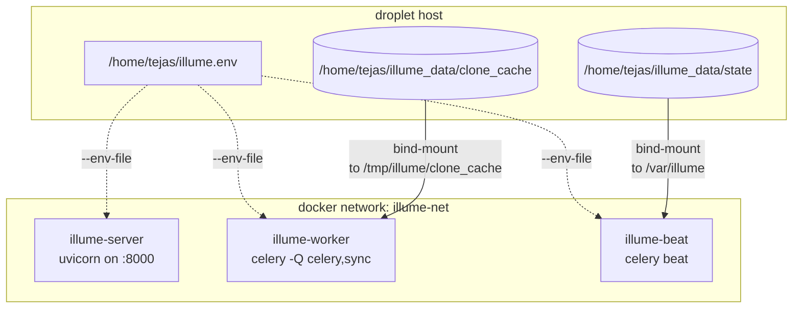
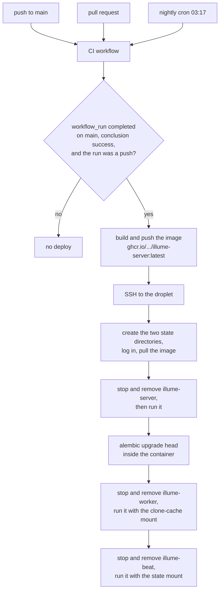

# Deployment

Every deploy runs `docker stop` → `docker rm` → `docker run`. Nothing survives a container's removal
except what is on a bind mount, and the two things that matter most to this product — a cache of cloned
repositories and a scheduler's last-run timestamps — are both files inside a container that gets
deleted.

That is the constraint the whole deployment is shaped around. The backend runs as three containers on a
single DigitalOcean droplet, built from one image and restarted by GitHub Actions; the frontend is
deployed separately.

This document covers the image, the three processes and why they are separate, the state that must
survive a deploy, and the CI/CD workflows that put it all in motion.

The configuration is in `server/Dockerfile`, `.github/workflows/ci.yml`,
`.github/workflows/deploy.yml`, and `.github/workflows/prod-smoke.yml`.

If you are operating an instance, [State that must survive a deploy](#state-that-must-survive-a-deploy)
is the section to read closely — every entry in it fails silently when it is wrong. If you are looking
for why the worker uses one process,
[Why the worker is `--concurrency=1`](#why-the-worker-is---concurrency1).

## Contents

- [The image](#the-image)
- [The three processes](#the-three-processes)
  - [Why the worker is `--concurrency=1`](#why-the-worker-is---concurrency1)
  - [Why the worker consumes two queues](#why-the-worker-consumes-two-queues)
  - [Why beat is a separate container](#why-beat-is-a-separate-container)
  - [The environment file](#the-environment-file)
- [State that must survive a deploy](#state-that-must-survive-a-deploy)
- [CI](#ci)
- [Deploy](#deploy)
- [Production smoke tests](#production-smoke-tests)
- [Local test infrastructure](#local-test-infrastructure)
- [The Makefile](#the-makefile)
- [Troubleshooting](#troubleshooting)
- [Design decisions and trade-offs](#design-decisions-and-trade-offs)
- [Related documentation](#related-documentation)

## The image

A two-stage build on `python:3.14-slim`.

**Builder stage** installs the compiler toolchain (`libpq-dev`, `gcc`, `git`) and `uv`, then runs:

```bash
uv sync --frozen --no-dev
```

`--frozen` means the lockfile is authoritative — a dependency change requires regenerating `uv.lock`,
which is why adding a package is a build change rather than a one-line edit. `--no-dev` keeps test
tooling out of the production image.

**Runtime stage** installs only `libpq-dev` and `git` — no compiler — and copies the virtual environment
across. It then runs:

```
uvicorn app.main:app --host 0.0.0.0 --port 8000
```

**`git` is in the runtime image because the product shells out to it.** Cloning, history mining, and
the sync probe are all real `git` invocations, not library calls. Dropping `git` from the runtime stage
would break ingestion entirely while leaving the API perfectly healthy.

## The three processes

| Container       | Command                                                                                                                              |
| --------------- | ------------------------------------------------------------------------------------------------------------------------------------ |
| `illume-server` | `uvicorn app.main:app` — the HTTP API and the WebSocket                                                                              |
| `illume-worker` | `celery -A app.core.celery worker --loglevel=info --pool=prefork --concurrency=1 -Q celery,sync --max-memory-per-child=614400`        |
| `illume-beat`   | `celery -A app.core.celery beat --loglevel=info -s /var/illume/celerybeat-schedule`                                                   |

All three run on the same Docker network, `illume-net`, and read the same environment file,
`/home/tejas/illume.env`.

### Why the worker is `--concurrency=1`

**Each ingestion peaks at several hundred megabytes**, and the overlapped stages inside one task are
threads, not processes — so a single ingest already uses the concurrency it needs. Running two at once
multiplies the parse-phase memory floor rather than halving the wall-clock.

The `prefork` pool takes its default concurrency from the **container's** reported CPU count, not the
VM's vCPU count, so deploying without `--concurrency=1` silently runs several workers. That is the kind
of misconfiguration that looks fine until a large repository arrives.

`--max-memory-per-child=614400` recycles a worker child after it has handled roughly 600 MB, capping
the damage from a slow leak across many ingests. This is a different knob from the
`worker_max_tasks_per_child=10` set in `app/core/celery.py`, which recycles after ten tasks — both are
in play, and they are easy to confuse.

`--pool=prefork` is required for both limits to have any effect. A `solo` pool ignores them.

### Why the worker consumes two queues

The worker listens on `celery` (initial ingests) and `sync` (background updates). They share one
concurrency-1 process, so **syncs serialise globally against ingests** — two overlapping parses would
exhaust the box.

The `sync` queue exists so a second worker pool can be split off later without a code change. Task
routing sends `sync_repository` to it; everything else stays on the default queue.

### Why beat is a separate container

Beat is a scheduler, not a worker. It runs `sweep_due_repositories` every ten minutes, and the schedule
is registered when `app.tasks.autoupdate` is imported.

It keeps its state — the last-run timestamps — in a schedule file, named with
`-s /var/illume/celerybeat-schedule`, on a bind mount. Without the mount, every deploy restarts the
cadence from zero. See [pipeline/sync.md](pipeline/sync.md#the-scheduler) for what the sweep does.

### The environment file

All three containers read one file at `/home/tejas/illume.env`, passed with `--env-file`. The backend's
`Settings` class requires every field, so a variable missing from that file is a container that exits
at startup rather than one that runs with a wrong default.

Two values in it have a shape that matters, and both fail in ways that do not point at the value:

- **`DOMAIN` must be a bare hostname.** It is written straight into the session cookie's `Domain`
  attribute, where a scheme or a port is invalid and makes the browser discard the cookie *silently*.
  Use `illume.example.com`, never `https://illume.example.com` or a value with a port. See
  [auth.md](auth.md#the-session-cookie).
- **`CONTACT_FROM_EMAIL` must be a bare address with no quotes and no display name.** Docker's
  `--env-file` parser does no quote processing, so `CONTACT_FROM_EMAIL="Illume <hi@x.com>"` arrives
  verbatim, quotes included, and Resend rejects the mailbox. The key must also belong to the Resend
  account that has the domain verified, or delivery fails with "domain not verified".

The generation credentials the worker reads — `AI_API_KEY`, `AI_MODEL`, `AI_BASE_URL` — are described
in [pipeline/generation.md](pipeline/generation.md#configuring-the-operators-credential), including why
an empty `AI_API_KEY` is the free-tier switch.

## State that must survive a deploy



Two directories are mounted, for exactly the reason in the opening paragraph:

| Host path                             | Container path            | Used by | Consequence if missing                                                         |
| ------------------------------------- | ------------------------- | ------- | ------------------------------------------------------------------------------ |
| `/home/tejas/illume_data/clone_cache` | `/tmp/illume/clone_cache` | worker  | Every deploy destroys the clone cache, so the next sync re-clones from scratch  |
| `/home/tejas/illume_data/state`       | `/var/illume`             | beat    | The beat cadence resets on every deploy                                        |

**The container path for the cache is not arbitrary.** `repo_cache._cache_root` resolves to
`tempfile.gettempdir() / "illume" / "clone_cache"`, which inside a Linux container is
`/tmp/illume/clone_cache`. The mount has to match that exactly, or the cache silently writes to the
ephemeral layer instead — and because the cache is a performance optimisation that falls back to
ephemeral clones on any failure, **it never reports the problem**. The only symptom is that syncs take
longer than they should.

Both directories are created by the deploy script before the containers start.

## CI

`ci.yml` runs on every pull request, on every push to `main`, and nightly at 03:17 UTC. Five jobs:

| Job              | What it does                                                                                        |
| ---------------- | --------------------------------------------------------------------------------------------------- |
| `backend-lint`   | Blocking: ruff and mypy over `tests/`. Report-only: ruff and mypy over `app/`                         |
| `frontend-lint`  | Blocking: `next typegen`, `tsc --noEmit`, eslint over tests/e2e/config. Report-only: eslint over `src/` |
| `backend-tests`  | Postgres (`pgvector/pgvector:pg16`) and Redis as services; migrations, then pytest with coverage      |
| `frontend-tests` | `npm run test:coverage`                                                                               |
| `e2e-nightly`    | Playwright; runs only on the schedule or a push to `main`, not on PRs                                 |

**The lint split is deliberate.** The `tests/` trees are clean and their lint is blocking; the
application code carries standing debt, so `ruff check app/`, `mypy app` and the `src/` eslint run with
`continue-on-error: true`. The debt stays visible in the log without failing the build. See
[testing.md](testing.md) for the current backlog.

**The backend test job runs `alembic upgrade head` as its own step before pytest.** Without it, several
xdist workers race to migrate the same fresh database and produce a scatter of unrelated errors — which
is also why a local backend run against a brand-new database can fail oddly and pass on the next try.

**Coverage is a ratchet, not a target.** Both test jobs compare measured coverage against a committed
floor file (`server/.coverage-floor`, `client/.coverage-floor`) and fail if it drops below. The floor
only moves up, and a PR that raises coverage is expected to raise the file in the same commit. The
README badges carry the floor values rather than a last-measured number, so they stay true between runs.

**`next typegen` runs before `tsc`** because `next-env.d.ts` is gitignored. Without it, a fresh checkout
reports a missing-module error for every asset import.

## Deploy



`deploy.yml` is triggered by the **CI workflow completing**, not by the push itself:

```yaml
on:
  workflow_run:
    workflows: [CI]
    types: [completed]
    branches: [main]
```

It proceeds only when CI concluded successfully **and** the triggering run was a push. So a red CI
blocks the deploy, and the image is built from the exact commit CI validated.

> **There is no path filter.** A documentation-only commit still rebuilds the image and restarts all
> three containers, which costs a few seconds of API downtime. That is an accepted trade: a missed
> backend deploy costs more than a brief restart.

The job builds and pushes `ghcr.io/<owner>/illume-server:latest`, then SSHes to the droplet and runs a
script that, in order:

1. Creates the two state directories.
2. Logs in to the registry and pulls the image.
3. Stops and removes `illume-server`, then starts it on `illume-net` with the env file.
4. **Runs `alembic upgrade head` inside the API container.** Migrations are applied by the deploy, not
   at application startup, so a bad migration fails the deploy rather than a running process.
5. Stops and removes `illume-worker`, then starts it with the clone-cache mount.
6. Stops and removes `illume-beat`, then starts it with the state mount.

The SSH command timeout is 60 minutes, because a large migration can legitimately take a while.

## Production smoke tests

`prod-smoke.yml` runs nightly at 04:43 UTC and on manual dispatch. It exercises the **deployed** site
with Playwright — signing in with credentials from repository secrets and checking that the live
instance and its dependencies are healthy.

It runs no services, no migrations, and no database of its own: it is a black-box check against
production. On failure it uploads the Playwright report as an artifact.

The dependency probe it relies on is `GET /healthz`, which returns `503` rather than `200` with a
failure flag when something is down — so an ordinary uptime monitor needs no custom logic. See
[api.md](api.md#health--get-healthz).

## Local test infrastructure

`docker-compose.test.yml` is the only compose file in the repository. It provides:

| Service         | Image                    | Port        |
| --------------- | ------------------------ | ----------- |
| `postgres-test` | `pgvector/pgvector:pg16` | 5433 → 5432 |
| `redis-test`    | `redis:7`                | 6380 → 6379 |

Both ports are offset from the development defaults so the two never collide. Postgres uses a tmpfs
data directory, so the test database is fast and disposable. There is no init script — the first
migration creates the `vector` extension.

`make test-infra` starts it; `make test-infra-down` stops it.

## The Makefile

| Target            | Does                                       |
| ----------------- | ------------------------------------------ |
| `test-infra`      | Start the test stack and wait for health    |
| `test-infra-down` | Stop it                                     |
| `test`            | Backend and frontend suites                 |
| `test-be`         | pytest, excluding slow marks                |
| `test-fe`         | Vitest, single pass                         |
| `test-e2e`        | Playwright end-to-end                       |
| `test-e2e-prod`   | Playwright against the deployed site        |
| `lint`            | Both linters                                |
| `lint-be`         | ruff check, ruff format check, mypy         |
| `lint-fe`         | `next typegen`, `tsc`, eslint               |

See [testing.md](testing.md) for what each suite covers.

## Troubleshooting

**A deploy succeeds but the old code is still running.**

Check that CI actually passed for that commit. The deploy is gated on the CI workflow concluding
successfully; a skipped or failed CI run produces no deploy at all.

**The clone cache is empty after every deploy.**

The bind mount is missing, or its container path does not match `/tmp/illume/clone_cache`. The cache
falls back to ephemeral clones without complaining, so this fails silently — the only symptom is that
syncs take longer than they should.

**Beat stops running sweeps.**

Check the schedule-file mount. A missing `/var/illume` mount means the schedule file is written into
the container's ephemeral layer and lost on the next deploy.

**The worker is OOM-killed on a large repository.**

Confirm `--concurrency=1` is actually in the `docker run` command. The default prefork concurrency
comes from the container's CPU count and can silently be greater than one.

**Migrations did not run.**

They run inside the API container as a deploy step, after the container starts and before the worker is
replaced. Check the deploy log for the `alembic upgrade head` step specifically.

**The contact form returns `503` or `502` in production while working locally.**

`RESEND_API_KEY` or `CONTACT_TO_EMAIL` is empty in the env file — the endpoint refuses a submission it
cannot deliver rather than accepting it. A `502` naming a domain means the key's Resend account has not
verified `CONTACT_FROM_EMAIL`'s domain.

**A container exits at startup with a validation error naming a field.**

That variable is missing from `/home/tejas/illume.env`. Every `Settings` field is required; there are no
defaults to fall back on.

**Ingestion fails immediately with a `git: not found` style error.**

The runtime image is missing `git`. It is installed explicitly in the runtime stage, and trimming it as
an unused build dependency breaks every clone.

## Design decisions and trade-offs

### Why bind mounts rather than a volume?

Because the deploy script is imperative and self-contained — it creates two host directories before it
starts anything. A named volume would work equally well and would survive the same `docker rm`, but it
would put that state somewhere the operator has to look up rather than somewhere they can `ls`.

The cost is that the paths are absolute and host-specific. `/home/tejas/illume_data` appears in the
workflow file, so moving the deployment to another host means editing the workflow.

### Why does the deploy restart all three containers?

Because the image tag does not change — it is `:latest` — so there is no way to tell a container to pull
a new one. `docker stop` → `docker rm` → `docker run` is the only sequence that guarantees the running
code matches the built image.

The cost is a few seconds of API downtime on every deploy, including documentation-only commits. That
is accepted: a missed backend deploy costs more.

### Why does the deploy run migrations instead of the application?

Because a migration failure should fail the *deploy*, where a human is already watching the output,
rather than crash-loop a container in production. Running it as an explicit step also means the API,
the worker and beat all start against a database that is already at the right revision — no race
between three processes each trying to migrate on startup.

The cost is that the deploy has a step that can fail after the API container is already running, and
the rollout is not atomic. The order is chosen so the failure lands between the API and the worker,
with the API already on the new image.

### Why is the worker pinned to one process when the box could run more?

Because memory, not CPU, is the binding constraint — and because the concurrency the pipeline needs is
already inside a single task. The stages overlap on thread pools, so a single ingest keeps a machine's
worth of cores busy without a second process. A second concurrent ingest does not halve the time; it
adds another parse-phase memory floor to the same box.

The cost is that a queue of pending ingests is processed strictly serially, and one pathologically
large repository delays every other user's ingestion behind it.

### Why is the sync queue separate if it shares the same worker?

So that splitting it later is a deployment change rather than a code change. The routing already exists;
adding a second worker pool pointed at `-Q sync` is a `docker run` flag.

The cost is a queue that is, today, never consumed independently — which makes it look like dead
configuration to a reader who has not seen this reasoning.

### Why does CI block on tests but not on application lint?

Because the tests are clean and the application code is not, and a build that fails on 89 pre-existing
ruff findings is a build nobody can merge against. Blocking on tests keeps the bar where it matters;
report-only lint keeps the debt visible and shrinking without turning it into a merge gate.

The cost is that the debt can grow silently under a green check. The counts in
[testing.md](testing.md) exist to make that growth visible.

## Related documentation

- [pipeline/sync.md](pipeline/sync.md) — the sweep beat schedules, and the clone cache the mount
  preserves.
- [data-model.md](data-model.md#migrations) — what `alembic upgrade head` does, and the 24 revisions it
  applies.
- [testing.md](testing.md) — the suites CI runs, and the coverage ratchet.
- [api.md](api.md#health--get-healthz) — the endpoint the smoke tests probe.
