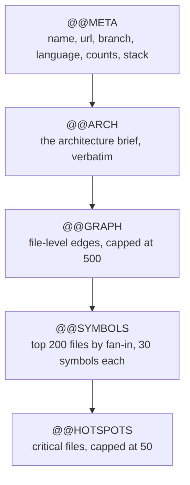

# The Text Export

Illume can render a completed analysis as a single plain-text document, marked with `@@` section
headers. It exists for one narrow purpose: to be pasted into a language model.

That purpose explains everything about its shape. It is not a backup, not a machine-readable
interchange format, and not complete — it is a hand-built summary of the parts of an analysis a model
needs in order to answer questions about a repository it has never seen.

The code is in `server/app/services/illume_exporter.py`, served by
`GET /api/v1/repository/{repo_id}/export/illume`.

## Contents

- [Downloading it](#downloading-it)
- [The document at a glance](#the-document-at-a-glance)
- [Section reference](#section-reference)
  - [`@@META`](#meta)
  - [`@@ARCH`](#arch)
  - [`@@GRAPH`](#graph)
  - [`@@SYMBOLS`](#symbols)
  - [`@@HOTSPOTS`](#hotspots)
- [The caps, and where they come from](#the-caps-and-where-they-come-from)
- [What it is not](#what-it-is-not)
- [Troubleshooting](#troubleshooting)
- [Design decisions and trade-offs](#design-decisions-and-trade-offs)
- [Related documentation](#related-documentation)

## Downloading it

The endpoint returns `text/plain` with a `Content-Disposition` header naming the file
`<repository-name>.illume`.

| Response | When                                                       |
| -------- | ---------------------------------------------------------- |
| `200`    | The analysis is complete                                   |
| `400`    | The repository is not `ready`                               |
| `404`    | The repository is not the caller's, or has no analysis data |

In the UI, `ExportIllumeButton.tsx` downloads the document and names it from the `repo=` line **inside
the bundle**, so the filename matches the repository rather than the internal identifier.

## The document at a glance

One plain-text file, five sections, always in this order:



The order is a reading order: identity, then the prose summary, then the structure, then the detail,
then the short list of what matters most. A reader who stops after `@@ARCH` has still read the point
of the document.

## Section reference

### `@@META`

One key per line: the repository name, its URL, the branch, the primary language, the generation date,
the counts of files, symbols, and edges, the detected stack, and the entry points.

Two fallbacks apply when the source fields are unset: the branch becomes `main` and the language
becomes `unknown`. Stack and entry points are flattened from their stored JSON structures into a
single comma-separated line each.

The counts here are **pre-truncation totals**. A repository with 4,000 edges reports 4,000 in `@@META`
and shows 500 in `@@GRAPH` — the gap is the cap, not a bug.

### `@@ARCH`

The architecture brief, verbatim.

When no brief was generated, the section contains the literal line
`No architecture summary generated.` — an explicit marker rather than an empty section, so a reader
can tell an empty brief from a truncated file.

### `@@GRAPH`

The file-level dependency edges, sorted by source and then target path, one per line:

```
src/app/main.py -> src/app/core/config.py [imports:Settings,get_settings]
```

Each line names the dependency types connecting the pair and the symbols involved. Two rules keep it
compact:

- **A symbol is dropped only when its name is exactly `<anonymous>` _and_ its edge type is `imports`.**
  A genuine import annotation with real names is kept, as the example above shows. If a dependency
  type is left with no symbols at all, that type is omitted from the line.
- **At most five symbols are listed per dependency type.** More are elided with a trailing `,...`.

Multiple dependency types for the same pair are joined with `; `. A pair whose annotations were all
dropped appears as a bare `src -> tgt`.

The section is **capped at 500 edges**. When there are more, the last line reads
`... and N more edges`.

Because only `imports` edges exist in the database (see
[data-model.md](data-model.md#dependencies)), every annotation in this section is an import. The
`calls` form the format supports has never been produced.

### `@@SYMBOLS`

The symbol listing for the **top 200 files by fan-in**, so the most structurally important files are
the ones that appear. Only functions, classes, and methods are listed, prefixed `fn:`, `cls:`, and
`meth:`, sorted by kind and then name:

```
src/app/core/config.py: fn:get_settings cls:Settings
```

Each file is capped at **30 symbols**, elided with a trailing `...`.

### `@@HOTSPOTS`

Files whose criticality is anything other than `safe`, sorted by fan-in descending and capped at
**50**:

```
src/app/core/database.py [critical,fan_in=14,cc=3]
```

The complexity value is omitted when it is not known. **This is the section to read first** — it is
the short list of files that matter most, and it is where a model answering questions about the
codebase should start.

## The caps, and where they come from

| Section    | Cap                     | Ordering                  |
| ---------- | ----------------------- | ------------------------- |
| `@@GRAPH`  | 500 edges               | by source, then target    |
| `@@SYMBOLS`| 200 files, 30 each      | by fan-in descending      |
| `@@HOTSPOTS`| 50 files               | by fan-in descending      |

The caps are not arbitrary. Two constraints produced them:

1. **A token budget.** The document is meant to fit in a model's context window alongside a question
   and an answer. The caps are what keep a large repository inside that envelope.
2. **Ordering so truncation drops the least interesting material.** Every capped section is sorted by
   importance before it is cut, so what falls off the end is the material a reader was least likely to
   want. An arbitrary tail would make the cap a coin flip.

A third constraint shaped the *implementation* rather than the format: the exporter originally loaded
every symbol row for the repository — source text, docstrings, everything — just to pick out three
fields, which made it the largest object in the API process on a large repository. It now selects only
the columns it needs, which keeps the request inside the same memory envelope the worker survives.

## What it is not

- **Not a backup.** It contains no source code beyond symbol names, and no embeddings, chat history,
  or pull requests.
- **Not complete.** Edges are capped at 500, symbols to 200 files, hotspots to 50.
- **Not machine-readable.** There is no parser for this format and no schema. It is text for a human or
  a model to read, and the `@@` markers exist to orient a reader — not to be parsed.
- **Not stable across versions.** Nothing version-stamps the format or the caps, so a document
  generated today and one generated next month can differ in shape.

## Troubleshooting

**The export is `400`.**

The repository is not `ready`. It must have completed a full analysis.

**The export is much shorter than expected.**

Check `@@META`'s counts against the caps. A repository with thousands of edges will show 500 and an
`... and N more edges` line — the intended truncation, not a failure.

**The brief section contains `No architecture summary generated.`**

The architecture brief failed to generate and degraded to its placeholder rather than failing the
run. See [pipeline/generation.md](pipeline/generation.md#stage-5--failure-and-degradation).

**A repository exports with no edges at all.**

Import resolution produced nothing — usually a language or a module layout the resolver does not
handle. The `@@META` edge count will be zero, and `@@GRAPH` will be empty.

**The download is named something odd.**

The button takes the filename from the `repo=` line inside the bundle. If the repository's name
contains characters a filesystem rejects, the browser decides what to do with them.

## Design decisions and trade-offs

### Why a custom text format rather than JSON or Markdown?

Because the consumer is a language model reading a prompt, and both alternatives are worse for that.
JSON spends tokens on punctuation and quotes that carry no meaning to a reader, and a model has to
parse structure before it can use content. Markdown has no convention for section boundaries that a
model can rely on.

The `@@SECTION` markers cost a few tokens and are unambiguous to both a model and a person skimming
the file. The cost is that nothing else can consume the format — there is no parser, and adding one
would mean the format now has a schema to keep stable.

### Why is `@@HOTSPOTS` last when it is the most useful section?

Because the document follows a reading order rather than an importance order: identity, summary,
structure, detail, highlights. A reader who reads top to bottom gets context before detail, which is
how the analysis is meant to be understood.

The cost is that the most actionable section is the furthest from the top, which is why the section
reference above says to read it first.

### Why cap `@@SYMBOLS` by fan-in rather than alphabetically or by size?

Because fan-in is the closest available proxy for structural importance, and the section is meant to
describe a codebase rather than enumerate one. A file imported by fourteen others belongs in a summary
of the system; a long file nobody imports does not.

The cost is that a genuinely important leaf module — a public API entry point with no importers — is
omitted entirely, and nothing in the document says so.

### Why does `@@GRAPH` keep `<anonymous>` symbols only for non-import edges?

Because the two cases mean different things. An anonymous *import* carries no information — the line
already says the files are connected — while an anonymous symbol on another edge type is at least
evidence that the edge was derived from real syntax rather than a path match.

The rule is asymmetric because the underlying data is: since only `imports` edges exist today, this
distinction has no effect in practice. It is ready for edge types the resolver does not yet produce.

### Why does the export re-derive its own graph rather than reusing the graph endpoint's payload?

Because the two want different things. The graph endpoint returns every node and edge for rendering,
with a per-request criticality score and client-oriented fields. The export wants a capped, sorted,
symbol-annotated projection in text. Sharing the payload would mean either the export carrying
rendering concerns or the graph endpoint carrying export concerns.

The cost is a third place that understands how dependency edges are shaped — alongside the graph
builder and the `file_graph` helper. See
[pipeline/graph.md](pipeline/graph.md#why-two-implementations-of-the-same-join).

## Related documentation

- [api.md](api.md) — the endpoint that serves this document, and its status codes.
- [data-model.md](data-model.md) — the tables the export reads, and why only `imports` edges exist.
- [pipeline/graph.md](pipeline/graph.md) — how the file-level edges this section prints are derived.
- [pipeline/git-intelligence.md](pipeline/git-intelligence.md) — what criticality means and how a file earns `critical`.
- [pipeline/generation.md](pipeline/generation.md) — the architecture brief that fills `@@ARCH`.
