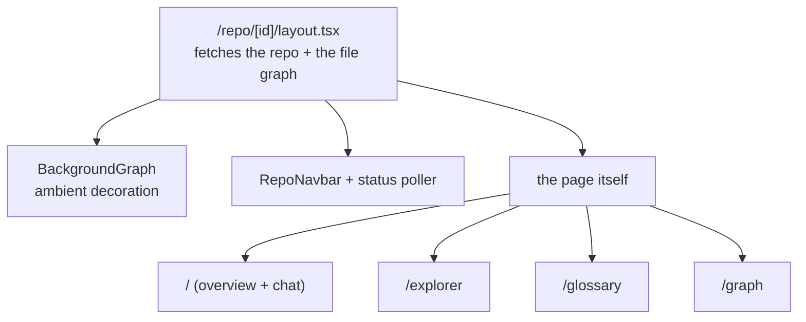
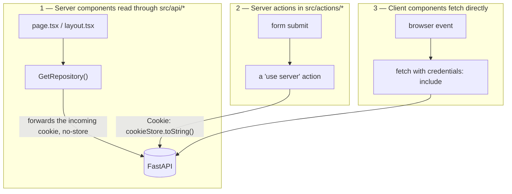

# The Frontend

Three different ways of reaching the backend ship in the same application. Some requests go through
`src/api/*` with the incoming cookie forwarded by hand; some go through server actions with the cookie
pasted into a header; some are plain `fetch` calls from the browser with `credentials: "include"`.

It looks like drift, and it reads that way until you know which one each screen needs. The rule is
mechanical once you see it — but a reader who does not know the rule will "fix" the inconsistency and
break authentication on the screen they were touching.

This document covers the routes, the server/client split, all three fetching strategies and why each
one exists, and the constraints the WebGL views impose.

The code is in `client/src/`. It is a Next.js 16 App Router application on React 19 and Tailwind 4,
with `react-force-graph-3d` for the dependency graph.

If you are reading for the first time,
[Data fetching](#data-fetching-three-strategies-deliberately) is the part worth slowing down for. If
you are about to write client code, read [Next.js 16 specifics](#nextjs-16-specifics) first.

## Contents

- [Routes](#routes)
- [The auth gate](#the-auth-gate)
- [Server and client components](#server-and-client-components)
- [Data fetching: three strategies, deliberately](#data-fetching-three-strategies-deliberately)
  - [1 — Server components through `src/api/*`](#1--server-components-through-srcapi)
  - [2 — Server actions in `src/actions/*`](#2--server-actions-in-srcactions)
  - [3 — Client components fetching directly](#3--client-components-fetching-directly)
- [WebGL and dynamic imports](#webgl-and-dynamic-imports)
- [The three graph components](#the-three-graph-components)
- [Other notable components](#other-notable-components)
- [Hooks](#hooks)
- [Types and validation](#types-and-validation)
- [Configuration](#configuration)
- [Next.js 16 specifics](#nextjs-16-specifics)
- [Troubleshooting](#troubleshooting)
- [Design decisions and trade-offs](#design-decisions-and-trade-offs)
- [Related documentation](#related-documentation)

## Routes

| Path                  | Kind   | Renders                                                             |
| --------------------- | ------ | ------------------------------------------------------------------- |
| `/`                   | Client | The marketing landing page, including a contained 3D graph           |
| `/login`              | Server | The OAuth sign-in form                                               |
| `/contact`            | Server | The contact form, inside a signed-in navbar when a session exists     |
| `/dashboard`          | Server | The repository grid, the add-repository modal, the free-tier banner  |
| `/settings`           | Server | The BYOK credential editor                                           |
| `/repo/[id]`          | Server | Overview: architecture summary, detected stack, and the chat         |
| `/repo/[id]/explorer` | Server | The file tree and reading-order explorer                             |
| `/repo/[id]/glossary` | Server | The searchable glossary, paginated                                   |
| `/repo/[id]/graph`    | Server | The interactive 3D dependency graph                                  |



A repository that is still being analysed renders the live progress view instead of the overview —
`/repo/[id]` is where the ingest stream is shown. See [websockets.md](websockets.md).

Three structural facts about the layout:

- **`/repo/[id]/layout.tsx` is the shared shell.** It fetches the repository and its file-level graph
  once, then wraps every sub-route in the ambient background graph, the navbar, a status poller, and
  an animated transition.
- **Every route under `/repo`, plus `/dashboard` and `/settings`, has a `loading.tsx`.** The root,
  login, and contact routes do not.
- **Error boundaries exist at the root and at `/repo/[id]`.** An error thrown by the repository
  layout itself falls through to the *root* boundary rather than the nested one — the nested boundary
  cannot catch a failure in the layout that renders it.

## The auth gate

`src/proxy.ts` is the Next.js middleware. **Next 16 renamed the convention from `middleware` to
`proxy`**, and the export follows the filename.

It is an auth gate, not a network proxy — nothing is forwarded anywhere, and there are no rewrites in
`next.config.ts`. It:

- redirects unauthenticated users away from `/dashboard`, `/repo`, and `/settings`, matched by prefix;
- redirects signed-in users away from `/login` and `/` to the dashboard;
- excludes static assets and the API path through its matcher.

## Server and client components

The split follows one rule: **fetch on the server, interact on the client.**

- **Pages and layouts are server components** by default. They read data and render markup.
- **Anything with state, effects, or event handlers is a client component.** In practice that means
  almost everything under `src/components/`.

Two components are server components despite living in the components directory — the footer and the
navbar skeleton — because neither needs interactivity.

> **A latent hazard lives here.** `RepoSettings.tsx` calls `useRouter` and `useState` but carries no
> `"use client"` directive. It works only because it is always rendered inside an already-client tree
> — the repository navbar's modal. Importing it from a server component fails at build time. Add the
> directive if you touch the file.

## Data fetching: three strategies, deliberately



The choice is made by **where the code runs**, not by which endpoint is being called:

| Strategy | Runs in     | Used for                                        | Cookie comes from                    |
| -------- | ----------- | ----------------------------------------------- | ------------------------------------ |
| 1        | Server      | Reads — pages and layouts                       | `headers().get("cookie")`, forwarded  |
| 2        | Server      | Writes — delete, save, sync, export             | `cookieStore.toString()`              |
| 3        | Browser     | Anything after the page has loaded              | The browser sends it automatically    |

### 1 — Server components through `src/api/*`

Server components call functions in `src/api/*`, which forward the **incoming request's cookie**
explicitly:

```ts
cookie: (await headers()).get("cookie") ?? ""
```

They also use `cache: "no-store"`.

The explicit forwarding is required, not decorative: a server-side fetch does **not** automatically
carry the browser's cookie, so without it every authenticated request would arrive anonymous. Some of
these modules are marked `"use server"` and the rest are plain server-only async functions — the
distinction is about what the caller needs, not about the fetching technique.

### 2 — Server actions in `src/actions/*`

Mutations — deleting a repository, saving credentials, triggering a sync, exporting — go through
server actions marked `"use server"`, which forward the cookie as a header:

```ts
Cookie: cookieStore.toString()
```

Writes go through actions so the mutation happens server-side and the UI can then refresh.

### 3 — Client components fetching directly

Client components and hooks call the backend **directly**, with the browser's own cookie:

```ts
fetch(url, { credentials: "include" })
```

This is what makes the chat, the live ingest stream, and the GitHub picker work without a round trip
through Next.js, and it is the right choice for anything that happens after the page has loaded.

`src/api/github.ts` is the one API module that is client-side only: it uses `credentials: "include"`
and no cookie forwarding, because GitHub browsing happens in the browser.

**The browser reaches the backend at an absolute URL**, `NEXT_PUBLIC_BACKEND_URL`. There is no rewrite
or proxy in `next.config.ts`, which is why the server pins CORS to a single origin. The variable is
inlined at build time and has **no fallback in code** — a build without it produces a bundle that
calls `undefined`, which is why `.env.example` supplies the local value.

## WebGL and dynamic imports

Three.js needs browser globals, so the 3D components are dynamically imported with server-side
rendering disabled:

```ts
dynamic(() => import("react-force-graph-3d"), { ssr: false })
```

**Any new WebGL component must follow this pattern**, or the build fails on the server render. This
applies to `GraphClient.tsx` and `BackgroundGraph.tsx` today.

## The three graph components

These are frequently confused, and only one of them is a dependency graph:

| Component             | What it is                                                                                       | Where it appears                          |
| --------------------- | ------------------------------------------------------------------------------------------------ | ----------------------------------------- |
| `GraphClient.tsx`     | The interactive 3D dependency graph: search, file/symbol toggle, reading-order tour, inspector     | `/repo/[id]/graph` only                    |
| `GitGraph.tsx`        | A **2D SVG** branch/commit timeline — not a dependency graph, not 3D — for choosing what to ingest | `RepoPickerModal`, `RepoSettings`          |
| `BackgroundGraph.tsx` | Non-interactive ambient decoration; renders nothing until the graph has loaded                     | `repo/[id]/layout.tsx`, the landing hero   |

`BackgroundGraph` takes a `variant`: `background` for the repository layout, and `contained` for the
landing page hero, where it is sized by a resize observer rather than filling the viewport.

Its `nodeColor` prop defaults to a literal `rgb(...)` string, and the type requires a value Three.js
can parse — **a CSS variable or an `oklch()` colour will not work.** Some of the palette tokens in this
design system are `oklch`, so this is a real constraint rather than a stylistic note.

See [pipeline/graph.md](pipeline/graph.md#how-data-becomes-visuals) for how graph data becomes visuals.

## Other notable components

| Component                | Purpose                                                                        |
| ------------------------ | ------------------------------------------------------------------------------ |
| `IngestFlow.tsx`         | The live progress page; folds WebSocket frames into per-stage states            |
| `IngestFlowCanvas.tsx`   | The animated pipeline diagram, driven purely by props                           |
| `IngestLogDrawer.tsx`    | The collapsible raw log, which auto-scrolls only when already at the tail       |
| `Chat.tsx`               | The RAG chat panel; disables itself and links to settings when quota is gone    |
| `ExplorerClient.tsx`     | Builds a file tree from the flat graph nodes; lazy-loads per-file ownership     |
| `RepoPickerModal.tsx`    | The two-step add-repository flow: pick a repo, then a branch or commit          |
| `AutoUpdateSection.tsx`  | The auto-update toggle, interval selector, manual sync, and status line         |
| `AiSettings.tsx`         | The BYOK credential editor                                                      |
| `RepoStatusPoller.tsx`   | Headless; refreshes while a repository is ingesting or syncing                  |
| `DashboardRefresh.tsx`   | Headless; refreshes the dashboard while any repository is still analysing       |
| `FreeTierBanner.tsx`     | Explains the free allowance on the dashboard                                    |
| `ExportIllumeButton.tsx` | Downloads the `.illume` text export                                             |

Two headless pollers exist rather than one because they watch different things: the dashboard
refreshes while *any* repository is mid-analysis, and the repository page refreshes while *that*
repository is syncing. Both stop after a bounded time, so a wedged row cannot poll forever.

## Hooks

| Hook                                             | Wraps                                                                 |
| ------------------------------------------------ | --------------------------------------------------------------------- |
| `useChat`                                        | History, ask, delete, clear — all non-streaming, all optimistic        |
| `useIngestStream`                                | The ingest WebSocket: normalises frames, reconnects, guards generations |
| `useGitGraph`                                    | Branches and multi-branch commits for the version picker               |
| `useGlossarySearch`                              | The search endpoint, with its own pagination                           |
| `useAiCredentialsForm`                           | Credential save and remove, with a blank-model fallback to the preset  |
| `useContactForm`                                 | Contact submission, including the honeypot field                       |
| `useLoginForm` / `useSignupForm` / `useRepoForm` | Form handling for their respective forms                               |
| `useLogout`                                      | Logout, then redirect                                                  |

Two behaviours worth knowing:

- **`useChat` treats `402` distinctly** — as a quota message linking to settings rather than a generic
  failure. Every other error renders the same retry message.
- **`useIngestStream` is deliberately transport-only.** It normalises and delivers frames; deriving
  node states is the component's job. See
  [websockets.md](websockets.md#what-a-client-should-do).

## Types and validation

Domain types live in `src/types/`, one module per area: `graph`, `repository`, `guide`, `glossary`,
`chat`, `ownership`, `github`, `explorer`, `user`, `ingest`. Zod schemas for form validation are in
`src/types/validators.ts`.

> The `Graph` type declares `language`, `fan_in`, and `fan_out` on **every** node, but symbol-level
> nodes do not carry them. The backend never sends them at symbol level — see
> [pipeline/graph.md](pipeline/graph.md#request-time-versus-stored) — so reading those fields on a
> symbol node yields `undefined` at runtime while the type says otherwise.

## Configuration

- **Next.js** 16, **React** 19, **Tailwind** 4. Tailwind 4 is CSS-first: there is no
  `tailwind.config.ts`, and the design tokens are defined in `globals.css` under `@theme`.
- **`@/*` aliases to `src/*`** (tsconfig).
- **`next.config.ts` contains only the remote image pattern** for GitHub avatars — no rewrites, no
  redirects, no custom headers.
- **One environment variable**: `NEXT_PUBLIC_BACKEND_URL`, inlined at build time.

## Next.js 16 specifics

This version differs from older Next.js in ways that matter, and the differences fail loudly rather
than subtly. **Do not write client code from memory of an earlier Next.js.** The version's own
documentation ships inside the repository at `client/node_modules/next/dist/docs/`, and it is the
authority on any API you are about to use.

The differences already visible here:

- The middleware entrypoint is `proxy.ts` exporting `proxy`, not `middleware.ts`.
- Error boundaries receive `unstable_retry`, not `reset`.
- `params` and `searchParams` are promises and must be awaited.
- `cookies()` and `headers()` are awaited.

## Troubleshooting

**An authenticated page renders as if signed out.**

A server-side fetch is not forwarding the cookie. `src/api/*` must pass
`cookie: (await headers()).get("cookie")`, and `src/actions/*` must set `Cookie: cookieStore.toString()`.
A server-side fetch does not inherit the browser's cookie automatically.

**A client component gets `401` on every request.**

`credentials: "include"` is missing from the `fetch`, or CORS is not configured for the app's origin.

**The build fails with a server-render error from a 3D component.**

The dynamic import is missing `{ ssr: false }`. Three.js needs browser globals.

**`TS2307` for every image import on a fresh checkout.**

`next-env.d.ts` is gitignored. Run `npx next typegen` first; `make lint-fe` and CI both do.

**A `BackgroundGraph` colour renders black or throws.**

The colour is a CSS variable or an `oklch()` value. The prop needs a literal Three.js can parse.

**Signup is not reachable.**

Correct. The signup form exists but no page imports it — see [Known gaps](#known-gaps) below.

## Design decisions and trade-offs

### Why three data-fetching strategies?

Because each one is the correct tool for a different phase of a page's life, and unifying them would
mean giving up something real:

- Server components must fetch to render, and must forward the cookie by hand because Node's `fetch`
  has no cookie jar.
- Writes must go through the server so the mutation is not in the browser and the UI can refresh from
  a server-rendered result.
- Anything that happens after load — a chat message, a WebSocket frame, a branch picker — has to run
  in the browser, and the browser already has the cookie.

The cost is exactly the confusion this document opens with. A reader cannot infer the rule from the
code without knowing it, and the three call shapes look interchangeable when they are not.

### Why is the middleware called `proxy.ts`?

Because Next 16 renamed the convention, and the codebase follows the version rather than older
memory. The name is actively misleading — nothing is proxied — but it is what the framework expects,
and renaming it back would break the gate.

### Why does the repository page have a status poller *and* a WebSocket?

Because they answer different questions. The WebSocket carries pipeline progress for an *ingestion*
and says nothing about a background [sync](pipeline/sync.md), which publishes no frames at all. The
poller watches the repository row's `sync_status`, which is the only place a sync reports itself.

The cost is two mechanisms where one would be tidier, and a page that can show a live progress view
while a sync is silently running underneath it.

### Why is the layout's graph fetch shared across sub-routes?

Because the background graph, the navbar's status display, and the explorer all need it, and each
sub-route fetching it again would multiply an uncapped payload by the number of tabs a user opens.
The graph endpoint has no node cap, so this is not a small optimisation.

The cost is that the layout depends on the graph endpoint succeeding. If the graph fails to load, the
sub-routes render inside a degraded shell.

### Why `BackgroundGraph` rather than a CSS or SVG backdrop?

Because the product's whole claim is a dependency graph, and an ambient rendering of the real one is
more honest decoration than an abstract pattern. It shares the data the page already has, so it costs
no extra request.

The cost is a second WebGL context on every repository page, which is real memory and a real
constraint on low-end devices — and it is why the component disables pointer interaction and renders
`null` until the graph has loaded.

### Why does the `Graph` type overstate symbol nodes?

Because there is one type for two payload shapes. The file-level graph carries `language`, `fan_in`,
and `fan_out`; the symbol-level graph does not, and the type does not split.

The cost is a type that lies at symbol level, which surfaces as `undefined` at runtime rather than as
a compile error. It is documented rather than fixed because splitting the type would ripple through
every consumer that currently treats a node as a node.

### Known gaps

1. **Dead components.** `RepoForm.tsx` and `SignupForm.tsx` are imported by no page — only by their
   own tests. Consequently **signup is unreachable from the UI**: the login form offers GitHub OAuth
   only, with no email/password fields and no link to a signup route.
2. **Unused API functions.** A handful of functions in `src/api/*` have no importer, superseded by
   direct client fetches.
3. **Three routes have no `loading.tsx`** — the root, login, and contact pages.
4. **`RepoSettings.tsx` is missing its `"use client"` directive** and works by accident.

## Related documentation

- [pipeline/graph.md](pipeline/graph.md) — the graph payload these components render, and how data
  becomes visuals.
- [websockets.md](websockets.md) — the frame contract `useIngestStream` consumes.
- [api.md](api.md) — the endpoints all three fetching strategies call.
- [auth.md](auth.md) — the cookie each strategy forwards, and the middleware gate above.
