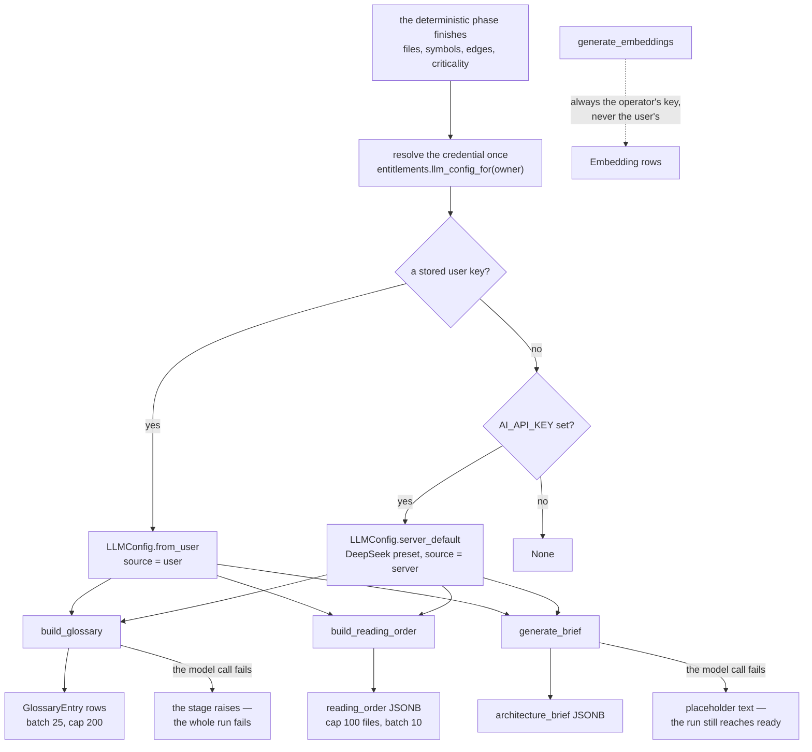

# Generation

A repository finishes parsing. The files exist, the dependency graph is built, the git history has
been mined and every file carries a criticality score. What is missing is the part a person actually
reads: what the symbols *mean*, which order to read the files in, and how the system fits together.

Three services write that, and a fourth — the chat answer — writes more of it later, on demand. This
document follows all four from the moment the deterministic phase ends to the rows they leave
behind, and explains why the credential plumbing is shaped the way it is. Generation is the most
decision-dense part of the codebase: it spans a frozen credential object, four provider presets, a
free-tier quota, two threading rules, and four call sites that each have to get the same details
right.

If you are reading for the first time, [The pipeline at a glance](#the-pipeline-at-a-glance) is the
map. If you are preparing to discuss it,
[Design decisions and trade-offs](#design-decisions-and-trade-offs) collects the reasoning.

## Contents

- [The pipeline at a glance](#the-pipeline-at-a-glance)
- [Stage 1 — Resolving the credential](#stage-1--resolving-the-credential)
  - [The provider registry](#the-provider-registry)
  - [Configuring the operator's credential](#configuring-the-operators-credential)
  - [The save-time probe](#the-save-time-probe)
- [Stage 2 — The glossary](#stage-2--the-glossary)
- [Stage 3 — The reading order](#stage-3--the-reading-order)
- [Stage 4 — The architecture brief](#stage-4--the-architecture-brief)
- [Stage 5 — Failure and degradation](#stage-5--failure-and-degradation)
- [The quota](#the-quota)
- [Design decisions and trade-offs](#design-decisions-and-trade-offs)
- [Related documentation](#related-documentation)

## The pipeline at a glance

Everything runs from `run_full_analysis` in `server/app/services/pipeline.py`. Three of the four
generation services are dispatched from there — the glossary and the reading order together on two
threads, the brief alongside the embedder — while chat answers are generated later, per question.



Four rules in that diagram are load-bearing and easy to get wrong:

- **The credential is resolved once and passed as an argument.** It is never stored in a
  contextvar, because [the generation runs on threads](#why-not-a-contextvar) that do not inherit
  one.
- **Embeddings never use the user's key.** They stay on the operator's credential so the index is
  provider-uniform.
- **Only the brief degrades.** A glossary or reading-order failure fails the whole analysis; the
  brief falls back to a placeholder and the repository still reaches `ready`.
- **`None` is a real outcome.** It means the free tier is exhausting or unconfigured, and the route
  has already answered `402` before generation is reached.

## Stage 1 — Resolving the credential

The credential object is a **frozen dataclass** in `server/app/services/llm_config.py`:

```python
@dataclass(frozen=True)
class LLMConfig:
    api_key: str
    model: str
    base_url: str | None = None
    supports_reasoning: bool = True
    source: Source = "server"          # "user" | "server"
```

Frozen matters, and not for style. The overlapped stages run on real threads, and the rule for those
threads is *scalars only* — no ORM instance, nothing mutable shared across a thread boundary. A
frozen value object satisfies that rule by construction.

`services/entitlements.py` owns the decision of which credential to use, so the route layer and the
task layer cannot disagree:

```python
def llm_config_for(user: Any) -> LLMConfig | None:
    """The user's own key if they have one, else the operator's, else None."""
```

The precedence is fixed: **user's stored key → operator's free-tier key → `None`**.

`LLMConfig.from_user` returns `None` unless all three of `ai_provider`, `ai_api_key` and `ai_model`
are set, and raises on an unknown provider rather than quietly falling back to the server credential.
`LLMConfig.server_default()` returns `None` when `AI_API_KEY` is empty — that single check is what
disables the free tier deployment-wide.

### The provider registry

`services/llm_providers.py` is deliberately **free of configuration imports**, so the credential
probe can read base URLs without a fully populated environment.

| Provider     | Default model             | Base URL                          | Reasoning |
| ------------ | ------------------------- | --------------------------------- | --------- |
| `openai`     | `gpt-4o-mini`             | `https://api.openai.com/v1`       | Yes       |
| `groq`       | `llama-3.3-70b-versatile` | `https://api.groq.com/openai/v1`  | **No**    |
| `openrouter` | `openai/gpt-4o-mini`      | `https://openrouter.ai/api/v1`    | Yes       |
| `deepseek`   | `deepseek-flash`          | `https://api.deepseek.com`        | Yes       |

There is **no custom-URL option**, and that is a security decision rather than an omission: a
user-supplied base URL would make the server issue authenticated requests to an arbitrary host.

Two methods on `LLMConfig` translate a preset into SDK arguments:

```python
def client_kwargs(self) -> dict[str, Any]:
    kwargs = {"api_key": self.api_key}
    if self.base_url is not None:      # never pass base_url=None
        kwargs["base_url"] = self.base_url
    return kwargs

def response_kwargs(self, effort: str = "minimal") -> dict[str, Any]:
    if not self.supports_reasoning:
        return {}                      # Groq 400s on reasoning.effort
    return {"reasoning": {"effort": effort}}
```

Both carry a trap worth stating: `base_url=None` must never reach the SDK, and `{}` from
`response_kwargs` is a *legitimate answer*, not a missing value. See
[Why is the reasoning parameter still wrong?](#why-is-the-reasoning-parameter-still-wrong) for what
happens when a caller treats it as one.

### Configuring the operator's credential

Three environment variables shape `LLMConfig.server_default()`, and one of them is the product's
free-tier switch:

| Variable      | Effect                                                                  |
| ------------- | ----------------------------------------------------------------------- |
| `AI_API_KEY`  | The operator's generation key. **Empty disables the free tier entirely** |
| `AI_MODEL`    | Overrides the preset's default model                                     |
| `AI_BASE_URL` | Overrides the preset's base URL                                          |

`AI_API_KEY` being optional is deliberate: an empty value is how an operator turns the free tier off,
and the result is a `402` on every entry point for a keyless user. There is no separate enable flag.

**`AI_BASE_URL` must not include `/v1` for DeepSeek.** The DeepSeek preset is
`https://api.deepseek.com`; the other providers' presets include their version path. Leaving the
variable empty uses the preset, which is almost always what you want.

That variable existing alongside a registry with no custom-URL option is not a contradiction: it is
set by the *operator*, who already controls the deployment and the credentials. The rule the registry
enforces is about *user*-supplied URLs, where the server would otherwise issue authenticated requests
to an arbitrary host.

**Embeddings are configured separately and differently.** They use `OPENAI_API_KEY` — never a user's
key, never the free-tier one — and the OpenAI SDK reads `OPENAI_BASE_URL` from the environment by
itself. The embedder and the RAG path deliberately rely on that ambient variable rather than passing
`base_url` to the client constructor, because the end-to-end suite uses it as a seam to point at a stub
server. Do not "fix" the missing `base_url` argument; passing it explicitly breaks that suite.

### The save-time probe

A key is validated **before it is stored**. `PUT /api/v1/auth/me/ai-credentials` issues a 16-token
Responses call with the supplied provider, key and model, and writes the row only on success:

| Outcome                | Response                                          |
| ---------------------- | ------------------------------------------------- |
| Bad key                | `400 "Incorrect API key for <Provider>."`          |
| Model unavailable      | `400 "That model isn't available on <Provider>."`  |
| Provider unreachable   | `400 "Could not reach <Provider>."`                |
| Unknown provider name  | `422`                                              |

The probe uses a 15-second timeout and disables retries, so a hanging provider fails at the form
rather than holding the request open. The API key must be 8–512 characters.

This is the difference between a form that tells a user their key is wrong and one that accepts it
and then produces empty glossaries an hour later. `GET` never returns the key — only whether one is
stored, which provider, which model, and when it was validated. See
[auth.md](../auth.md#the-ai-credential-store).

## Stage 2 — The glossary

`build_glossary` in `services/glossary_builder.py` turns parsed symbols into business-domain
definitions.

```python
build_glossary(db, repo, *, mode: Literal["full", "incremental"] = "full", llm=None) -> int
```

- Symbols are sent in batches of **25**, and a repository is capped at **200 entries**.
- Output budget is **3000 tokens**, reasoning effort `minimal`.
- `full` mode deletes the repository's existing entries first.
- `incremental` mode — used by [sync](sync.md) — keeps what exists and spends the remaining budget
  on symbols that do not yet have a definition.
- Symbols the parser could not name (`<anonymous>`) are excluded, and definitions are deduplicated
  by name.

The call site is one of the four that has to get the reasoning arguments right:

```python
response_kwargs = (
    llm.response_kwargs("minimal") if llm is not None
    else {"reasoning": {"effort": "minimal"}}
)
```

## Stage 3 — The reading order

`build_reading_order` in `services/onboarding.py` produces the ordered file list. The ordering itself
is deterministic — a topological sort over the file dependency graph, with cycle members ordered
among themselves by fan-in. The model writes only the prose.

```python
build_reading_order(db, repo, *, mode="full", llm=None) -> OnboardingGuide
```

- At most **100 files** are annotated (`MAX_ANNOTATED_FILES`).
- Annotations are sent in batches of **10** (`ANNOTATION_BATCH_SIZE`).
- Output budget is **1500 tokens**, reasoning effort `minimal`.

Those batches share the same `LLM_MAX_WORKERS = 4` pool as the glossary, because the two stages run
concurrently — so they compete for four slots rather than getting four each.

Each file gets one or two sentences explaining *why* reading it unlocks what comes after it.

## Stage 4 — The architecture brief

`generate_brief` in `services/architecture_brief.py` is the longest generation and the only one that
reads the README.

```python
generate_brief(db, repo, readme_content: str | None = None, *, llm=None) -> OnboardingGuide
```

- Output budget is **4000 tokens**, reasoning effort `low` — the one stage that asks for more than
  `minimal`.
- It assembles a narrative from the entry points, the module dependency structure, the critical
  files, and the ownership data.
- `_call_llm_narrative` **degrades to a placeholder string on failure** instead of raising.

That last point is the one exception in the whole generation phase, and
[it is deliberate](#why-does-only-the-brief-degrade).

On the incremental [sync](sync.md) path the brief is regenerated **before** the glossary, which has a
visible consequence: the brief is given a preview of the glossary, and at that moment the preview
reflects the *previous* sync's glossary rather than the one the same pass is about to write.

## Stage 5 — Failure and degradation

The behaviour on failure differs per artefact, and the difference is the design:

| Artefact           | On a model failure                                 |
| ------------------ | -------------------------------------------------- |
| Architecture brief | **Degrades to a placeholder.** The run completes.  |
| Glossary           | Fails the stage, which fails the analysis.          |
| Reading order      | Fails the stage, which fails the analysis.          |
| Chat answer        | `502` to the client, with the provider's message.   |

Because the brief degrades silently, a repository can be `ready` with a placeholder summary. If the
brief reads as generic, the model call failed — the worker log will say so. A missing *glossary* is a
different matter: it means the run did not succeed.

## The quota

`services/entitlements.py` holds every decision about spending the operator's allowance, so the route
layer and the task layer cannot drift.

| Constant             | Value | Meaning                    |
| -------------------- | ----- | -------------------------- |
| `FREE_INGESTIONS`    | `1`   | Free analyses per user     |
| `FREE_CHAT_MESSAGES` | `5`   | Free chat questions per user |

Claims are **conditional `UPDATE`s whose `rowcount` is checked** — the same compare-and-set pattern
the [sync sweep](sync.md#the-claim-predicate) uses:

```sql
UPDATE users SET free_chat_messages_used = free_chat_messages_used + 1
WHERE id = :id AND free_chat_messages_used < 5
```

The `WHERE` clause refuses a second claim when the allowance is gone, so two concurrent requests
cannot both spend the last unit — the loser sees `rowcount = 0` and is denied rather than silently
overdrawing.

Two details of *when* the chat counter is charged:

- **Only when an answer was actually generated.** A question that returned the canned "no relevant
  code found" response costs nothing.
- **After the model call, in its own short transaction**, so the row lock is not held across a
  multi-second network request. The ingestion claim, by contrast, is bundled into the same
  transaction as the repository insert.

## Design decisions and trade-offs

### Why a frozen dataclass instead of a dict or a config object?

Because the value crosses a thread boundary, and the rule for those threads is *scalars only*. A
frozen dataclass cannot be mutated by one thread while another reads it, and it carries no session
identity — so it satisfies the constraint structurally rather than by convention. A dict would work,
but it would let a caller add or drop a key mid-flight, and the failure would surface as a provider
error rather than a type error.

### Why not a contextvar?

This is the decision most likely to be "fixed" by a future reader, so the reasoning is worth stating
plainly.

Suppose the credential were set in a `contextvar` before dispatching the overlapped stages. Threads
do **not** inherit context variables from the thread that started them. Every overlapped generation
would therefore silently fall back to the server key. For a BYOK user that means the operator pays
for their analysis; for a keyless user it means work succeeds that should have been refused. Both
failures are silent, which is what makes them the worst kind. Passing the frozen object explicitly is
what prevents both.

### Why does `client_kwargs()` refuse to pass `base_url=None`?

Because the SDK distinguishes an absent key from an explicit `None`. The registry uses `None` to mean
"the provider's default", so translating that into an explicit `None` on the client constructor would
override the default with nothing.

This is exactly the kind of thing a tidy-up removes — `base_url=config.base_url` reads cleaner than a
conditional — so the contract is stated in the method rather than left implicit.

### Why does only the brief degrade?

Because of what each artefact is for. The brief is generated last and matters least to someone's first
ten minutes in the product: a repository with a placeholder summary is still browsable. A missing
glossary or reading order leaves the core onboarding flow empty — the repository would be `ready` and
useless. Failing the whole analysis over the brief would be the wrong trade.

The cost is that a `ready` repository can carry a placeholder with nothing in the status to say so.
That is accepted: the alternative is losing a completed analysis to a transient provider error on its
least important artefact.

### Why do embeddings never use the user's key?

Because a user's index has to be comparable with itself. If each user embedded with their own model,
the vectors in one repository would be meaningless against a query embedded elsewhere — and mixing
providers inside a single index would silently corrupt retrieval rather than failing.

The cost is real and lands on the operator: embeddings are the largest-volume API call in the
product, and generation is the part users bring their own key for.

### Why probe a key at save time rather than on first use?

Because first use is minutes later, in a background task, on the user's least-attended surface. A key
that fails there produces an empty glossary and a repository that never quite looks right, with
nothing connecting the symptom to the credential. Probing at the form turns a silent, delayed,
hard-to-attribute failure into an immediate message naming the provider.

The cost is an extra API call on save, and a small coupling: the form now depends on the provider
being reachable at that moment.

### Why is the free ingestion checked as a boolean rather than against the constant?

Because the column is `free_ingest_used`, a boolean, and the allowance is one. Writing
`WHERE free_ingest_used IS FALSE` is a single-row compare-and-set; writing
`WHERE count < FREE_INGESTIONS` would need a counter column that does not exist.

The cost is that `FREE_INGESTIONS` is **inert** — no enforcement code reads it, so changing it
changes nothing. It survives as documentation of the policy, and as a trap: it looks like the knob for
the free tier and is not one.

### Why is the reasoning parameter still wrong?

It should not be, and this is the one entry here that records a defect rather than a decision.

`response_kwargs()` correctly returns `{}` for a provider that cannot reason, and
`tests/unit/services/test_llm_config.py` pins that. But all four call sites then do:

```python
if not response_kwargs:
    response_kwargs = {"reasoning": {"effort": "minimal"}}
```

which cannot distinguish "no credential was passed" from "this provider does not support reasoning" —
so it re-adds the parameter for exactly the providers the registry exists to protect. A Groq user
gets a 400. Worse, `_annotate_files` swallows per-batch failures, so the reading order can come back
with zero annotations and no error at all.

The fix is to delete those four fallbacks: the `llm is None` branch already supplies its own dict, so
`{}` from a real credential can be trusted to mean what it says.

### Why does the `llm=None` branch still read `settings.AI_MODEL`?

Because it predates the credential split and was never removed. It builds a client from
`settings.OPENAI_API_KEY` and `settings.AI_MODEL` — **not** from `LLMConfig.server_default()`, which
would use the free-tier `AI_API_KEY` and the DeepSeek preset. Those are different credentials, and
the difference has already caused one confusing doc claim.

In practice the pipeline always passes a credential, so the branch is reached only by a direct caller
such as `scripts/probe_ai_provider.py`. It is kept because removing it would make `llm` required and
touch four public signatures — a larger change than the bug it would close.

## Related documentation

- [ingestion.md](ingestion.md) — where these stages sit in the full analysis, and how the overlapped
  threads are kept safe.
- [sync.md](sync.md) — the incremental variants: `mode="incremental"` for the glossary, the
  hash-reconciled embeddings, and why the brief runs before the glossary there.
- [retrieval.md](retrieval.md) — the fourth generation service, which answers questions from the
  index these stages build.
- [auth.md](../auth.md#the-ai-credential-store) — the credential store, the save-time probe, and how
  a key is written.
- [data-model.md](../data-model.md) — the `GlossaryEntry`, `OnboardingGuide` and `Embedding` tables
  these stages write.
- [architecture.md](../architecture.md#design-decisions-and-trade-offs) — the reasoning behind the async/sync split
  and the thread-safety rule these stages obey.
