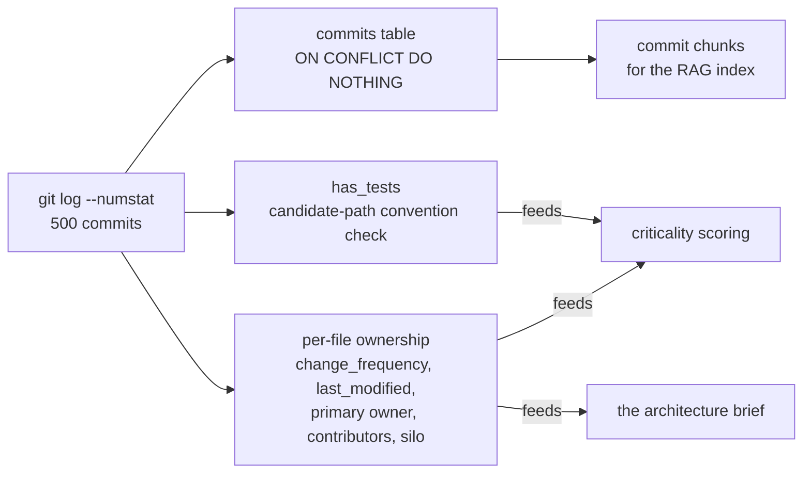
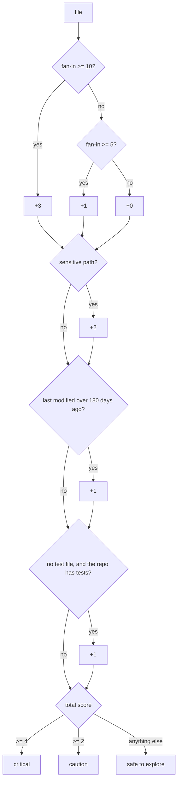
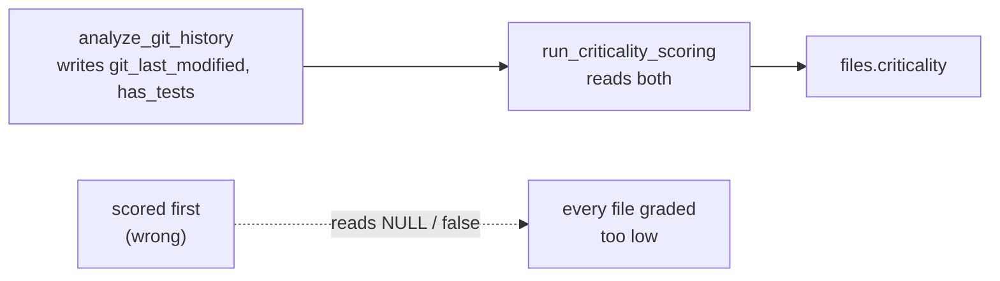

# Git Intelligence

The source code tells you what a file does. It does not tell you that the payments module has been
edited by one person for three years, that nobody has touched the auth middleware since 2022, or that
a file imported by fourteen others has no test anywhere.

Illume mines the commit history for exactly that: who owns each file, which files have a single point
of human failure, what changes constantly, and what is untested. Those signals are then folded into a
per-file criticality score — the classification the 3D graph colours its nodes by.

This document covers the mining, the ownership records it produces, how those signals feed criticality,
and the API that exposes them.

The code is in `server/app/services/git_analyzer.py`, `server/app/services/criticality.py`, and
`server/app/services/pr_fetcher.py`.

If you are reading for the first time,
[The scoring model](#the-scoring-model) is the part worth understanding; the rest is mechanism. If you
are debugging a score you believe is wrong, start with
[The ordering constraint](#the-ordering-constraint).

## Contents

- [Mining history](#mining-history)
- [What is produced](#what-is-produced)
  - [Commits](#commits)
  - [Per-file ownership](#per-file-ownership)
  - [Test presence](#test-presence)
  - [The 500-commit window is a real boundary](#the-500-commit-window-is-a-real-boundary)
- [The scoring model](#the-scoring-model)
  - [The ordering constraint](#the-ordering-constraint)
- [Pull requests](#pull-requests)
- [What this feeds](#what-this-feeds)
- [The API](#the-api)
- [Troubleshooting](#troubleshooting)
- [Design decisions and trade-offs](#design-decisions-and-trade-offs)
- [Related documentation](#related-documentation)

## Mining history

`analyze_git_history` runs one `git log` against the local clone:

```
git log --numstat -n 500 --format=%H\x1f%ae\x1f%an\x1f%s\x1f%ai
```

Three things about that command are deliberate:

- **The cap is 500 commits.** A long history is analysed from its most recent 500, which bounds the
  cost and focuses the analysis on the code as it currently is. This is a real boundary, not a sample
  — see [The 500-commit window](#the-500-commit-window-is-a-real-boundary).
- **A unit-separator delimiter** (`\x1f`) rather than a tab or a comma, because commit subjects
  routinely contain both.
- **`--numstat`** gives per-file added and deleted line counts in the same pass, so the history is
  walked once rather than twice.

Binary files report `-` in place of line counts and are counted as zero. Renames are normalised from
git's `dir/{old => new}/file` form to a plain path.

An empty history — a repository with no commits, or a shallow clone — returns early rather than
raising.

## What is produced



### Commits

The most recent 500 commits are stored with hash, author name and email, message, changed-file count,
the file list, and the authored timestamp. Insertion is `ON CONFLICT DO NOTHING` on
`(repository_id, hash)`, so re-analysing a repository never duplicates them.

### Per-file ownership

For every file touched inside the window, the analyzer computes:

| Signal              | Meaning                                                                 |
| ------------------- | ----------------------------------------------------------------------- |
| `change_frequency`  | How often the file changed                                              |
| `git_last_modified` | When it last changed                                                    |
| `primary_owner`     | The author with the most commits touching it                            |
| `contributors`      | Every author, with the percentage of changes they are responsible for    |
| `is_knowledge_silo` | True when **exactly one** author has ever touched the file              |

The knowledge-silo flag is the bus-factor signal: a file with one author is a single point of human
failure. It is computed purely from the mined window, so a file touched by one person within the last
500 commits is flagged even if someone else worked on it years earlier.

> **`bus_factor` can go stale.** The ownership upsert updates the owner, the contributors and the silo
> flag on re-analysis, but omits `bus_factor` from its update set. After a re-analysis, `contributors`
> and `bus_factor` can disagree. Reading the contributors list is always correct; the count may not be.
> See [data-model.md](../data-model.md#code_owners).

### Test presence

Test detection works by convention rather than by running anything. The analyzer generates candidate
paths from templates — `test_<stem>.py`, `<stem>_test.py`, `<stem>.spec.ts`, and similar — and looks
for them in the file's own directory, its `tests/` and `__tests__/` subdirectories, a `spec/`
subdirectory, and the repository root's test directories.

A file is marked `has_tests` when a candidate exists. This is a heuristic in both directions: a test
file following an unconventional naming scheme is missed, and a same-named file that is not a test
would count.

### The 500-commit window is a real boundary

The window is not a random sample — it is the most recent N commits, so it is systematically biased
toward actively-changed code. That is the right bias for onboarding, since it is the code a newcomer
will actually touch, but it means absence from the data means *"not recently touched"* and never
*"does not exist"*.

Four consequences follow:

1. A file last touched 600 commits ago has no owner in the data, no change frequency, and a
   `git_last_modified` that may be absent — which feeds straight into its criticality score.
2. Test detection is name-based, so it finds conventionally named tests and misses the rest.
3. `bus_factor` can be stale after a re-analysis.
4. Ownership is line-count attribution, not authorship of intent. An author who reformatted a file
   accumulates changes as readily as one who rewrote it.

## The scoring model



`run_criticality_scoring` turns the mined signals plus dependency fan-in into a three-level
classification stored on each file.

| Signal                                         | Points |
| ---------------------------------------------- | ------ |
| Fan-in ≥ 10 (imported by ten or more files)    | +3     |
| Fan-in ≥ 5                                     | +1     |
| Path matches a sensitive pattern               | +2     |
| Last modified more than 180 days ago           | +1     |
| No test file **and** the repository has tests  | +1     |

**Sensitive path patterns** are matched by regular expression against the path: `config.`, `database.`,
`middleware/`, `migrations/`, `auth.`, `security.`, `celery.`, and `main.`.

The test-coverage point is **conditional on the repository having tests at all**. Without that
condition, a repository with no tests would have every file penalised, and the signal would carry no
information — everything would score the same. The repository-level flag is inferred from the files
when it is not supplied.

| Score | Classification     |
| ----- | ------------------ |
| ≥ 4   | `critical`         |
| ≥ 2   | `caution`          |
| else  | `safe`             |

### The ordering constraint

**Criticality must run after git history.** It reads `git_last_modified` and `has_tests`, and both are
written only by the git analyzer. Scored first, every file is graded against `NULL` and `false` — which
reads as "nothing is stale, nothing is untested" — so every file scores lower than it should, silently.

The scanner deletes and re-inserts every file row, so this is not a theoretical hazard: a reordering
resets both columns. The unit tests **cannot** catch it, because they inject those values directly into
the scorer. See [ingestion.md](ingestion.md#two-orderings-that-are-load-bearing).



## Pull requests

`fetch_pull_requests` retrieves merged pull requests through the GitHub API:

- **Up to 200**, newest-updated first, in pages of 100.
- Only **merged** PRs are kept — a closed-but-unmerged PR is skipped.
- The walk stops on an empty or short page, or when the 200 cap is reached.

Rate limiting is handled explicitly: a `429` or `403` reads `Retry-After`, falling back to the
`X-RateLimit-Reset` timestamp minus the current time, with a minimum of one second and a default of
sixty. A `404` or `401` raises a client error rather than retrying, because neither will improve.

Insertion is `ON CONFLICT DO NOTHING` on `(repository_id, number)`.

Pull requests matter beyond display: they become embedded chunks, so the chat can answer questions
about *why* a change was made — a question the source code cannot answer at all.

## What this feeds

| Consumer               | Uses                                                     |
| ---------------------- | -------------------------------------------------------- |
| Criticality            | `git_last_modified`, `has_tests`, and path patterns      |
| The architecture brief | File ownership summary, bus factors, knowledge silos     |
| The chat index         | Commit and PR chunks                                     |
| The UI                 | The ownership map, the silo list, and the repository stats |

## The API

| Endpoint                                           | Returns                                                 |
| -------------------------------------------------- | ------------------------------------------------------- |
| `GET /api/v1/repository/{repo_id}/ownership`       | Paginated per-file ownership with contributor breakdowns |
| `GET /api/v1/repository/{repo_id}/ownership/silos` | Every file flagged as a knowledge silo                   |
| `GET /api/v1/repository/{repo_id}/stats`           | Totals, language breakdown, and the top five contributors |

The ownership map paginates at 50 per page with a maximum of 200, and accepts an optional exact
`file_path` filter. Each entry carries the contributors with their percentages and last-commit dates.

`stats` returns total files, total lines of code, a per-language breakdown, the distinct contributor
count, the top five contributors by files owned, the knowledge-silo count, and the total dependency
count.

All three require a session and return `404` for a repository that is not the caller's. See
[api.md](../api.md#ownership--apiv1repository).

## Troubleshooting

**Every file scores the same after a re-ingest.**

Criticality ran before git history. Both `git_last_modified` and `has_tests` were still at their
defaults, so every file scored against the same inputs. Check stage ordering, not the scoring rules.

**A file has no owner.**

It was not touched within the most recent 500 commits. The window is the boundary — see below.

**A file is flagged as a knowledge silo but clearly has more than one author.**

The other author's work predates the 500-commit window. The flag is computed from the window only.

**`bus_factor` disagrees with the contributor count.**

A known staleness: the ownership upsert omits `bus_factor` from its update set, so a re-analysis
refreshes `contributors` without refreshing the count.

**A file with an obvious test is marked `has_tests = false`.**

The test does not match one of the candidate path templates. Detection is purely name-based.

**Pull requests are missing for a repository that has them.**

Only merged PRs are stored, and only the newest 200. A repository whose merges are older, or which
squashes without merge commits, will have fewer than expected.

## Design decisions and trade-offs

### Why cap at 500 commits?

Because the cost of the analysis has to be bounded, and the history that matters for onboarding is the
recent history. A repository with 40,000 commits would otherwise dominate ingest time, and the
ownership signal from a 2014 contributor is not what a newcomer needs.

The cost is stated in [The 500-commit window](#the-500-commit-window-is-a-real-boundary) below: a file
last touched 600 commits ago has no owner, no change frequency, and possibly no last-modified date —
which then feeds straight into its criticality score.

### Why is the commit window a real boundary rather than a sample?

Because taking the most recent commits is what keeps the analysis useful and affordable at once. The
alternative — walking the entire history — is unbounded in cost and answers a question nobody asked:
who wrote this in 2014.

The consequences are listed under
[The 500-commit window is a real boundary](#the-500-commit-window-is-a-real-boundary). The short
version is that the bias is toward the code a newcomer will touch, and every edge case that falls out
of it errs in the same direction: recent work is visible, older work is not.

### Why is criticality a three-level classification rather than a number?

Because the number is already stored, in `criticality_reasons`, and the product needs a decision rather
than a measurement. The graph colours nodes by three states; the export lists anything that is not
`safe`. A continuous score would have to be thresholded by every consumer independently, and they
would disagree.

The cost is that a file scoring 3 and one scoring 3.9 are treated identically, and the boundary
between `caution` and `critical` is a policy choice (4) rather than an emergent property.

### Why is test presence name-based rather than execution-based?

Because there is no way to run an unknown repository's test suite from inside an ingestion. The
languages differ, the runners differ, the dependencies are not installed, and the clone is deleted
afterwards. And even if a suite ran, the question is not "do the tests pass" but "does this file have
one".

The cost is stated above: unconventional layouts and same-named non-test files both produce wrong
answers, always in the direction of "no test".

### Why store commits in the database at all?

Because they become embedded chunks, and because `change_frequency` and `git_last_modified` are derived
from them. The chat can answer "why was this changed?" only because the commit messages are in the
index alongside the code.

The cost is that the `commits` table is one of the larger ones, and 500 rows per repository is a floor
rather than a ceiling for a large instance.

### Why is the sensitive-path list a set of regexes rather than a directory allow-list?

Because the signal is about *what kind of file it is*, not where it lives. `auth.py` in a nested module
is as sensitive as `auth.py` at the root, and `migrations/` is sensitive regardless of what it contains.
A path pattern express both.

The cost is that the list is tuned to the conventions of the languages and frameworks this project has
seen. A repository with an unconventional layout — no `auth.` prefix, no `migrations/` directory — gets
no sensitive-path points at all.

## Related documentation

- [ingestion.md](ingestion.md) — where these stages sit in the full analysis, and the
  ordering constraint they participate in.
- [sync.md](sync.md) — what a re-analysis does to these tables, and why the upserts
  matter.
- [data-model.md](../data-model.md) — the `commits` and `code_owners` tables in full.
- [retrieval.md](retrieval.md) — how commit and PR text becomes embeddable chunks.
- [graph.md](graph.md#how-data-becomes-visuals) — how criticality reaches the 3D view.
