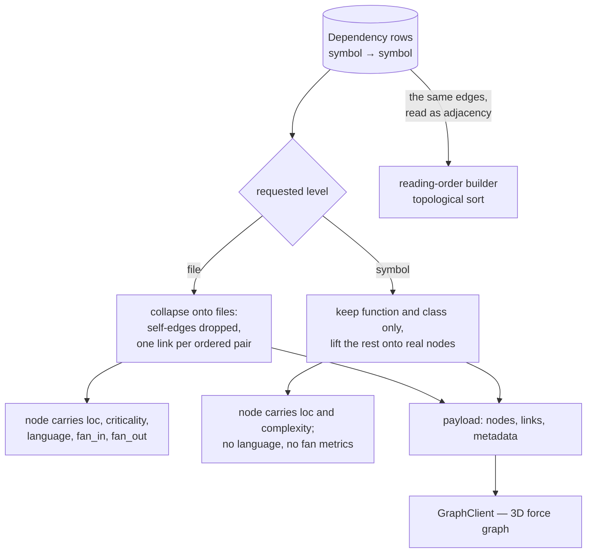

# The Dependency Graph

Open the **Graph** tab and a repository becomes a slowly rotating cloud of points: big red ones in
the middle, small green ones on the edges, blue lines running between them. Click a node and its
connections light up; search for a name and it grows a halo. That picture is a database join.

This document covers how symbol-level `Dependency` edges become something a browser can draw, why the
same join exists twice in the codebase, and what the picture does and does not tell you. The graph is
also what makes the reading order possible — the topological sort runs on the same edges — so the
accuracy of everything here propagates into the onboarding flow.

If you are reading for the first time, [The pipeline at a glance](#the-pipeline-at-a-glance) is the
map. If you are preparing to discuss it,
[Design decisions and trade-offs](#design-decisions-and-trade-offs) collects the reasoning.

## Contents

- [The pipeline at a glance](#the-pipeline-at-a-glance)
- [One join, two implementations](#one-join-two-implementations)
- [The endpoint](#the-endpoint)
- [File level](#file-level)
  - [Collapsing rules](#collapsing-rules)
  - [Request-time versus stored](#request-time-versus-stored)
- [Symbol level](#symbol-level)
- [Lifting edges onto real nodes](#lifting-edges-onto-real-nodes)
- [Barrel resolution](#barrel-resolution)
- [What the graph does not carry](#what-the-graph-does-not-carry)
- [The client](#the-client)
- [Troubleshooting](#troubleshooting)
- [Design decisions and trade-offs](#design-decisions-and-trade-offs)
- [Related documentation](#related-documentation)

## The pipeline at a glance



Three rules in that diagram are load-bearing:

- **Self-edges are dropped at file level**, so a file that imports itself never appears as a loop.
- **A collapsed link's `type` is the most common of its edges and its `weight` is the count** — so the
  link is a summary, not a single relationship.
- **Symbol nodes have no `language`, `fan_in` or `fan_out`**, even though the client's `Graph` type
  declares them on every node.

## One join, two implementations

There are two ways to turn symbol-level edges into file-level edges, and both exist on purpose:

| Module             | Used by                                                                     |
| ------------------ | --------------------------------------------------------------------------- |
| `graph_builder.py` | The `GET /graph` endpoint only — its own private join, plus the payload shapes |
| `file_graph.py`    | The reading-order builder, the architecture brief, and the text exporter      |

They were split because each had drifted into re-implementing the join with different dedup rules,
and the two consumers genuinely want different things: the visualisation wants a payload with counts
and a dominant edge type, while the reading order wants an adjacency map.

**If you change how edges are derived, both need checking.** They do not share code and will not fail
together.

### Which `file_graph` functions are actually live

Worth stating precisely, because it is easy to assume the obvious function is the used one:

| Function                 | Status                                                                 |
| ------------------------ | ---------------------------------------------------------------------- |
| `iter_file_edges`        | **Live** — streaming generator used by the reading-order builder        |
| `build_int_adjacency`    | **Live** — integer-keyed adjacency, used with the above                 |
| `query_file_edges_async` | **Live** — used by the text exporter                                    |
| `build_dep_path_map`     | **Live** — used by the architecture brief                               |
| `query_file_edges`       | Called only by `build_file_graph` (below), and by tests                  |
| `build_adjacency`        | Called only by `build_file_graph` (below)                                |
| `build_file_graph`       | No caller anywhere — so the two above are dead in effect                |

The reading-order path uses the **streaming** pair rather than the plain query. A large repository's
edge list is streamed in chunks of 1000 and folded into a compact integer-keyed map, instead of being
materialised in memory as a list of UUID pairs.

## The endpoint

```
GET /api/v1/repository/{repo_id}/graph?level=file|symbol
```

- `level` defaults to `file`.
- `404` if the repository is not the caller's.
- **`409` if `status != "ready"`** — a client should poll rather than treat this as an error.
- `500` if the build raises.
- **Nothing is cached, and there is no node cap.** Every file or symbol is returned, so a large
  repository produces a large response and the client requests it with `cache: "no-store"`.

## File level

### Collapsing rules

- Self-edges — both endpoints in the same file — are dropped.
- Each distinct ordered `(source_file, target_file)` pair becomes exactly **one** link.
- That link's `type` is the **most common** dependency type among the collapsed edges, and its
  `weight` is the **total count** of them.

**Node fields:**

| Field               | Value                                                              |
| ------------------- | ------------------------------------------------------------------ |
| `id`                | The file's UUID, stringified                                        |
| `label`             | The basename of the path                                            |
| `path`              | Full repository-relative path                                       |
| `group`             | Parent directory                                                    |
| `kind`              | Always `"file"`                                                     |
| `loc`               | Lines of code                                                       |
| `criticality`       | `critical` / `caution` / `safe`, defaulting to `"medium"`           |
| `criticality_score` | `critical` → 100, `caution` → 75, `safe` → 25, anything else → 50   |
| `language`          | Defaults to `"unknown"`                                             |
| `fan_in` / `fan_out`| Persisted counts                                                    |

**Link fields:** `source`, `target`, `type`, `weight`.

**Metadata:** `total_nodes`, `total_edges`, and `clusters` — the count of distinct top-level
directories.

### Request-time versus stored

`fan_in`, `fan_out`, `criticality`, `loc`, and `language` are **persisted columns**, written during
ingestion. `criticality_score` is computed **per request** from the criticality string.

A subtlety: the file-level path normalises the criticality string with `.lower().strip()` before
scoring, and the symbol-level path does not. In practice the pipeline writes lowercase values, so
this does not currently bite — but a value with unexpected casing would score differently between the
two levels.

## Symbol level

Only `function` and `class` symbols become nodes. Methods, imports and variables do not appear.

**Node fields:** `id`, `label` (the symbol name), `path`, `group`, `kind`, `loc`
(`end_line - start_line + 1`), `complexity` (cyclomatic), `criticality`, `criticality_score`.

> **Symbol nodes have no `language`, `fan_in`, or `fan_out`** — even though the client's `Graph` type
> declares those fields on every node. Code that reads them at symbol level gets `undefined`.

**Link fields:** `source`, `target`, `type`, `weight` — where `weight` is **always 1**. Unlike file
level, symbol links are not collapsed or counted.

**Sibling links.** Symbols in the same file are linked consecutively in source order with
`type = "sibling"`. This is not a dependency relationship; it exists so a file's contents read as a
connected chain rather than a cluster of disconnected points.

## Lifting edges onto real nodes

An edge can point at a symbol that is not a node — an import, a variable, or a symbol that was
filtered out. Both endpoints are lifted, but **not in the same way**:

1. **The source is lifted to the best node in its own file** — either the file directly, or via an
   import symbol's recorded file. If that file has no nodes at all, the edge is **dropped**. The
   source side is never barrel-resolved.
2. **The target is lifted the same way, and then barrel-resolved if that is not enough.** When the
   target's file has no nodes, `_resolve_barrel_target` walks downstream to find one.

`_pick_best_node` chooses which node to lift onto. Given a target name it prefers an exact name match,
then a case-insensitive one; without a name it prefers a non-anonymous function, then a class, then
simply the first candidate.

## Barrel resolution

A barrel — `index.ts`, `__init__.py` — contains only re-exports and therefore produces **zero nodes**.
An edge pointing into a barrel would have nowhere to land, so those edges would vanish from the graph.

`_resolve_barrel_target` walks downstream from the barrel until it reaches a file that does have
nodes, accumulating targets and guarding against cycles with a `visited` set.

**Detection is structural, not by filename.** Any file with no function or class nodes is treated as
a barrel candidate. This catches barrels with unconventional names. The cost is that an empty file or
a constants-only module is also treated as a barrel candidate. That is harmless: the walk finds
nothing, and the edge is dropped as it would have been anyway.

## What the graph does not carry

**The reading-order tier never reaches the client.** `OnboardingGuide.reading_order` stores a `tier`
for each file, but the guide endpoint emits only `position`, `file_path`, `annotation`, and `fan_in`.
The client re-joins the guide onto graph nodes **by `path`** at render time.

## The client

Three components, frequently confused. Only one of them is a dependency graph:

| Component             | What it is                                                                                             | Where it is used                        |
| --------------------- | ------------------------------------------------------------------------------------------------------ | --------------------------------------- |
| `GraphClient.tsx`     | The full interactive 3D dependency graph — search, file/symbol toggle, reading-order tour, inspector     | `repo/[id]/graph` only                  |
| `GitGraph.tsx`        | **Not a dependency graph and not 3D** — a 2D SVG branch/commit timeline for choosing what to ingest     | The add-repository modal, repo settings |
| `BackgroundGraph.tsx` | Non-interactive ambient 3D decor; renders nothing until the graph has loaded                            | The repo layout, and the homepage hero   |

### How data becomes visuals

- **Node size** is `sqrt(loc) * 0.5`, with a floor of 10 LOC.
- **Node colour** follows a priority order: a search match is purple, the selected node blue,
  otherwise criticality — critical red, caution yellow, everything else green.
- **Links** are brightened to width 2 in blue only when incident to the selected node.

**Selection is the only focus mechanism.** Neighbours are not dimmed or recoloured — selecting a node
changes the colour of its incident links and nothing else, so any description of selection "revealing"
a node's neighbourhood is true only in that narrow sense.

Search matches get expanding halo rings built from six billboarded ring meshes, animated by a single
perpetual `requestAnimationFrame` loop that scales and fades them.

Performance guards are deliberately minimal: a low sphere resolution and one directional particle per
link. `BackgroundGraph` additionally disables all pointer interaction and pins its force parameters
behind a ref guard so they are applied once. Its `nodeColor` must be a literal Three.js can parse —
an `oklch()` CSS token will not work, which matters because some of this design system's tokens are
`oklch`.

The 3D components are dynamically imported with server-side rendering disabled, because Three.js needs
browser globals.

## Troubleshooting

**The graph is empty but files exist.**

Every edge resolved to nothing. Check whether the repository's imports actually resolve — a language
whose import resolution fails produces files with no edges, and a file with no edges and no siblings
is a lone node. Also check `status`: a `409` from the endpoint means the analysis is not finished.

**Edges point at surprising symbols.**

Lifting is heuristic. An import edge lifted onto "the first function in the file" may not be the
symbol you expected — `_pick_best_node` has no semantic information to work with.

**A barrel's re-exports produce strange long-range edges.**

Expected. The barrel walk finds real targets several files downstream, so an edge that looks like it
points at `index.ts` lands somewhere further away.

**Symbol level looks sparser than file level.**

Methods are not nodes at symbol level, and sibling links are not dependencies. A file whose behaviour
lives in its methods looks emptier at symbol level than it is.

**A large repository makes the page slow or the request fail.**

There is no node cap and no server-side cache — the entire graph is serialised per request. The
response grows linearly with the repository.

## Design decisions and trade-offs

### Why two implementations of the same join?

Because they want different outputs. The visualisation needs collapsed counts and a dominant edge
type per pair; the reading-order builder needs a streaming adjacency map it can fold into integers.
Serving both from one function would mean a mode flag and two sets of semantics inside it — harder to
read than two focused functions.

The cost is real and is the reason this section exists: **a change to edge derivation must be checked
in both places.** The duplication is only acceptable while it stays visible.

### Why is the barrel detected structurally rather than by filename?

Because filename conventions fail in exactly the repositories that need the help. A barrel is not
`index.ts` because of its name — it is a file that re-exports and defines nothing. Detecting it by
"has no function or class nodes" catches unusual names, at the cost of also catching an empty file or
a constants module.

That cost is nil, because the barrel walk on such a file finds nothing and the edge is dropped exactly
as it would have been without the check.

### Why is the source side never barrel-resolved?

Because the two sides fail differently. Dropping a source edge loses one link in a picture that
already has thousands. The target side is where the edge *lands*, so a missing target means the link
disappears entirely rather than merely moving. Resolving barrels only where the loss is real keeps the
walk — which follows an arbitrary chain of files — off the common path.

### Why are symbol-level links given a weight of 1?

Because there is nothing to collapse. At file level a link summarises many symbol edges, so a count is
meaningful; at symbol level an edge is a single relationship between two symbols, and inventing a
weight would imply a multiplicity that does not exist.

### Why does the client get every node, with no cap?

Because a capped graph is a misleading graph: a force layout with a subset of the nodes produces a
different shape, and the user cannot tell that anything is missing. Returning everything keeps the
picture honest.

The cost is the one in the troubleshooting section — the response grows linearly with the repository,
and past a certain size the page stops being usable. That is a known scaling limit rather than a
correctness problem.

### Why is selection the only focus mechanism?

Because dimming neighbours requires deciding what counts as a neighbour, and in a dependency graph
that is a judgement the user is better placed to make. Highlighting incident links shows the immediate
relationship without asserting that everything else is irrelevant.

The cost is that the feature is less impressive than it sounds in a README, which is why the docs say
plainly that neighbours are neither dimmed nor recoloured.

### Why is `criticality_score` computed per request instead of stored?

Because it is a pure function of a stored string, and storing it would mean keeping two columns in sync
through every re-analysis for no benefit. The mapping is four constants.

The cost is a small inconsistency: the file-level path lowercases and strips the criticality string
before scoring, and the symbol-level path does not.

## Related documentation

- [ingestion.md](ingestion.md) — the `resolve_dependencies` and `compute_fan_metrics` stages that write
  the edges this document reads.
- [sync.md](sync.md) — how the edges are cleared and rebuilt on an incremental update.
- [data-model.md](../data-model.md) — the `Dependency` table and its uniqueness constraint.
- [frontend.md](../frontend.md) — the WebGL constraints the graph components obey.
- [git-intelligence.md](git-intelligence.md) — where `fan_in` and `criticality` come from.
- [exports.md](../exports.md) — the text export's `@@GRAPH` section, which renders the same edges.
