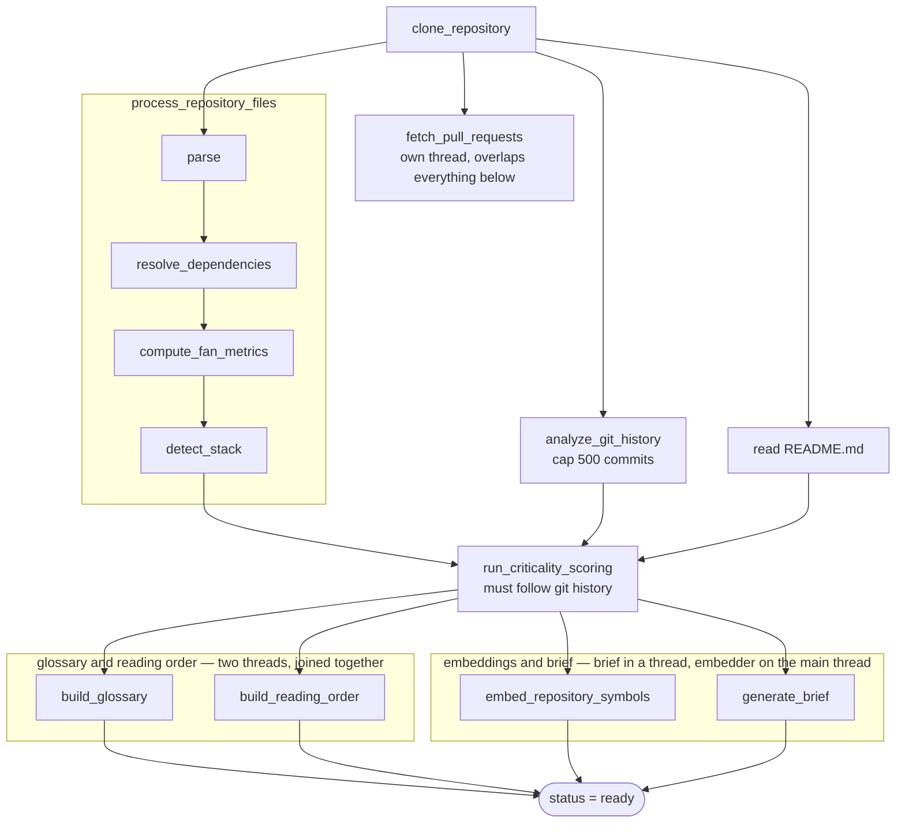
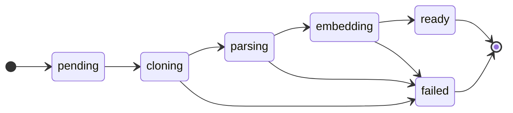

# Ingestion Pipeline

You paste a GitHub URL into the dashboard and press **Add**. The page becomes a live diagram: clone,
then pull requests and parsing fanning out, then git history, then four stages that light up in pairs.
A minute later the repository is `ready`, and there is a reading order, a glossary, a graph and a
brief where before there was a URL.

This document follows that run from the queued task to the `ready` status. Ingestion is the largest
piece of the system: it spans a clone, a multi-language parser, a dependency resolver, a git
historian, a scorer, and four model-backed generators, three of which run concurrently on threads
against a single database.

If you are reading for the first time, [The pipeline at a glance](#the-pipeline-at-a-glance) is the
map. If you are preparing to discuss it,
[Design decisions and trade-offs](#design-decisions-and-trade-offs) collects the reasoning.

## Contents

- [The pipeline at a glance](#the-pipeline-at-a-glance)
- [Where an ingestion starts](#where-an-ingestion-starts)
- [The stages](#the-stages)
  - [clone](#clone)
  - [pr_fetch](#pr_fetch)
  - [parse](#parse)
  - [resolve_dependencies and compute_fan_metrics](#resolve_dependencies-and-compute_fan_metrics)
  - [detect_stack](#detect_stack)
  - [git_history](#git_history)
  - [criticality](#criticality)
  - [The LLM phase](#the-llm-phase)
- [Concurrency, and the rule that makes it safe](#concurrency-and-the-rule-that-makes-it-safe)
- [Two orderings that are load-bearing](#two-orderings-that-are-load-bearing)
- [Idempotency](#idempotency)
- [Failure and retry](#failure-and-retry)
- [Progress and instrumentation](#progress-and-instrumentation)
- [Troubleshooting](#troubleshooting)
- [Design decisions and trade-offs](#design-decisions-and-trade-offs)
- [Related documentation](#related-documentation)

## The pipeline at a glance

Everything runs from the Celery task `ingest_repository` in `server/app/tasks/ingest.py`, whose work
lives in `run_full_analysis` in `server/app/services/pipeline.py`:



Four rules in that diagram are load-bearing:

- **Three pairs overlap, and the rule that makes that safe is not exception handling** — it is that
  no database session is ever shared across a thread.
- **Criticality runs after git history**, because it reads two columns only the git analyzer writes.
- **The parser runs before the git analyzer**, because the parser deletes every file row first.
- **Only the brief may fail without failing the run.**

## Where an ingestion starts

Three things queue a full analysis:

| Trigger                                   | Route or task                                | Notes                                       |
| ----------------------------------------- | -------------------------------------------- | ------------------------------------------- |
| Adding a repository                       | `POST /api/v1/repository`                    | The normal path                              |
| Re-ingesting                              | `PUT /api/v1/repository/{repo_id}/reingest`  | Deletes the row first, then recreates it     |
| A sync deciding a full rebuild is cheaper | `sync_repository`                            | Force-push, or over the size thresholds      |

In every case the task runs on a **sync** database session, because Celery is a sync caller. Routes
use the async engine. This split runs through the whole codebase — see
[architecture.md](../architecture.md#async-and-sync-are-split-by-caller).

The task is declared `@celery.task(bind=True, max_retries=3)`, and everything below happens inside a
`get_db_context()` block that owns the session and its rollback.

## The stages

Every stage name is a member of the `Stage` enum in `server/app/services/_stages.py`, and a unit test
parses every `stage(...)` call out of `app/` to assert the two sets stay equal. The values are
`clone`, `pr_fetch`, `parse`, `resolve_dependencies`, `compute_fan_metrics`, `detect_stack`,
`git_history`, `criticality`, `glossary`, `reading_order`, `generate_embeddings`, `brief`, `ready`,
plus the two join stages.

That parity test is why `grep stage=` and `grep stage_timer` describe the same graph.

### clone

`services/cloner.py` → `repo_cache.ensure_clone`.

Produces a working tree at the requested commit, and writes `ingested_branch` and
`ingested_commit_sha` immediately — committed *before* any analysis, so a later failure still records
what was attempted. When the clone cache is enabled, this is a fetch-and-reset rather than a fresh
clone; see [sync.md](sync.md#the-clone-cache).

### pr_fetch

`services/pr_fetcher.py`.

Up to 200 merged pull requests, newest-updated first, in pages of 100. Only merged PRs are kept. The
walk stops on an empty or short page, or at the cap.

This stage runs on **its own single-worker thread** and is joined last, after the clone has already
been cleaned up — so its network time is almost entirely hidden behind the parse and the git
analysis. It is the cheapest overlap in the pipeline and the one that buys the most.

### parse

`services/scanner.py` → `process_repository_files`, which contains four timed stages of its own.

`parse` walks the tree and runs tree-sitter over each file, producing `File` rows and their
`AstSymbol` rows. It **deletes every existing `File` row for the repository first**, cascading away
their symbols and edges — which is what makes a retried ingestion safe rather than duplicating
everything.

It commits in batches of **500 files** (`FILE_BATCH_SIZE`) rather than once at the end, so a
partially completed parse is a state the system has to tolerate. The idempotency rules below are what
make that tolerable.

> `process_repository_files` is deliberately **not** wrapped in its own timer. It contains four timed
> stages, and wrapping it as well would count their time twice in the profile.

### resolve_dependencies and compute_fan_metrics

`services/dependency_resolver.py`.

`resolve_dependencies` turns import specifiers into `Dependency` edges between symbols, and
`compute_fan_metrics` writes `fan_in` and `fan_out` for every file.

`resolve_dependencies` is **insert-only**, which is why the whole-repository edge delete has to run
before it. It resolves candidate files through a five-strategy chain: exact stem, the package index
map, a unique short stem, a language-family filter, then an exact-suffix score — with a
disambiguation pass when several files match.

### detect_stack

`services/stack_detector.py`.

Reads manifests (`package.json`, `go.mod`, `Cargo.toml`, `Gemfile`, `composer.json`, `pom.xml`,
`build.gradle`), Python import patterns, and CI config filenames into `detected_stack`, and infers
entry points from filename conventions and main-guard patterns. It is explicitly best-effort:
unreadable files are skipped rather than failing the stage.

### git_history

`services/git_analyzer.py`.

Runs `git log --numstat -n 500` and derives per-file ownership, change frequency, last-modified
dates, test presence, and up to 500 `Commit` rows. The full treatment is in
[git-intelligence.md](git-intelligence.md).

### criticality

`services/criticality.py`.

Scores every file from fan-in, path sensitivity, staleness, and test presence, then classifies it
`critical`, `caution`, or `safe`. See
[Two orderings that are load-bearing](#two-orderings-that-are-load-bearing) for why this stage's
position is not negotiable.

### The LLM phase

Four stages, dispatched as two overlapped pairs:

| Pair | Stage | Thread |
| --- | --- | --- |
| 1 | `build_glossary` | worker thread |
| 1 | `build_reading_order` | worker thread |
| 2 | `embed_repository_symbols` | **main thread** |
| 2 | `generate_brief` | worker thread |

The two pairs are joined by the named stages `glossary_and_reading_order_join` and
`embed_and_brief_join`. Those exist so the time spent waiting for the slower of a pair is measured
and visible rather than hidden inside the pair's own timers.

`embed ∥ brief` is sound because the brief reads no `Embedding` rows and the guide upsert writes only
the columns it is handed — so the brief cannot overwrite the reading order the other thread is
writing.

See [generation.md](generation.md) for the credential model and what each service produces, and
[retrieval.md](retrieval.md) for what the embedder writes.

## Concurrency, and the rule that makes it safe

**The rule is not exception handling — it is that a database session is never shared across
threads.** Every overlapped call lives in `server/app/tasks/_parallel.py` and obeys two constraints:

1. **It receives only scalars** — a `repo_id`, a `github_url`, credentials. No ORM instance bound to
   the main thread's identity map is ever handed to a worker.
2. **It opens its own session** inside the thread.

One helper looks like a violation, and it is worth understanding why it is not. The brief helper
loads the `Repository` row inside its own thread, because `generate_brief` adds the row back to the
session and must therefore be working with a row that session knows about. The session is still the
thread's own — what changes is that the object is loaded per-thread rather than passed across.

This constraint is also why credentials travel as a frozen `LLMConfig` rather than a contextvar.

## Two orderings that are load-bearing

Both have been wrong at some point, and both fail silently when they are.

### Criticality scoring must follow git history

`run_criticality_scoring` reads `File.git_last_modified` and `File.has_tests`. Those columns are
written only by the git analyzer. Score before it, and every file is graded against `NULL` and
`false` — which reads as "nothing is stale, nothing lacks tests", so the scores come out quietly
wrong rather than raising.

The unit tests inject those values directly into the scorer, so they pass regardless of the order the
pipeline uses. This is one of the few places where the test suite cannot catch a regression.

### The parser runs before the git analyzer

`process_repository_files` deletes every `File` row before re-inserting. Git history is then applied
to the freshly inserted rows. Running git history first would mean its updates landed on rows that
were about to be deleted.

## Idempotency

A full parse can be running twice at once — two workers on the same repository, or a re-ingest that
races a sync. The pipeline is written so that this inserts once rather than duplicating:

| Table           | Constraint                                | Conflict behaviour on a full parse         |
| --------------- | ----------------------------------------- | ------------------------------------------ |
| `files`         | `(repository_id, path)`                   | `ON CONFLICT DO NOTHING`                   |
| `commits`       | `(repository_id, hash)`                   | `ON CONFLICT DO NOTHING`                   |
| `pull_requests` | `(repository_id, number)`                 | `ON CONFLICT DO NOTHING`                   |
| `code_owners`   | unique on `file_id`                       | `ON CONFLICT DO UPDATE`                    |
| `embeddings`    | `(repository_id, source_type, source_id)` | Not needed — the table is emptied first     |
| `dependencies`  | `(source_symbol_id, target_symbol_id)`    | Not needed — removed by cascade first       |

Each is worth a sentence, because they do not all work the same way:

- **`files`, `commits`, `pull_requests`** use `ON CONFLICT DO NOTHING`, so a second concurrent pass
  inserts nothing and the first pass's rows win.
- **`code_owners`** uses `ON CONFLICT DO UPDATE`, because re-analysis should refresh the ownership
  statistics rather than keep the first result.
- **`ast_symbols`** has no conflict clause, and needs none. A file row delete cascades to its symbols,
  so a re-insert cannot collide.
- **`embeddings`** has no conflict clause on a full parse either. `generate_embeddings` deletes every
  row for the repository first and then inserts plainly. The `ON CONFLICT DO UPDATE` clause appears
  only in `incremental` mode.
- **`dependencies`** are removed the same way as symbols. On a full parse the `File` delete cascades
  through `ast_symbols` to both of an edge's endpoint columns.

That last point corrects a natural but wrong assumption: **`delete_repo_edges` is not called on the
full-parse path at all.** It is called only by the sync path, where files are *not* deleted wholesale
and the edges therefore have to be cleared explicitly.

## Failure and retry

On an exception, in this exact order:

1. The exception is logged.
2. **`db.rollback()` runs.** This is not incidental. Without it, the query that reloads the
   repository raises `PendingRollbackError`, the bare `except` swallows that, and the row's status is
   left frozen at whatever stage it reached — a repository that looks like it is still parsing,
   forever.
3. The repository is reloaded and set to `status = "failed"`.
4. A failure frame is published.
5. `self.retry(countdown=10)` is raised.

The countdown is a **fixed 10 seconds**, not a backoff. `max_retries=3` means three retries after the
original attempt, so a repository can be attempted **four times** in total — which is why the
progress UI shows `attempt N of 4`.

The clone is removed in a `finally`, so a failed run does not leak disk.

### Status transitions



The intermediate states are written by the services themselves. `manage_status=False` suppresses
them, which is what the sync path uses so it does not disturb a `ready` repository.

## Progress and instrumentation

Progress frames are published to Redis on the channel `task:{repo_id}:logs`, and the WebSocket
endpoint relays that channel verbatim.

Frames carry `stage=` and `phase=` when those fields apply, and the client renders node states from
them rather than inferring anything from event names. The four LLM stages each publish an explicit
`*_complete` frame rather than being assumed finished when something downstream starts.

Two kinds of frame deliberately omit a field:

- The **failure frame** carries `phase=failed` and **no `stage`**, because the catch-all runs outside
  the pipeline and genuinely cannot know which stage raised.
- A few **status frames** carry a `stage` but no `phase`.

See [websockets.md](../websockets.md) for the full frame contract.

### Per-stage instrumentation

`services/_stage_timer.py` logs one `stage_timer` line per stage with its wall-clock time, a
`tracemalloc` peak, and (on Linux) the `VmHWM` delta. To profile a run:

```bash
docker logs illume-worker 2>&1 | grep stage_timer
```

**Concurrent stages pass `measure_memory=False` and log `mem=not_measured`.** Both memory counters
are process-global, so a delta measured across a window in which another thread was allocating would
attribute that thread's allocations to this stage. For those stages, compare each one's wall-clock
against the corresponding `*_join` line: a well-overlapped pair lands near `max()`, not the sum.

## Troubleshooting

**A repository is stuck in `parsing`, `cloning`, or `embedding` and never moves.**

The task died without setting `failed`. Check the worker log for the traceback. The most common cause
is the worker being killed mid-run — an OOM, or a deploy restarting the container — which leaves the
row as-is. Re-ingest is safe: the row is deleted and recreated, and every insert is idempotent.

**A repository is `failed` and retried four times.**

Read the last traceback in the worker log. The failure frame carries no `stage`, so the traceback is
the only place the failing stage is named.

**Criticality looks wrong — everything is `safe`, or nothing is stale.**

Almost always the scoring-before-git-history ordering. Confirm `git_history` appears before
`criticality` in the `stage_timer` lines.

**A stage's wall-clock time is roughly the sum of two concurrent stages rather than the max.**

The overlap is not happening. Check that the helper is opening its own session, and that nothing
raised immediately — an immediate failure makes `future.result()` return at once.

**Memory spikes on a large repository.**

Look for a `stage_timer` line with a large `tracemalloc` peak. `parse` and `generate_embeddings` are
the two that scale with repository size — and the embedder's peak is a known defect: it loads the
repository's rows into memory rather than streaming them.
Concurrent stages cannot report memory by design, so check the container's own memory usage too.

**Ingestion reaches `ready` but a later stage's data is missing.**

Only the brief can be missing on a `ready` repository: it degrades to a placeholder string rather
than raising. A missing glossary or reading order means the run did **not** succeed — those stages
propagate their failures.

## Design decisions and trade-offs

### Why overlap stages rather than run them sequentially?

Because the pipeline is dominated by waiting: network calls to GitHub, to the model provider, and to
the embedding API. The box is memory-constrained but has idle CPU, so a bounded thread pool buys
wall-clock for almost nothing.

The cost is that Stage A is a real concurrency problem, and every future stage must be written with
the session rule in mind. The overlap is a deliberate trade of simplicity for time.

### Why the "scalars only, own session" rule instead of locking?

Because a SQLAlchemy session is not thread-safe, and a shared one fails unpredictably rather than
reliably — it might work in testing and corrupt state under load. Passing only scalars removes the
possibility structurally rather than guarding against it.

The cost is that each thread re-loads what it needs, and credentials must be threaded explicitly
through every generation call.

### Why does the parser delete all files rather than diff them?

Because on a full parse there is nothing to diff against — the row may have been ingested months ago
by a different code version, and reconciling two arbitrary states is far more complex than rebuilding
one. Deleting and re-inserting is simple, and the cascade removes the symbols, edges and ownership
rows that would otherwise go stale.

The cost is that a full parse throws away work it could theoretically have reused, which is exactly
what the [sync](sync.md) path exists to avoid.

### Why batch commits mid-parse instead of committing once?

Because a large repository's parse can take minutes, and holding one transaction open that long
holds locks and grows the WAL. Committing every 500 files bounds both.

The cost is that a crashed parse leaves a partial file set behind — which is why the `files` unique
constraint and `ON CONFLICT DO NOTHING` matter. A retry has to tolerate half the work already being
there.

### Why is `delete_repo_edges` not used on the full-parse path?

Because the cascade already does it. Deleting every `File` row cascades through `ast_symbols` to both
endpoint columns of every `Dependency` edge, so the edges are gone before `resolve_dependencies` runs.
Calling `delete_repo_edges` as well would be a redundant whole-table delete.

It exists for the sync path, where files are *not* deleted and the edges have to be cleared
explicitly.

### Why does the failure handler roll back before anything else?

Because the alternative is a repository frozen forever in a status it never left. Without the
rollback, the reload query raises `PendingRollbackError`, the bare `except` swallows that too, and
the status write never happens — so the row keeps whatever stage it reached and the UI polls it
indefinitely.

This is the single most consequential line in the error path, and it is easy to reorder by accident
when adding logging above it.

### Why retry at all, rather than fail immediately?

Because the most common ingestion failures are transient: a GitHub rate limit, a clone timeout, a
provider hiccup. Retrying three times with a fixed delay converts most of those into successes.

The cost is that a genuinely broken repository is attempted four times over forty seconds, which is
why the count is small and why the sync path takes the opposite approach — see
[sync.md](sync.md#why-does-a-failed-sync-disable-itself-instead-of-retrying-forever).

### Why do concurrent stages not report memory?

Because both memory counters — `tracemalloc` and `VmHWM` — are process-global. A delta measured
across a window in which another thread was allocating attributes that thread's allocations to this
stage, producing a number that looks precise and means nothing.

Recording `mem=not_measured` is the honest option: it tells the reader the number is unavailable
rather than giving them a wrong one.

### Why publish progress best-effort?

Because the progress stream is a report about the work, not part of it. A Redis blip failing an
otherwise complete analysis would be the tail wagging the dog.

The cost is that the guarantee is not uniform — the task's own publisher closure calls
`redis_client.publish` directly, with no `try`/`except`, so pipeline-level frames do not have the same
protection as the sub-service ones.

## Related documentation

- [sync.md](sync.md) — the incremental path, which reuses these stages and adds the lease, the
  watermarks, and the full-rebuild escalation.
- [generation.md](generation.md) — the credential model and the four LLM services this pipeline
  dispatches.
- [retrieval.md](retrieval.md) — what `generate_embeddings` writes, and how chunking decides it.
- [graph.md](graph.md) — what the dependency edges this pipeline builds are turned into.
- [git-intelligence.md](git-intelligence.md) — the `git_history` and `criticality` stages in
  detail.
- [websockets.md](../websockets.md) — the frame contract the progress stream follows.
