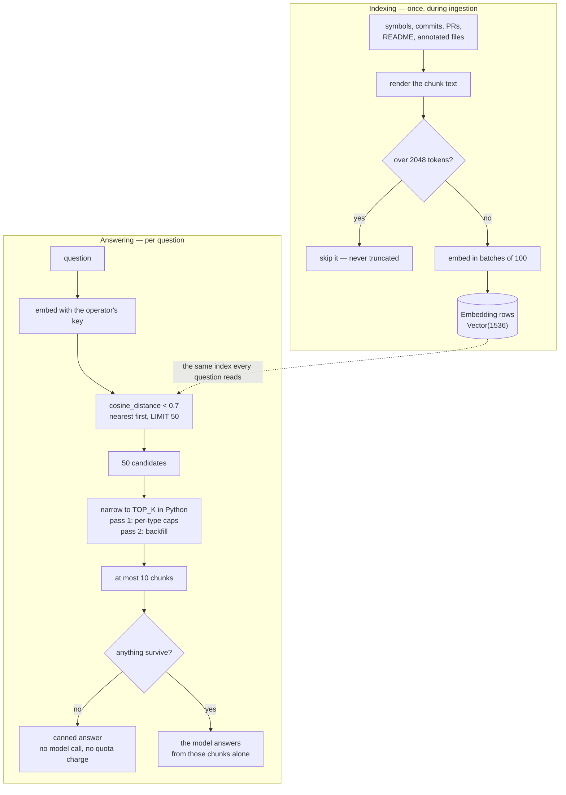

# Retrieval and the RAG Chat

You open a repository you have never seen and ask the chat *"how does authentication work here?"*. A
few seconds later you get an answer naming `core/security.py` and `middleware/auth.py`, with
citation cards underneath that expand to show the exact code, the docstring, or the commit that
introduced it. Nothing was written by a human for you; it came out of the index the ingestion built.

This document covers both halves of that: how the index is built, and how a question is answered from
it. They are worth reading together, because most of the retrieval behaviour — and most of its
weaknesses — is decided at indexing time, long before anyone asks anything.

If you are reading for the first time, [The pipeline at a glance](#the-pipeline-at-a-glance) is the
map. If you are preparing to discuss it,
[Design decisions and trade-offs](#design-decisions-and-trade-offs) collects the reasoning.

## Contents

- [The pipeline at a glance](#the-pipeline-at-a-glance)
- [Part 1 — Building the index](#part-1--building-the-index)
  - [What gets embedded](#what-gets-embedded)
  - [The chunk text, per source type](#the-chunk-text-per-source-type)
  - [Chunks over the limit are skipped](#chunks-over-the-limit-are-skipped)
  - [The whole-file fallback](#the-whole-file-fallback)
  - [Order of work](#order-of-work)
  - [Full versus incremental](#full-versus-incremental)
- [Part 2 — Answering a question](#part-2--answering-a-question)
  - [Step 1 — Embed the query](#step-1--embed-the-query)
  - [Step 2 — Retrieve candidates](#step-2--retrieve-candidates)
  - [Step 3 — Diversify down to ten](#step-3--diversify-down-to-ten)
  - [Step 4 — Generate, or decline](#step-4--generate-or-decline)
- [The prompt](#the-prompt)
- [History](#history)
- [The response](#the-response)
- [Failure behaviour](#failure-behaviour)
- [The client](#the-client)
- [Troubleshooting](#troubleshooting)
- [Design decisions and trade-offs](#design-decisions-and-trade-offs)
- [Related documentation](#related-documentation)

## The pipeline at a glance

Indexing happens during ingestion, in `services/embedder.py`. Answering happens per question, in
`answer_question` in `services/rag.py`.



Four rules in that diagram are load-bearing:

- **Chunks over the token limit are skipped, not truncated** — so the index has holes, and they are
  invisible from the outside.
- **The type caps are soft.** A backfill pass ignores them, so a symbol-only result set can far
  exceed five symbols.
- **The retrieval threshold is deliberately loose** (similarity ≈ 0.3) because the narrowing happens
  in the next step, not in SQL.
- **The model is never asked to cite.** The `sources` array is assembled server-side and can disagree
  with the prose.

## Part 1 — Building the index

### What gets embedded

Only symbols of these kinds:

```python
EMBEDDABLE_KINDS = {"function", "class", "method"}
```

Imports and module-level variables are parsed and stored, but never embedded. Every embedded row also
stores the **rendered text** that was embedded, not the raw source — which is what makes a citation
card readable without a second database lookup.

### The chunk text, per source type

| `source_type`  | The chunk text contains                                                                                     |
| -------------- | ----------------------------------------------------------------------------------------------------------- |
| `symbol`       | The file path; `kind: name`; the glossary definition **or** the docstring; up to 5 callers; up to 5 callees; the raw source |
| `commit`       | Short hash and author; the message; the first 20 changed files                                               |
| `pull_request` | `PR #<number>: <title>` and the description                                                                  |
| `document`     | The README, split on `##` headings, one chunk per section                                                    |
| `file`         | The file path; its reading-order annotation; up to 15 symbol names it contains                               |

> **The `Called by:` and `Calls:` lines are always empty.** They are populated from dependency edges
> of type `calls`, and the resolver only ever writes `imports`. The lines are rendered, they are just
> never filled in — the call graph does not exist anywhere in the pipeline. See
> [data-model.md](../data-model.md).

### Chunks over the limit are skipped

`MAX_CHUNK_TOKENS` is **2048**, estimated as `len(text) // 4` — a cheap approximation, not a real
tokenizer.

A chunk that exceeds it is **dropped entirely**. A long function is therefore silently absent from
the index: it cannot be retrieved, and asking about it produces the canned "no relevant code found"
answer rather than a partial one. For repositories with large functions, a meaningful fraction of the
code is unsearchable — and nothing in the response says so.

### The whole-file fallback

If every symbol in a file was skipped — all too long, or none of an embeddable kind — the file would
contribute nothing and become invisible to search. To prevent that, the embedder tracks which files
produced at least one surviving symbol chunk, and for the remainder emits a fallback chunk containing
the file's path and all of its symbol source, subject to the same limit.

These are stored with `source_type = "symbol"` (so they participate in the same uniqueness and
reconciliation rules) and `source_id = file_id`.

### Order of work

1. Symbol chunks
2. Commits
3. Pull requests
4. README sections
5. Annotated files
6. Whole-file fallbacks

Batches of **100** are committed as they complete, so a mid-run API failure keeps the progress already
made rather than rolling the whole index back. The embedding client has a 60-second timeout and two
retries.

**README sections are the exception to batching**: they are embedded in a single un-batched call,
however many sections there are.

### Full versus incremental

- **`full` mode** deletes every embedding row for the repository and rebuilds, inserting plainly.
- **`incremental` mode** — used by [sync](sync.md) — deletes only the `symbol` and `file` chunks
  belonging to changed files, then reconciles by comparing a **SHA-256 hash of the chunk text**. Text
  that has not changed is not re-embedded. Writes here are upserts on
  `(repository_id, source_type, source_id)`.

Hash reconciliation covers **symbol, file, and document (README) chunks**. Commit and pull-request
chunks are not reconciled — and since PRs are never re-fetched, they do not change on a sync anyway.

## Part 2 — Answering a question

### Step 1 — Embed the query

The question is embedded with the same model, using the **operator's key**. A user's BYOK credential
never touches the embedding path, because the index must stay provider-uniform.

### Step 2 — Retrieve candidates

A single SQL query filters and orders:

```sql
WHERE cosine_distance(embedding, :query) < 0.7
ORDER BY distance ASC
LIMIT 50
```

The threshold is a cosine *distance*, so `< 0.7` means similarity greater than roughly `0.3` — a
deliberately loose filter, because the next step narrows it.

### Step 3 — Diversify down to ten

Fifty candidates are narrowed to `TOP_K = 10` by `_apply_diversity_caps`, which runs in **Python, not
SQL**, in two passes:

**Pass one** walks the candidates in relevance order and takes each one only if its type is under its
cap:

| Type           | Cap |
| -------------- | --- |
| `symbol`       | 5   |
| `commit`       | 2   |
| `pull_request` | 1   |
| `document`     | 1   |
| `file`         | 2   |
| anything else  | 2   |

**Pass two** backfills any remaining slots, ignoring the caps.

Because of the backfill, **the caps are soft**. A question whose best matches are all code can return
far more than five symbols — the caps shape the result set rather than bounding it. Their purpose is
to stop one dominant type crowding out the commit or README context.

### Step 4 — Generate, or decline

If nothing survived retrieval, the function returns a canned answer — *"No relevant code was found in
this repository for your question"* — with `generated = False`, **without calling the model at all**.
The chat endpoint uses that flag to skip charging the free-tier counter, so an unanswerable question
is free.

Otherwise the model is called with the assembled prompt.

## The prompt

A system prompt instructs the model to answer only from the supplied context, to name files, symbols,
lines, commit hashes and PR numbers, and to say when something is not present.

Context blocks are separated by `\n\n---\n\n`, each prefixed with a source marker:

```
[Source 1] [Code] src/app/core/config.py — Settings (lines 48–67)
[Source 4] [Commit] a1b2c3d4 by Tejas
[Source 7] [PR #142] Add auto-update
```

Messages are the system prompt, then the replayed history as real conversation turns, then the
question. The generation call uses reasoning effort `minimal` and a **3000-token** output limit.

> **The model is not asked to cite the `[Source N]` markers.** The `sources` array returned to the
> client is assembled server-side from the retrieved rows, independently of anything the model writes.
> So the prose answer and the citation cards can disagree — the model may describe a commit whose card
> is not shown, or name a file that appears as a different source index. Treat the cards as "what was
> retrieved", not as "what the answer used".

There is **no explicit context budget**. The prompt is bounded only by the ten-chunk limit and the
2048-token per-chunk cap, so a worst case is on the order of 20,000 tokens of context.

## History

The client sends the full prior conversation. The server truncates it with:

```python
payload.history[-5:]
```

That is five **messages**, not five exchanges — roughly two and a half question-and-answer pairs.
Older turns are dropped silently.

History is replayed as genuine conversation turns ahead of the new question rather than being folded
into the system prompt, which keeps the model's view of the conversation conventional.

## The response

```python
RAGResponse  { answer, sources, generated }
```

Each entry in `sources` is a `SourceReference` carrying `source_type` and `chunk_text`, plus
type-specific fields:

- **code**: `file_path`, `symbol_name`, `start_line`, `end_line`
- **commit**: `commit_hash`, `author_name`
- **pull request**: `pr_number`, `pr_title`

`sources` is persisted as JSONB on the `chat_messages` row, which is why reloading a conversation
restores its citation cards even after the underlying code has changed.

## Failure behaviour

`rag.py` itself has no exception handling around either the embedding or the generation call.

**The chat route wraps it.** Provider errors — authentication, connection, timeout, and API status —
are caught in `chat.py` and returned as **`502`** with the provider's message. So an LLM outage is a
`502`, not a `500`. An exception the SDK does not model still becomes a `500`.

## The client

`hooks/useChat.ts` and `components/Chat.tsx` are **entirely non-streaming**: the answer arrives in one
JSON response, not token by token.

Send, delete, and clear are all **optimistic** — local state updates before the request and is not
rolled back if the request fails, so a failed send leaves a message on screen marked with an error. A
`402` is surfaced distinctly, as a quota message linking to the settings page.

Citation cards render the source type and expand to show `chunk_text`, with a deep link to GitHub. The
branch is threaded through from the repository, falling back to `master` when unknown.

## Troubleshooting

**The chat says "no relevant code was found" for something clearly in the repository.**

Either retrieval found nothing within cosine distance 0.7, or the relevant code is not in the index
at all. Check the second possibility first: a long function is **skipped**, not truncated, and a
symbol kind outside `{function, class, method}` is never embedded.

**A citation card shows text the answer does not mention.**

Expected. The cards are the retrieved set, assembled independently of the model's prose.

**The answer mentions a file that has no card.**

Also expected, for the same reason — the model draws on whatever reached the prompt.

**Only the last couple of exchanges are remembered.**

By design. The server truncates history to five messages.

**Chat returns `402` with a key stored.**

The route reads the stored key first, so a `402` alongside a stored key means the row's `ai_provider`
or `ai_model` is empty — `from_user` returns `None` unless all three fields are set. Re-saving the
credential fixes it.

**Embedding a repository is slow or expensive.**

Embeddings are the dominant API cost of an ingestion, and the work is broader than the symbol count
suggests: a full run embeds symbols, commits, pull requests, README sections, annotated files, and
whole-file fallbacks. Symbols, commits, PRs and annotated files go in batches of 100; README sections
go in one call.

## Design decisions and trade-offs

### Why store the rendered text instead of the raw source?

Because a retrieved chunk has to be readable on its own. A citation card that showed only the raw
body of a function would leave the reader to work out which file it came from and what the symbol is
called — information the index already had at write time and then threw away.

The cost is storage: `chunk_text` is a rendered duplicate of source that also lives in `ast_symbols`.
That duplication is deliberate.

### Why skip oversized chunks instead of truncating them?

Because a truncated chunk produces a *misleading* embedding, not a merely incomplete one. The vector
would represent a fragment that ends mid-expression, and retrieval would match it confidently. A
skipped chunk is invisible; a truncated one is actively wrong.

The cost is real and understated in the product: for repositories with large functions, a meaningful
fraction of the code is unsearchable, and nothing in the response tells the user that.

### Why run the diversity caps in Python rather than SQL?

Because the rule is inherently sequential — pass one depends on what earlier candidates filled, and
pass two depends on the leftovers. Expressing that as a window function would be possible but far
harder to read, and the set is 50 rows, so the cost of doing it in Python is nil.

The cost is that the caps cannot be applied during the index scan, so all 50 candidates are always
transferred.

### Why are the caps soft?

Because the alternative is worse. Hard caps would refuse to fill the result set when the best matches
are all one type, handing the model five chunks instead of ten for no benefit. The caps exist to
*shape* the mix, not to enforce a quota — so the backfill pass is what makes them useful rather than
harmful.

### Why is the retrieval threshold so loose (similarity ≈ 0.3)?

Because the narrowing happens later. A tight SQL threshold would discard candidates that the
diversity pass would have promoted, and the caps already bound the final count. Filtering hard in SQL
and then diversifying is doing the same job twice, with the first pass unable to see the type mix.

### Why is the model not asked to cite the source markers?

Because citation correctness is not something a model can be trusted with, and the client does not
need the model's help to render a card. The `sources` array is built from the rows that were actually
retrieved, so it is always accurate about *what was used* — at the cost of not knowing which of them
the prose actually drew on. The two can disagree, and the cards are the honest half.

### Why is history truncated to five messages rather than five exchanges?

Because the truncation is applied to the message list the client sends, and that list is flat. Five
messages is roughly two and a half turns, which is enough for pronoun resolution and follow-up
questions — the main thing history is for — without letting a long conversation dominate the prompt.

The cost is that a question referring to something six messages back loses its referent, silently.

### Why does the chat route map provider errors to 502 while `rag.py` has no try/except?

Because `rag.py` is a library function used by the pipeline as well as the route, and swallowing an
error there would hide it from both. The route is the boundary where a failure becomes an HTTP
response, so the mapping belongs there.

The cost is that a non-SDK exception still becomes a `500`, and that anything calling `answer_question`
directly gets the raw exception.

### Why commit embedding batches as they complete?

Because embedding a large repository is many API calls over several minutes, and a failure at batch 58
should not discard batches 1–57. Committing incrementally means a retry resumes rather than restarts.

The cost is a partially built index is a state the rest of the system must tolerate — which is why
the uniqueness constraint on `(repository_id, source_type, source_id)` exists.

## Related documentation

- [ingestion.md](ingestion.md) — where the embedder sits in the pipeline, and how its concurrency is
  kept safe.
- [sync.md](sync.md) — the incremental path, which reconciles by chunk hash instead of rebuilding.
- [generation.md](generation.md) — the credential model the embedding path deliberately does *not*
  use.
- [data-model.md](../data-model.md) — the `Embedding` table, its vector column, and the missing index.
- [frontend.md](../frontend.md) — the chat UI, and how citation cards are rendered.
- [api.md](../api.md) — the chat endpoints, their status codes, and the quota they enforce.
