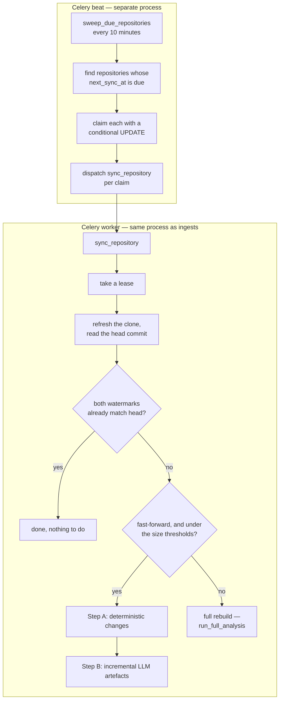
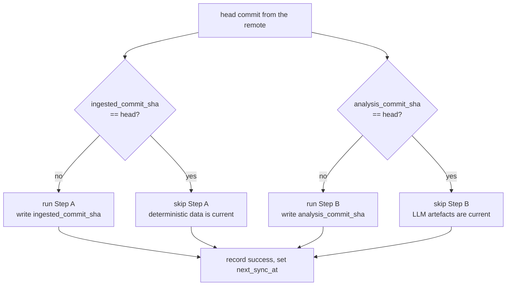

# Auto-Update (Sync)

A repository was ingested a week ago. Since then forty commits landed — a new module, a deleted
helper, two dependency bumps. Nobody wants to re-run the whole analysis, and nobody wants to click
anything. Auto-update is the answer: a per-repository switch that wakes on a schedule, works out
what changed, and reprocesses only that, while the repository stays `ready` and browsable the whole
time.

This document follows one update from the sweep that schedules it to the watermark it leaves behind.
Sync is the part of the system with the most locking: it runs against a live repo another user is
reading, alongside a worker that is also running first-time ingests, on a machine that cannot afford
two parses at once.

If you are reading for the first time, [The two update paths](#the-two-update-paths) is the map. If
you are preparing to discuss it,
[Design decisions and trade-offs](#design-decisions-and-trade-offs) collects the reasoning.

## Contents

- [The two update paths](#the-two-update-paths)
  - [Why two paths](#why-two-paths)
- [The scheduler](#the-scheduler)
  - [The claim predicate](#the-claim-predicate)
  - [How a claim works](#how-a-claim-works)
- [The incremental path](#the-incremental-path)
  - [The lease](#the-lease)
  - [The two watermarks](#the-two-watermarks)
  - [How the head commit is found](#how-the-head-commit-is-found)
  - [Step A — the deterministic pass](#step-a--the-deterministic-pass)
  - [Step B — the incremental LLM pass](#step-b--the-incremental-llm-pass)
- [The full-rebuild path](#the-full-rebuild-path)
- [Side-by-side comparison](#side-by-side-comparison)
- [The clone cache](#the-clone-cache)
- [Success, failure and backoff](#success-failure-and-backoff)
- [Invariants worth protecting](#invariants-worth-protecting)
- [What a sync actually costs](#what-a-sync-actually-costs)
- [Troubleshooting](#troubleshooting)
- [Design decisions and trade-offs](#design-decisions-and-trade-offs)
- [Related documentation](#related-documentation)

## The two update paths



Four rules in that diagram are load-bearing:

- **Syncs and ingests share one worker process**, so a sync can never run concurrently with an
  ingest — or with another sync.
- **The lease is what allows a killed worker to recover.** Without an expiry, a deploy that
  SIGKILLs a mid-sync process leaves the row locked forever.
- **Both watermarks must match before the sync does nothing.** One matching is not enough, because
  the two halves fail independently.
- **Escalation is decided before Step A runs**, not partway through it.

### Why two paths

A diff is usually small: a handful of files, a few hundred lines. Reprocessing the whole repository
for that would be wasteful — but so would forcing every change through the incremental machinery,
because some changes make the diff meaningless:

- A **force-push or a rebase** rewrites history. The old commit is no longer an ancestor of the new
  one, so "what changed between them" has no answer.
- A **large change** — more than 500 files, or more than half the repository — is cheaper to rebuild
  than to reconcile file by file.
- A **cache problem** means there is no working tree to diff against in the first place.

So the sync asks one question — *is this diff usable and small?* — and picks a path. The two paths
share the same pipeline code; they differ only in how much of it they run.

## The scheduler

`beat_schedule` registers one entry, `sweep-due-repositories`, running `sweep_due_repositories` every
600 seconds. The schedule is registered by assignment when `app.tasks.autoupdate` is imported, which
is why that module is in the Celery app's `include` list.

**Beat is a separate process from the worker.** A deploy restarts both, and the beat process keeps its
schedule file on a bind mount so the next beat process resumes the previous cadence rather than
restarting the clock.

The tunables are module-level constants in `tasks/autoupdate.py` rather than `Settings` fields:

| Constant                        | Value  | Meaning                                                        |
| ------------------------------- | ------ | -------------------------------------------------------------- |
| `AUTO_UPDATE_ENABLED`           | `True` | Deployment-wide kill switch; the sweep returns 0 when false     |
| `SWEEP_INTERVAL_MINUTES`        | `10`   | How often beat runs the sweep                                   |
| `SYNC_LEASE_MINUTES`            | `60`   | How long a sync's lease is valid for                            |
| `SWEEP_BATCH_LIMIT`             | `50`   | Maximum repositories claimed per sweep                          |
| `SWEEP_OFFSET_JITTER_SECONDS`   | `60.0` | Random extra delay added to the next due time                   |
| `SYNC_FULL_MAX_FILES`           | `500`  | Above this many changed files, rebuild from scratch             |
| `SYNC_FULL_MAX_RATIO`           | `0.5`  | Above this fraction of files changed, rebuild from scratch      |
| `SYNC_MAX_CONSECUTIVE_FAILURES` | `3`    | After this many failures in a row, auto-update turns itself off |
| `SYNC_BACKOFF_BASE_MINUTES`     | `5`    | Base for the exponential retry delay                            |

### The claim predicate

The sweep looks for repositories that are:

```sql
status = 'ready'
AND auto_update_enabled IS TRUE
AND (next_sync_at IS NULL OR next_sync_at <= now)
AND (sync_lease_expires_at IS NULL OR sync_lease_expires_at < now)
```

That four-part predicate is defined once and reused verbatim in both the `SELECT` and the `UPDATE`,
which is what makes the claim atomic.

The lease clause is the one that recovers a lost worker. A deploy does `docker stop` followed by
`docker rm`, so a worker killed mid-sync would otherwise leave `sync_status = 'updating'` forever
with no way back.

### How a claim works

1. `SELECT` up to `SWEEP_BATCH_LIMIT` (50) candidates, ordered by `next_sync_at` ascending with
   `NULLS FIRST` — never-synced repositories go first.
2. For each, compute a new due time: `now + interval_hours`, plus a random jitter of up to 60
   seconds. The jitter spreads out repositories that were all ingested at once, so they do not all
   come due in the same sweep forever.
3. Run the conditional `UPDATE` with the same predicate. **`rowcount == 1` means this process won the
   claim.** `rowcount == 0` means something else got there first, and the sweep moves on.
4. Dispatch `sync_repository` for each claimed repository.

There is a second way a sync starts: `POST /api/v1/repository/{repo_id}/sync` dispatches
`sync_repository` directly, without the sweep. Because the sweep only claims rows with
`auto_update_enabled` set, a manual sync is the only route for a repository that has auto-update
turned off.

> **The sweep does not write `sync_generation`.** It only bumps `next_sync_at`. The generation UUID is
> minted later, by the worker, when it takes its lease. If you are tracing a sync through the
> database, the sweep's claim and the worker's lease are two separate writes.

## The incremental path

### The lease

`_take_lease` performs another conditional `UPDATE`, requiring `status = 'ready'` and an unheld or
expired lease. On success it writes:

- `sync_status = 'updating'`
- `sync_lease_expires_at = now + 60 minutes`
- `sync_generation = <a fresh uuid4>`
- `last_sync_error = NULL`

If `rowcount` is 0 it rolls back and returns nothing, and the task exits — another worker holds the
lease. Active sync states are `queued`, `checking`, and `updating`.

**The generation UUID is the anti-clobber mechanism.** A re-ingest deletes and recreates the
repository row under the same identifiers. If that happens mid-sync, the sync's writes would land on
a row that no longer represents the analysis it was working from. Before the *analysis* watermark is
written, the sync re-reads the generation and compares: if it changed, it rolls back and returns
without stamping anything.

The guard covers `analysis_commit_sha` only. `ingested_commit_sha` is written with no generation
check — see [Invariants](#invariants-worth-protecting).

The lease is released in a `finally`, and the release is itself conditional: it will not touch a row
whose generation does not match, nor one no longer in an active state. Releasing is best-effort — it
logs and rolls back on failure rather than raising, because a failed release must not mask the real
error.

### The two watermarks

This is the core of incremental behaviour. A repository records **two** commits, because two kinds
of derived data can be stale independently:

| Column                 | Covers                                                                | Written when                 |
| ---------------------- | --------------------------------------------------------------------- | ---------------------------- |
| `ingested_commit_sha`  | Files, symbols, dependency edges, fan metrics, criticality, commits    | The end of Step A            |
| `analysis_commit_sha`  | Glossary, reading order, architecture brief, embeddings               | After the LLM phase succeeds |



**The short-circuit requires both to equal the head commit.** If the deterministic data is current
but the LLM artefacts are not — the common case after an LLM provider outage — the next sync runs
only Step B rather than redoing the parse.

Pull requests are in neither list. The ingest task fetches them on its own thread during a first
ingestion, and neither sync path re-fetches them, so PR data and PR embeddings go stale after the
first ingest.

### How the head commit is found

The sync calls `ensure_clone`, which refreshes the cached clone and then reads `HEAD`. A refresh
means a real `git fetch origin <branch>`, a `git reset --hard`, and a `git clean -fdx` against the
cached working tree. It is not a zero-cost check.

> `repo_cache.py` contains a `_ls_remote_sha` helper that would ask the remote for a branch's SHA
> without transferring objects, and `GIT_LS_REMOTE_TIMEOUT_SECONDS` exists to bound it. **Nothing
> calls it.** The docstring in `tasks/sync.py` still describes the probe as running inside
> `ensure_clone`, which is stale. Treat any "cheap probe" description of this path as inaccurate:
> today, a sync that turns out to have nothing to do has still paid for a fetch.

### Step A — the deterministic pass

Step A runs only when `ingested_commit_sha` differs from the head. Its order is fixed:

```
apply_file_delta        upsert added/modified, delete removed, cascade their children
analyze_git_history     re-mine commits for the changed set
delete_repo_edges       clear the repository's edges
resolve_dependencies    rebuild them
compute_fan_metrics     recompute fan-in/out
run_criticality_scoring must follow git history
detect_stack            refresh stack and entry points
```

Two details about the cost are worth being precise about, because the intuitive reading is wrong in
both cases:

- **Only the embedding API calls scale with the diff.** The graph work does not. `delete_repo_edges`
  and `resolve_dependencies` re-resolve the **whole** repository, `compute_fan_metrics` and
  `run_criticality_scoring` recompute over every file, and `analyze_git_history` re-mines up to 500
  commits. What a small change saves is the parse of unchanged files and the embedding of unchanged
  chunks.
- **The edge rebuild is whole-repository, not incremental.** Rebuilding only the changed files' edges
  would leave stale edges pointing at deleted files and miss new edges into unchanged files.

And one structural fact that is easy to assume away: **Step A is not a single transaction.** Each
stage commits internally — `analyze_git_history`, `resolve_dependencies`, `compute_fan_metrics` and
`run_criticality_scoring` each call `commit()` as they finish. A reader can therefore observe the new
file delta against the old edges, fan metrics, or criticality values while Step A is still running.

### Step B — the incremental LLM pass

Step B regenerates only the artefacts affected by the change. In order, it runs the brief first, then
the incremental glossary, then the reading order.

Generating the brief first has a visible consequence: the brief is given a preview of the glossary,
and at that point the preview reflects the **previous** sync's glossary rather than the one this pass
is about to write.

The individual passes behave like this:

- **Glossary** runs in `incremental` mode: it keeps existing entries and spends its remaining budget
  (up to 200 entries) on symbols that do not have one.
- **Embeddings** run incrementally: rows for changed files are deleted and rebuilt, and unchanged
  chunks are reconciled by comparing a SHA-256 hash of their text, so identical text is not
  re-embedded.
- **Reading order and brief** are regenerated for the repository.

Hash reconciliation covers **symbol, file, and document (README) chunks**. Commit and pull-request
chunks are not reconciled — and since PRs are not re-fetched, they do not change on a sync anyway.

## The full-rebuild path

A sync escalates when incremental work would be more expensive or simply incorrect:

- **Non-fast-forward.** If the old commit is not an ancestor of the new one — a force-push, a branch
  switch, or a rebase — the diff is meaningless.
- **Too many changes.** More than `SYNC_FULL_MAX_FILES` (500) files, or more than
  `SYNC_FULL_MAX_RATIO` (50%) of the repository.
- **Cache problems.** A pinned commit, a disabled cache, an unwritable cache root, a failed refresh,
  or a repository over 512 MiB all bypass the cache and clone fresh.

The full path deletes every `File` row and calls the same `run_full_analysis` the ingest task uses.
Because it is the shared pipeline, it runs with `overlap_llm=False`: the LLM stages run sequentially
there rather than overlapped.

## Side-by-side comparison

| | Incremental | Full rebuild |
| --- | --- | --- |
| **Trigger** | A usable, small diff | Force-push, rebase, branch switch, or over the size thresholds |
| **Parse** | Only added and modified files | Every file |
| **Edges, fan metrics, criticality** | Recomputed over the whole repository | Recomputed over the whole repository |
| **Glossary** | `mode="incremental"` — tops up to 200 | `mode="full"` — deletes and rewrites |
| **Embeddings** | Changed files, reconciled by hash | All rows deleted and rebuilt |
| **LLM stages** | Overlapped | Sequential (`overlap_llm=False`) |
| **What it saves** | The parse of unchanged files, and their embedding calls | Nothing — it is the ingest path |

The honest summary: the incremental path saves the *parse* and the *embedding spend*. It does not
save the graph work, which is always whole-repository.

## The clone cache

Keeping a clone on disk between syncs turns "clone the repository" into "fetch and reset", which for
a large repository is the difference between seconds and minutes.

The cache root is `tempfile.gettempdir() / "illume" / "clone_cache"`, with no environment override,
so inside the Linux container it resolves to `/tmp/illume/clone_cache` — exactly where the production
deploy bind-mounts it. Without that mount, every deploy destroys the cache.

**The cache is a performance optimisation and never a correctness dependency.** Every failure mode
falls back to today's ephemeral `tempfile.mkdtemp` clone:

- cache disabled
- a specific commit requested (the cache tracks one branch per repository)
- the cache root is not writable
- a fetch or reset fails or times out
- the repository exceeds 512 MiB

One case is *not* on that list, though it looks as if it should be. If the cached directory is
missing or is not a git repository, `ensure_clone` does not fall back to an ephemeral clone — it
clones fresh **into the cache**, so the next sync gets the benefit.

Eviction is least-recently-used, driven by a marker file per repository, and never evicts the
repository currently being worked on. Removal retries read-only files, because Windows keeps
`.git/objects` locked.

Token hygiene matters here in a way it does not for an ephemeral clone: the cached repository
persists, so the remote URL — which embeds the access token — is rewritten on every refresh, and git
is run with prompts disabled and global/system config suppressed so no credential helper can
interfere.

## Success, failure and backoff

### On success

`_record_success` resets everything: `sync_status = 'idle'`, the lease cleared, `sync_generation`
nulled, the consecutive-failure counter back to zero, `last_sync_error` cleared, `last_synced_at`
stamped, `next_sync_at` set to now plus the configured interval, and `last_sync_summary` saved with
the counts the settings panel displays.

### On failure

`sync_repository` is declared `max_retries=0` — it does **not** use Celery's retry mechanism. It has
its own, because the retry needs to be spaced over minutes and to stop eventually:

- `consecutive_sync_failures` increments.
- Backoff is `5 × 2^(n-1)` minutes: 5, 10, 20, 40, and so on.
- **After 3 consecutive failures, auto-update turns itself off** for that repository, and
  `last_sync_error` explains why. A repository whose analysis is broken stops consuming resources and
  stops filling the log, and the settings panel tells the owner what happened.

> The `_record_failure` docstring says the backoff is "capped by the lease window". The code applies
> no cap. The docstring is wrong; the code is the behaviour.

### Guard clauses

Before doing any work, the task returns early — with no writes at all — when: the repository is
missing, its `status` is not `ready`, it has no `ingested_commit_sha` to diff against, its owner has
no LLM credential, or the lease cannot be taken.

## Invariants worth protecting

Four properties the rest of the system relies on. Each has been broken at least once.

1. **A sync never changes `status`.** The graph endpoint, the navigation and the progress view all
   key off `status = 'ready'`. Leaving it alone is what keeps the product usable during an update.
   The sync's own state lives in `sync_status`, which only the settings panel reads.

2. **The lease must have an expiry.** Remove `sync_lease_expires_at` and a SIGKILLed worker locks its
   repository forever, with no path back short of a manual database edit.

3. **Both watermarks gate the short-circuit.** Checking only one re-runs work that is already done,
   or worse, skips work that is not.

4. **The generation guard covers the analysis watermark.** `analysis_commit_sha` is written only if
   the generation still matches the lease. `ingested_commit_sha` currently has **no** such guard, so a
   superseded sync can stamp the deterministic watermark with a commit the rebuilt row never
   reflected — after which the next sync believes Step A is unnecessary.

## What a sync actually costs

| Work | Scales with |
| --- | --- |
| `git fetch` + `reset` + `clean` | Repository size, on **every** sync, including one that changes nothing |
| Parse | Changed files |
| `git log --numstat` | Up to 500 commits, always |
| Edge rebuild, fan metrics, criticality | Every file, always |
| Embedding API calls | Changed chunks only |
| LLM generation | Changed artefacts only, and only if `analysis_commit_sha` lags |

The dominant fixed cost is the clone refresh, and the dominant variable cost is the LLM phase — which
is why the two watermarks exist.

### No live progress

A background update produces no frames on the live-log channel:

- The **whole-rebuild path** passes `redis_client=None` and a logger-only publish stub. The
  pipeline's own stage frames reach that stub, so they appear in the worker log as `sync(full): …`.
- The **sub-service frames** — scanner, git analyzer, embedder — call `publish_log(None, …)`, which
  raises inside the helper, is swallowed, and logs only a generic `Redis publish failed (channel=…)`
  warning. The event and message are lost.
- The **incremental path** has no stub at all.

So the frames do not all reach the worker log either, and none reach Redis. The progress UI is built
for the initial ingest path; a user watching a background update sees the settings panel's status
line, which polls `sync_status` rather than reading the stream.

## Troubleshooting

**Auto-update stopped by itself.**

Read `last_sync_error`. Three consecutive failures disable it by design. Fix the underlying cause,
then re-enable.

**A repository shows `updating` and never moves.**

The lease is 60 minutes; the sweep reclaims it after that. If it happens repeatedly, the sync is
being killed mid-run — check the worker log for an OOM kill or a deploy restart.

**Syncs never run at all.**

Check, in order: `AUTO_UPDATE_ENABLED` is true; the beat process is actually running (it is a
separate process, and a missing schedule-file mount resets its cadence); the repository's
`auto_update_enabled` is true in the database; and its `status` is `ready`.

**A sync runs but changes nothing.**

Correct behaviour when both watermarks already equal the head commit. Look at `ingested_commit_sha`
and `analysis_commit_sha` — if one lags, the next sync will run only that half.

**Syncs are slower than expected on repositories that rarely change.**

Expected today: an idle sync still performs a real fetch, because the head commit is read by
refreshing the cached clone. See [How the head commit is found](#how-the-head-commit-is-found).

**The graph looks inconsistent during a sync.**

Step A commits stage by stage, so a read can catch the new file list against the old edges or
criticality values. See [Step A](#step-a--the-deterministic-pass).

**A repository re-analyses from scratch every time rather than incrementally.**

The change is exceeding one of the escalation thresholds, or the history is not fast-forward. Look at
`last_sync_summary` and compare the head SHAs; a force-push to the tracked branch causes this every
time.

**Disk usage grows without bound.**

The cache should evict at 2 GiB. Confirm `CLONE_CACHE_ENABLED` and check that the process can write
its marker files — eviction depends on them, and if they cannot be written the cache cannot tell what
is stale.

## Design decisions and trade-offs

### Why two watermarks instead of one?

Because the two halves fail independently. An LLM outage leaves the deterministic data current and
the generated prose stale. With a single watermark, every subsequent sync would re-parse the entire
repository to fix a glossary. Two watermarks let the next sync run only the missing half.

The cost is the extra state, and the care needed to write each at the right moment — which is exactly
where `ingested_commit_sha`'s missing generation guard comes from.

### Why does a sync keep `status = 'ready'`?

Because changing it would take the product offline for the duration of every background update — the
opposite of the feature's purpose. The graph endpoint, the nav and the progress view all key off
`ready`, so leaving it alone is what makes an update invisible to a reader.

The cost is the one described under Step A: because the status never changes, a client reading during
a sync sees the tables as they are at that instant, not a snapshot of a completed update. Reads are
individually consistent; they are not a snapshot.

### Why does the sweep only bump `next_sync_at`?

Because the sweep's job is to decide *who* runs, not to run anything. Writing `sync_generation` at
claim time would mean the generation is minted before a worker has committed to the work — and a
dispatch that never arrives would leave a generation that no lease owns.

Keeping the two writes separate means the lease is the only place a generation comes from, and the
lease is always taken by the process that is about to do the work.

### Why a 60-second jitter on the next due time?

Because repositories are usually ingested in bursts — a demo, a team onboarding, a batch import — so
without jitter they all come due in the same sweep forever. The jitter decorrelates them at negligible
cost.

### Why does a failed sync disable itself instead of retrying forever?

Because the alternative is a broken repository consuming a slot every backoff interval indefinitely,
filling the log and the queue with a failure nobody is reading. Three consecutive failures is enough
to conclude the problem is not transient, and turning the switch off is a signal a human can act on.

The cost is that a repository genuinely broken by a transient outage stays off until someone
re-enables it. That is the right side of the trade: silence is recoverable, a loop is not.

### Why escalate to a full rebuild rather than reconcile a large diff?

Because file-by-file reconciliation has a fixed cost per file — a delete, an upsert, a cascade, an
edge rebuild — and past a few hundred files the bookkeeping exceeds the cost of throwing the
deterministic data away and rebuilding it. The 500-file and 50% thresholds are the point where that
crossover is measured to sit.

A non-fast-forward is the harder case: it is not about cost at all. Rebase and force-push rewrite the
commits the old SHA referred to, so the diff between old and new is not a description of what changed
in the code.

### Why does the worker run with `--concurrency=1`?

Because each ingestion peaks at several hundred megabytes, and the overlapped stages inside one task
are threads, not processes — a single task already uses the concurrency it needs. Running two at once
multiplies the memory floor rather than halving the wall-clock.

The `prefork` pool takes its default concurrency from the **container's** reported CPU count, not the
VM's vCPU count, so deploying without the flag silently runs several. The `sync` queue exists so a
second pool could be split off later, not because it runs now.

### Why does the cache fall back instead of failing?

Because the cache is an optimisation and nothing else. Every failure mode — unwritable root, oversize
repository, disabled by config, a fetch that times out — has a correct slow path, and taking it costs
minutes rather than correctness. A cache that could fail a sync would be a liability.

The interesting case is the cached directory that is missing or is not a git repository: that is not
treated as a failure but as a cold start, so the fresh clone is written *into* the cache. Falling
back to an ephemeral clone there would mean never warming the cache again.

## Related documentation

- [ingestion.md](ingestion.md) — the full analysis, whose stages the rebuild path reuses unchanged.
- [generation.md](generation.md) — the LLM services, and what `mode="incremental"` changes about the
  glossary and the brief.
- [retrieval.md](retrieval.md) — the embedding index this path reconciles, and how the hash
  comparison decides what to re-embed.
- [deployment.md](../deployment.md) — the three containers, the bind mounts that make the clone cache
  survive a deploy, and why the worker runs at concurrency 1.
- [data-model.md](../data-model.md) — the `repositories` columns this path writes: the lease, the
  watermarks, and the failure counters.
