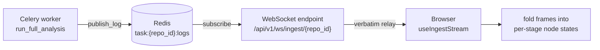
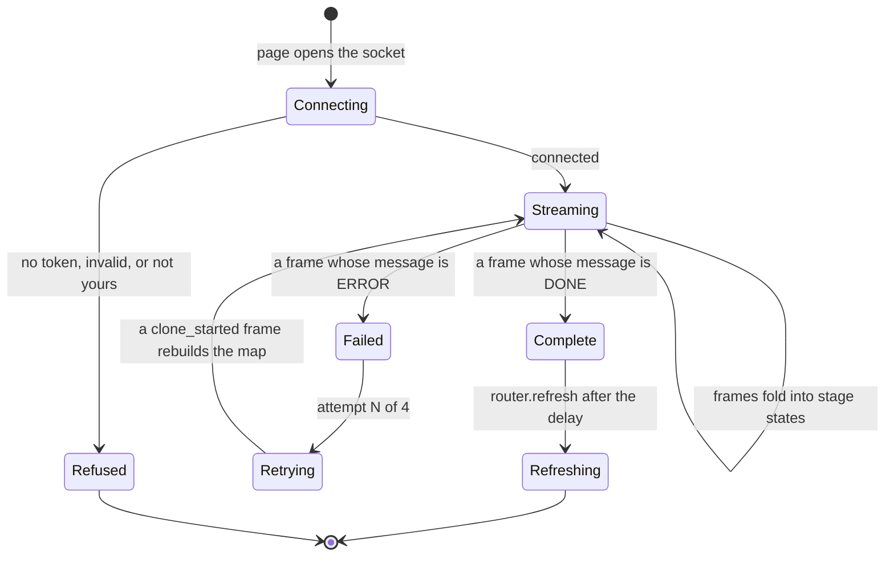

# Live Progress

An ingestion takes minutes. Without a live view, a user who has just added a repository stares at a
spinner with no way to tell a slow clone from a hung worker. So the worker narrates what it is doing:
it publishes structured frames to a Redis channel, and a WebSocket endpoint relays that channel to the
browser verbatim.

This is the one non-HTTP interface in the product, and it has the least forgiving contract — a client
that renders the wrong thing shows the user a progress bar that lies. This document describes the
connection, the frame shape, and the vocabulary a client renders from.

The code is in `server/app/api/v1/ws.py` (the endpoint), `server/app/services/_publish.py` (the
publisher), and `server/app/services/_stages.py` (the vocabulary).

If you are writing a client, read [The frame](#the-frame) and
[What a client should do](#what-a-client-should-do). If you are adding a pipeline stage, read
[Adding a stage](#adding-a-stage) — there are three things to do and one of them is easy to forget.

## Contents

- [The channel at a glance](#the-channel-at-a-glance)
- [The connection](#the-connection)
- [The frame](#the-frame)
  - [`stage` and `phase`](#stage-and-phase)
  - [The failure frame is the exception](#the-failure-frame-is-the-exception)
- [The event catalogue](#the-event-catalogue)
- [What a client should do](#what-a-client-should-do)
- [Adding a stage](#adding-a-stage)
- [What does not reach this channel](#what-does-not-reach-this-channel)
- [Troubleshooting](#troubleshooting)
- [Design decisions and trade-offs](#design-decisions-and-trade-offs)
- [Related documentation](#related-documentation)

## The channel at a glance



Four rules in that pipeline are load-bearing:

- **The relay is verbatim.** The WebSocket does not transform, filter, or reorder. Whatever the worker
  published is what the client receives, so the frame contract is the worker's to keep.
- **`stage` and `phase` drive the UI, not event names.** A client folds frames into node states; it
  does not pattern-match on `event`.
- **The server closes the socket when the run ends.** A successful analysis ends the stream from the
  server side, with no distinguishing close code.
- **A background sync publishes nothing here.** The frames exist in the worker log and nowhere else.

## The connection

```
WS /api/v1/ws/ingest/{repo_id}
```

Authentication accepts the session token from **either** source:

- the `access_token` cookie, or
- a **`?token=` query parameter**.

The query parameter exists because some client transports cannot set headers on a WebSocket handshake.
It is a known compromise: query strings are written to access logs by default, so a session token
passed this way can end up in a log file. The cookie is the preferred path, and one of the three
security weaknesses recorded in [auth.md](auth.md#the-threat-model).

After reading the token, the endpoint decodes it and verifies the caller owns the repository. Every
failure closes the socket with code **1008** and a reason string — no token, invalid token, or
repository not found. "Not found" and "not yours" close identically, the same non-disclosure rule the
HTTP API follows with its `404`s.

**The server closes the socket itself when a frame's `message` is `DONE` or `ERROR`.** A successful
analysis therefore ends the connection from the server side, and that close carries no distinguishing
code or reason. A client must treat a close as the end of the stream and read the final frame it
already received — not treat every close as a failure. This is the single most common integration
mistake.

## The frame

Every frame is a JSON object. Three fields are always present:

| Field       | Type   | Meaning                                |
| ----------- | ------ | -------------------------------------- |
| `event`     | string | What happened — see the catalogue below |
| `message`   | string | Human-readable text for display         |
| `timestamp` | string | ISO-8601 UTC                            |

Additional keys appear depending on the event: `stage`, `phase`, `processed`, `total`, `count`,
`status`.

### `stage` and `phase`

**The client renders node states from `stage` and `phase`. It does not infer anything from event
names.** This is the central contract, and it is why the four LLM stages each publish an explicit
completion frame rather than being assumed finished when something downstream starts.

`phase` has four values:

| Phase      | Meaning                        |
| ---------- | ------------------------------ |
| `started`  | The stage has begun            |
| `progress` | The stage is partway through   |
| `done`     | The stage finished successfully |
| `failed`   | The run failed                 |

`stage` values come from the `Stage` `StrEnum` in `services/_stages.py`, and are copied from the names
passed to the stage timer. A unit test parses every `stage(...)` call out of `app/` and asserts the two
sets stay equal — so the stages that appear in frames and the stages that appear in timing logs cannot
drift apart. That test is why `grep 'stage='` and `grep stage_timer` describe the same graph.

Both are `StrEnum`, so they serialise as bare strings through the `json.dumps` and no consumer needs to
know they were ever enums.

The stages are:

`clone`, `pr_fetch`, `parse`, `resolve_dependencies`, `compute_fan_metrics`, `detect_stack`,
`git_history`, `criticality`, `glossary`, `reading_order`, `generate_embeddings`, `brief`, `ready` —
plus the two join stages `glossary_and_reading_order_join` and `embed_and_brief_join`.

### The failure frame is the exception

When a run fails, the catch-all publishes a frame with `phase = failed` and **no `stage` field at
all**.

That is deliberate rather than an omission. The error handler runs outside `run_full_analysis` and
genuinely cannot know which stage raised. Guessing would attribute the failure to the wrong node and
send the client's UI to the wrong place. A frame with no stage means *"the run failed, location
unknown"*, and the worker log holds the traceback that names it.

## The event catalogue

Event names follow `<stage>_<phase>` for stage-boundary frames, plus a handful of standalone events.
Remember that the names are for humans reading logs — the client should be folding on `stage`/`phase`.

### Lifecycle

| Event           | Meaning                                                          |
| --------------- | ---------------------------------------------------------------- |
| `clone_started` | Cloning has begun                                                 |
| `status_update` | A repository status transition                                    |
| `done`          | The whole analysis finished — carries `stage=ready`, `phase=done`  |
| `error`         | The run failed — carries `phase=failed` and no stage               |

### Stage boundaries

These mirror their stages, each with a `started` and a `complete` frame:

`checkout_started`, `clone_complete`, `file_discovery`, `parsing_started`, `deps_resolved_started`,
`deps_resolved`, `metrics_started`, `metrics_complete`, `stack_detected`, `db_storage_complete`,
`git_analysis_started`, `git_analysis_complete`, `commits_parsed`, `ownership_written`,
`file_stats_aggregated`, `prs_fetch_started`, `prs_fetch_complete`, `criticality_started`,
`criticality_complete`, `glossary_started`, `glossary_complete`, `reading_order_started`,
`reading_order_complete`, `embedding_started`, `embedding_complete`, `brief_started`,
`brief_complete`.

### Progress frames

Two events carry counts, and they are the only ones a progress bar should read:

| Event                | Extra fields         | Meaning            |
| -------------------- | -------------------- | ------------------ |
| `file_processed`     | `processed`, `total` | Parse progress     |
| `embedding_progress` | `processed`, `total` | Embedding progress |

The `parse` node is the one the progress canvas renders a counter for.

## What a client should do



The reference implementation is `client/src/hooks/useIngestStream.ts` with
`client/src/components/IngestFlow.tsx`. Its behaviour is worth copying:

- **Normalise every frame** into a shape with all optional fields present, so a consumer never checks
  for `undefined`. An unparseable frame is still rendered as text rather than dropped.
- **Build node states by folding frames**, not by reading the latest one. A stage is `done` once its
  completion frame has been seen, regardless of what arrives later.
- **Detect a retry.** A clone-start following a failure means the task is retrying, so the state map is
  rebuilt from that frame onward. Ingestion retries up to three times, so the UI shows `attempt N of 4`.
- **Refresh the page data once per outcome**, not on every frame — on completion after a short delay,
  on failure after a longer one.
- **Reconnect after a grace period** if the socket closes before the run finished, with a generation
  guard so a superseded socket's close event does not report the new one as closed.

## Adding a stage

Three things, and the second is the one that gets forgotten:

1. Add the member to the `Stage` enum in `services/_stages.py`.
2. Wrap the work in `stage(...)` from `services/_stage_timer.py`.
3. Publish **both** a `started` and a `done` frame.

Skipping the `done` frame leaves the client's node lit forever, because the contract explicitly
forbids the client from inferring completion. The unit test that compares the enum against the
`stage(...)` call sites catches a missing member, but it cannot catch a missing frame — that one is on
you.

The failure frame is the only exception, and it carries no `stage` at all.

## What does not reach this channel

**A background [sync](pipeline/sync.md) publishes nothing here.** The sync task passes
`redis_client=None` and a logger-only `_publish` stub into the pipeline, so every publish call it
reaches fails on `None.publish` and is swallowed by the best-effort handler. The frames exist in the
worker log and nowhere else.

That is why watching a background update shows no live progress in the UI while a first ingestion
does: the progress view is built for the ingest path only. Wiring the sync to the channel is the
prerequisite for covering it.

**Publishing is also not uniformly best-effort on the ingest path.** The `publish_log` helper catches a
Redis failure and logs a warning, on the principle that losing a progress message must not fail an
analysis that is merely reporting on itself. But the ingest task publishes its own pipeline-level
frames through a different closure that calls `redis_client.publish` directly, with no `try`/`except` —
so a Redis error there propagates out of the pipeline and fails or retries the ingest.

## Troubleshooting

**The socket connects but nothing arrives.**

Confirm the analysis is actually running. If the repository is being updated by a *sync* rather than an
ingestion, there will never be frames — see above.

**The socket closes immediately with 1008.**

No token, an invalid or expired token, or the repository is not the caller's. The close reason
distinguishes them.

**The socket closes with no reason and the run looks fine.**

Expected. The server closes the socket itself when the final frame's message is `DONE`. Read the frame
you already have rather than treating the close as a failure.

**Frames stop partway through and the socket stays open.**

The task may have died. The WebSocket relays Redis and has no independent knowledge of the task's
liveness, so a killed worker produces silence rather than an error frame.

**A stage's node never turns green.**

Check whether that stage publishes a `*_complete` frame. If it does not, the fix belongs in the
publisher, not in the client.

**The same token appears in access logs.**

Expected when the client uses `?token=`. Prefer the cookie where the transport allows it.

## Design decisions and trade-offs

### Why relay Redis verbatim rather than shape frames per client?

Because there is exactly one producer and one consumer, and an intermediate translation layer would be
a third place for the vocabulary to drift. The worker, the endpoint, and the client all speak the same
`stage`/`phase` contract, and the unit test that pins the enum against the timer call sites only works
because there is a single vocabulary to pin.

The cost is that the frame format is a public contract whether or not it is treated as one. Changing a
field name is a breaking change to the client.

### Why does the client fold frames rather than read the latest?

Because frames arrive out of order relative to the work they describe. A completion frame for one stage
can arrive after a start frame for the next, since the stages are overlapped on threads. Reading only
the latest frame would show a stage as `started` when it had already finished.

The cost is state in the client: the hook keeps a map rather than a single latest value, and has to
rebuild it when a retry restarts the pipeline.

### Why does the failure frame have no `stage`?

Because the catch-all runs outside `run_full_analysis` and cannot know which stage raised. The
alternative is to track the current stage in a mutable shared location so the handler can read it —
which would be wrong under concurrency, because the overlapped stages would race to write it, and the
handler would frequently name the wrong one.

The cost is that a failed run tells the client *that* it failed and not *where*. The traceback in the
worker log has the rest.

### Why does the server close the socket on completion?

Because otherwise the client has to distinguish "the run finished" from "the connection dropped" by
timeout, and a silent network failure would leave a progress view hanging indefinitely. Closing on the
final frame gives the client an unambiguous end-of-stream signal.

The cost is that the close is indistinguishable from an error close at the protocol level — both are
just a close. The client has to use the frame it received, not the close code, to tell them apart.

### Why accept the token as a query parameter at all?

Because `EventSource` and some WebSocket transports cannot set request headers, so there is no way to
send the cookie on the handshake from those clients. Accepting the parameter makes the endpoint
reachable.

The cost is stated where it happens: the token lands in access logs. The cookie path exists so a client
that *can* send it does not have to.

### Why is the sync path not wired to this channel?

Because the sync is designed to be invisible: it keeps `status='ready'` precisely so the product does
not change while it runs. Wiring it to the live-log channel would surface progress the design is
deliberately hiding, and would need a UI decision the current progress view does not make — it renders
node states for a pipeline that runs once, not a diff of what changed.

The cost is that a background update is genuinely unobservable from the browser, which is a debugging
problem when one goes wrong.

## Related documentation

- [pipeline/ingestion.md](pipeline/ingestion.md) — the stages these frames describe, and how they are
  overlapped.
- [pipeline/sync.md](pipeline/sync.md) — why a sync produces no frames.
- [api.md](api.md) — the HTTP surface this endpoint sits beside.
- [auth.md](auth.md) — the token, and the query-parameter compromise in the threat model.
- [frontend.md](frontend.md) — where the client hook and progress canvas live.
